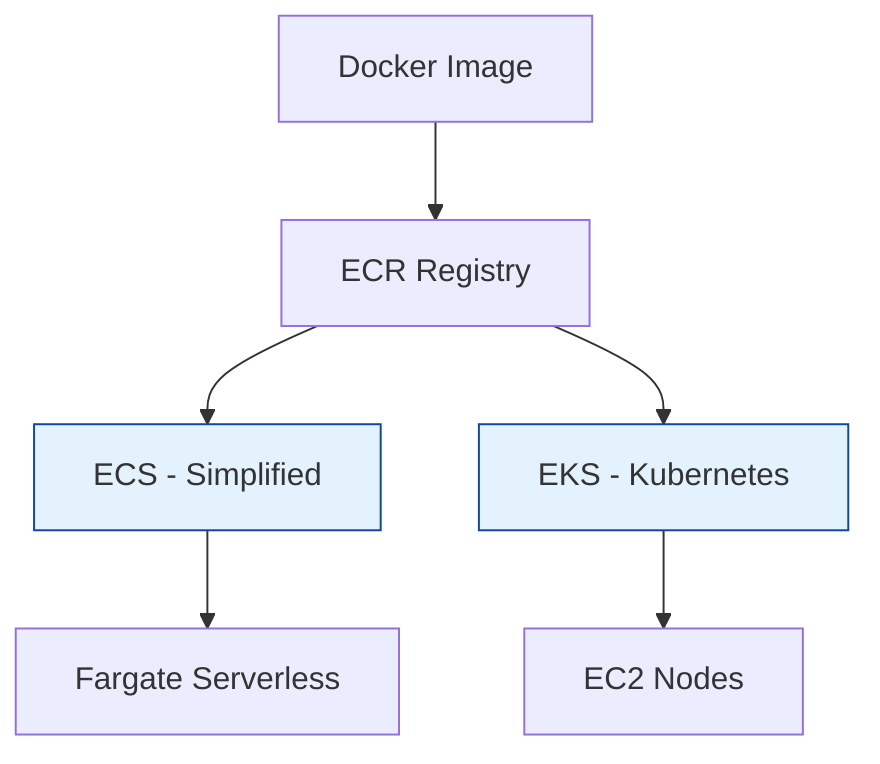

# AWS Containers (ECS & EKS)

Running Docker containers on AWS.

## Architecture: ECS vs EKS

## Real World Scenarios
### Scenario: Microservices Migration
**Context:** Monolithic app is being broken into 20 services. Team knows Docker but not Kubernetes.
**Solution:**
- **ECS (Elastic Container Service):** Use ECS with Fargate.
**Benefit:** Lower learning curve than K8s. No server management (Fargate).

## Quiz

<b>1. ECR stands for:</b>

A) Elastic Container Registry 
B) Electronic Card Reader 
C) Easy Code Run 
D) Elastic Cloud Runner 
 
<b>Answer: A) Elastic Container Registry</b>

<b>2. ECS vs EKS: Which uses standard Kubernetes?</b>

A) EKS 
B) ECS 
 
<b>Answer: A) EKS</b>

<b>3. Fargate is:</b>

A) Serverless compute engine for containers 
B) A firewall 
C) A database 
D) A gate 
 
<b>Answer: A) Serverless compute engine for containers</b>

<b>4. To run a container, you need a Task Definition in ECS. This is similar to a:</b>

A) Docker Compose file 
B) Python script 
C) Variable 
D) User 
 
<b>Answer: A) Docker Compose file</b>

<b>5. Can EKS run on Fargate?</b>

A) Yes 
B) No 
 
<b>Answer: A) Yes</b>

<b>6. Which costs more to manage (Control Plane fees)?</b>

A) EKS (Cost per hour for cluster) 
B) ECS (Free control plane) 
 
<b>Answer: A) EKS (Cost per hour for cluster)</b>

<b>7. "Pod" is a concept in:</b>

A) Kubernetes (EKS) 
B) ECS 
C) Docker 
D) S3 
 
<b>Answer: A) Kubernetes (EKS)</b>

<b>8. "Task" is a concept in:</b>

A) ECS 
B) EKS 
C) Lambda 
D) RDS 
 
<b>Answer: A) ECS</b>

<b>9. App Mesh is used for:</b>

A) Service Mesh (networking between microservices) 
B) Drawing shapes 
C) Login 
D) Storage 
 
<b>Answer: A) Service Mesh (networking between microservices)</b>

<b>10. To authenticate Docker CLI to ECR, you run:</b>

A) aws ecr get-login-password | docker login... 
B) docker login aws 
C) login 
D) sudo login 
 
<b>Answer: A) aws ecr get-login-password | docker login...</b>

<b>11. Can ECS run Windows Containers?</b>

A) Yes 
B) No 
 
<b>Answer: A) Yes</b>

<b>12. What is the "Sidecar" pattern?</b>

A) Running a helper container alongside the main application container in the same task/pod 
B) Driving a motorcycle 
C) A backup server 
D) A database 
 
<b>Answer: A) Running a helper container alongside the main application container in the same task/pod</b>

<b>13. EKS Nodes are managed via:</b>

A) Managed Node Groups or Self-Managed EC2 
B) Magic 
C) Not managed 
D) Console only 
 
<b>Answer: A) Managed Node Groups or Self-Managed EC2</b>

<b>14. Copilot CLI is a tool for:</b>

A) Simplifying ECS deployment 
B) Flying planes 
C) EKS management 
D) S3 uploads 
 
<b>Answer: A) Simplifying ECS deployment</b>

<b>15. Why use a Private Registry (ECR) instead of Docker Hub?</b>

A) Security, speed (in VPC), and unlimited pulls 
B) It's cheaper 
C) It has more images 
D) Docker Hub is closed 
 
<b>Answer: A) Security, speed (in VPC), and unlimited pulls</b>

<b>16. IAM Roles for Tasks (ECS) allows:</b>

A) Granular permissions per container 
B) Granular permissions per node 
C) All containers share same permission 
D) Nothing 
 
<b>Answer: A) Granular permissions per container</b>

<b>17. In EKS, "kubectl" is:</b>

A) The command line tool for Kubernetes 
B) An AWS service 
C) A container 
D) A database 
 
<b>Answer: A) The command line tool for Kubernetes</b>

<b>18. Can you run stateful workloads (with EBS) on EKS?</b>

A) Yes, using CSI drivers 
B) No 
 
<b>Answer: A) Yes, using CSI drivers</b>

<b>19. Which load balancer is best for containerized HTTP apps?</b>

A) Application Load Balancer (ALB) 
B) Classic Load Balancer 
C) Network Load Balancer 
D) Gateway Load Balancer 
 
<b>Answer: A) Application Load Balancer (ALB)</b>

<b>20. ECS "Service" ensures:</b>

A) A specified number of tasks are always running (auto-restart) 
B) One task runs once 
C) Nothing 
D) Logging 
 
<b>Answer: A) A specified number of tasks are always running (auto-restart)</b>

<b>21. Does EKS support Helm charts?</b>

A) Yes 
B) No 
 
<b>Answer: A) Yes</b>

