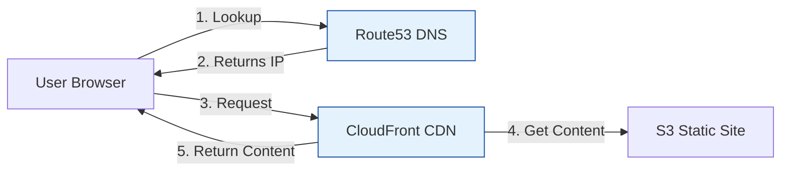

# AWS Web Hosting (Route53 & CloudFront)

DNS and Content Delivery.

## Architecture: Web Request Flow

## Real World Scenarios
### Scenario: Global Marketing Site
**Context:** High traffic launch for a new product page. Users are worldwide.
**Solution:**
- **S3:** Host the static HTML/CSS/JS.
- **CloudFront:** Cache the site at Edge Locations globally.
- **Route53:** Latency-based routing (optional) or simple Alias record to CloudFront.
**Benefit:** Fastest possible load times, low cost, 99.99% availability, survives massive traffic spikes.

## Quiz

<b>1. Route53 is a:</b>

A) Highly available and scalable DNS web service 
B) Router hardware 
C) Road map 
D) Database 
 
<b>Answer: A) Highly available and scalable DNS web service</b>

<b>2. "53" in Route53 refers to:</b>

A) The TCP/UDP port for DNS 
B) The year it was founded 
C) Number of regions 
D) Nothing 
 
<b>Answer: A) The TCP/UDP port for DNS</b>

<b>3. An "Alias Record" in Route53 is better than CNAME because:</b>

A) It can point to AWS root resources (like ELB/CloudFront) and is free for queries 
B) It is faster 
C) It is red 
D) CNAME is deprecated 
 
<b>Answer: A) It can point to AWS root resources (like ELB/CloudFront) and is free for queries</b>

<b>4. Which Routing Policy routes traffic to the Region with the fastest response time?</b>

A) Latency Routing 
B) Simple Routing 
C) Geolocation Routing 
D) Failover Routing 
 
<b>Answer: A) Latency Routing</b>

<b>5. Which Routing Policy routes traffic based on the user's physical location (Country/State)?</b>

A) Geolocation Routing 
B) Latency Routing 
C) Weighted Routing 
D) Simple Routing 
 
<b>Answer: A) Geolocation Routing</b>

<b>6. CloudFront is a:</b>

A) Content Delivery Network (CDN) 
B) Cloud server 
C) Front-end framework 
D) Storage 
 
<b>Answer: A) Content Delivery Network (CDN)</b>

<b>7. "TTL" (Time To Live) determines:</b>

A) How long a DNS record is cached by the resolver 
B) Steps to live 
C) Uptime 
D) Cost 
 
<b>Answer: A) How long a DNS record is cached by the resolver</b>

<b>8. Route53 Health Checks can:</b>

A) Monitor endpoint health and trigger failover 
B) Check your blood pressure 
C) Monitor costs 
D) Delete records 
 
<b>Answer: A) Monitor endpoint health and trigger failover</b>

<b>9. Weighted Routing is used for:</b>

A) A/B Testing (e.g., 10% to new version, 90% to old) 
B) Heavy traffic 
C) Load balancing 
D) Security 
 
<b>Answer: A) A/B Testing (e.g., 10% to new version, 90% to old)</b>

<b>10. Route53 is a Global Service. (True/False)</b>

A) True 
B) False 
 
<b>Answer: A) True</b>

<b>11. Can Route53 register domain names?</b>

A) Yes (Registrar) 
B) No 
 
<b>Answer: A) Yes (Registrar)</b>

<b>12. CloudFront "Origin" can be:</b>

A) S3 Bucket, Load Balancer, EC2, or custom HTTP server 
B) Only S3 
C) Only EC2 
D) Only local files 
 
<b>Answer: A) S3 Bucket, Load Balancer, EC2, or custom HTTP server</b>

<b>13. "OAI" (Origin Access Identity) is used to:</b>

A) Restrict access to an S3 bucket so only CloudFront can access it 
B) Identify users 
C) Login 
D) Route traffic 
 
<b>Answer: A) Restrict access to an S3 bucket so only CloudFront can access it</b>

<b>14. CloudFront signed URLs are for:</b>

A) Restricted content access (Paid content, private) 
B) Public content 
C) Formatting URLs 
D) Shortening URLs 
 
<b>Answer: A) Restricted content access (Paid content, private)</b>

<b>15. Dynamic Content (API) via CloudFront:</b>

A) Is optimized via the AWS private network backbone to the origin 
B) Is cached forever 
C) Is impossible 
D) Is slow 
 
<b>Answer: A) Is optimized via the AWS private network backbone to the origin</b>

<b>16. Route53 Failover record type:</b>

A) Directs traffic to a backup resource if the primary is unhealthy 
B) Fails request 
C) Is default 
D) Is weighted 
 
<b>Answer: A) Directs traffic to a backup resource if the primary is unhealthy</b>

<b>17. Lambda@Edge runs:</b>

A) Code at CloudFront Edge Locations (closest to user) 
B) In the region 
C) On the user device 
D) In S3 
 
<b>Answer: A) Code at CloudFront Edge Locations (closest to user)</b>

<b>18. Can you host a Zone Apex (e.g., example.com) on an ELB?</b>

A) Yes, using Route53 Alias Record 
B) No, CNAME limitations 
 
<b>Answer: A) Yes, using Route53 Alias Record</b>

<b>19. Geo-Proximity Routing uses:</b>

A) Bias values to shift traffic usage between geographic regions 
B) Latency 
C) Failover 
D) Weights 
 
<b>Answer: A) Bias values to shift traffic usage between geographic regions</b>

<b>20. To prevent DDoS attacks at the Edge, CloudFront integrates with:</b>

A) AWS Shield and WAF 
B) Security Groups 
C) IAM 
D) S3 
 
<b>Answer: A) AWS Shield and WAF</b>

<b>21. Multi-Value Answer Routing:</b>

A) Returns multiple healthy IP addresses (Simple Load Balancing) 
B) Returns one value 
C) Is complex 
D) Is precise 
 
<b>Answer: A) Returns multiple healthy IP addresses (Simple Load Balancing)</b>

