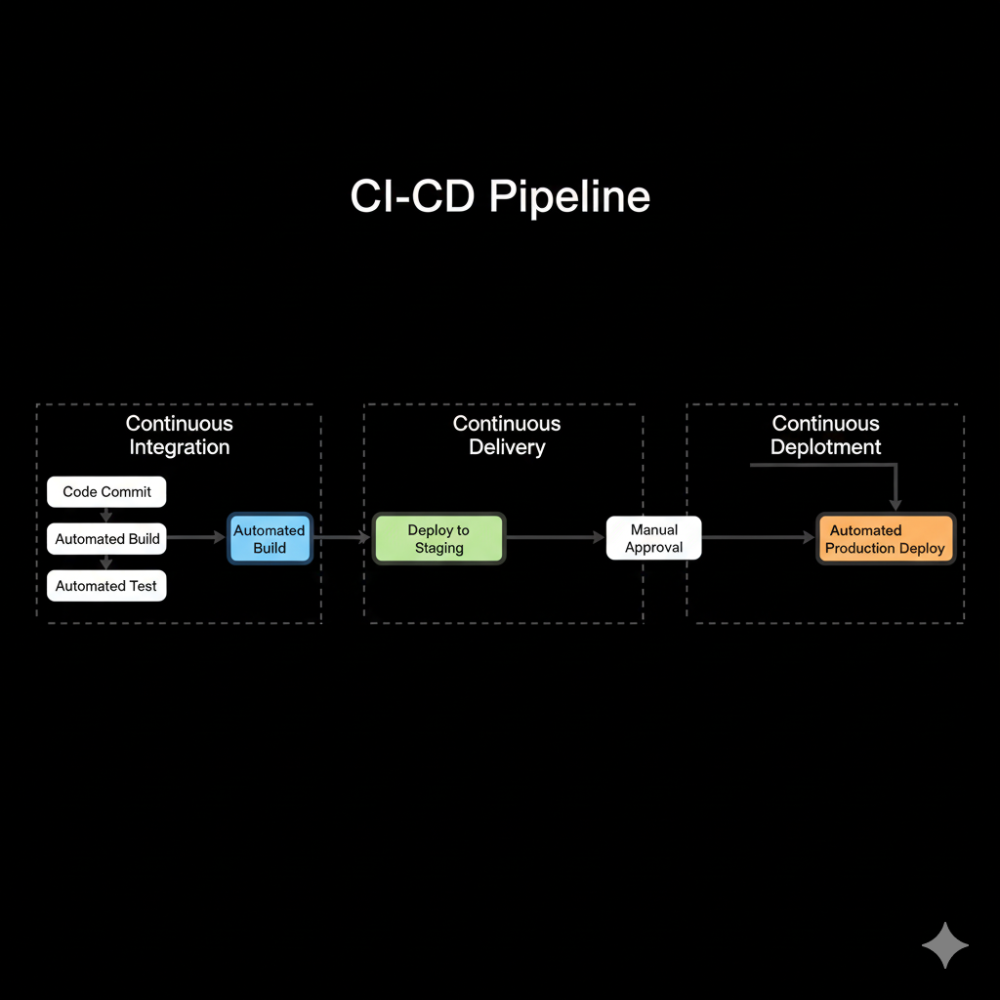
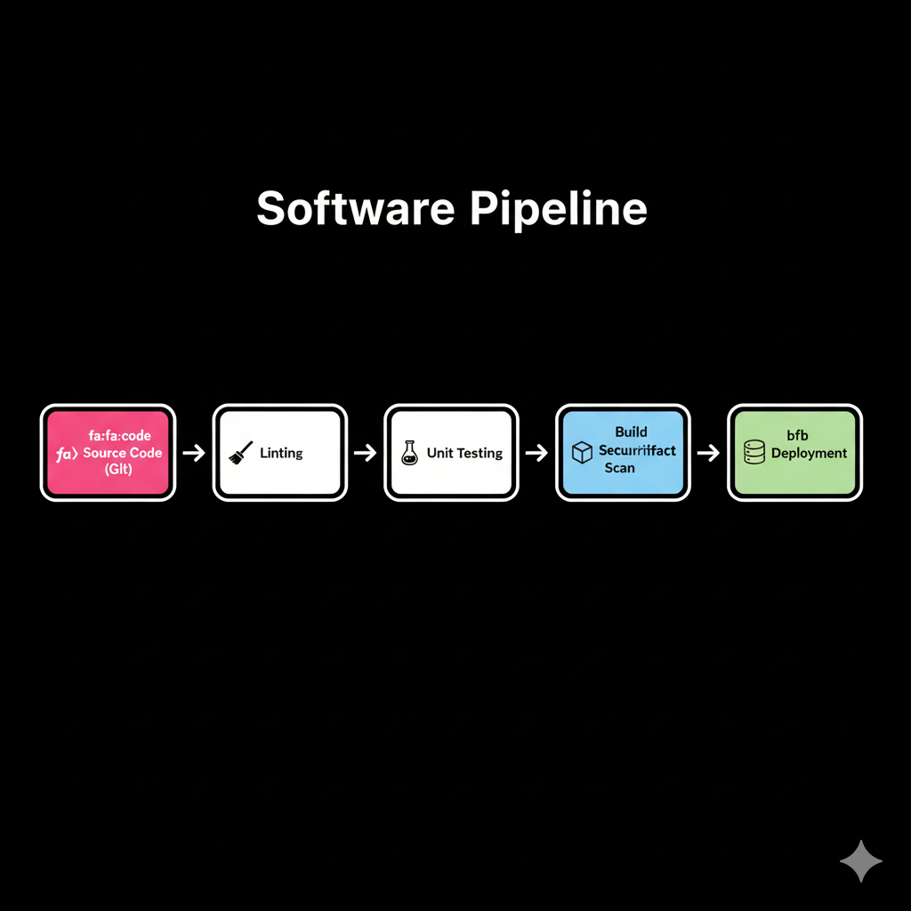
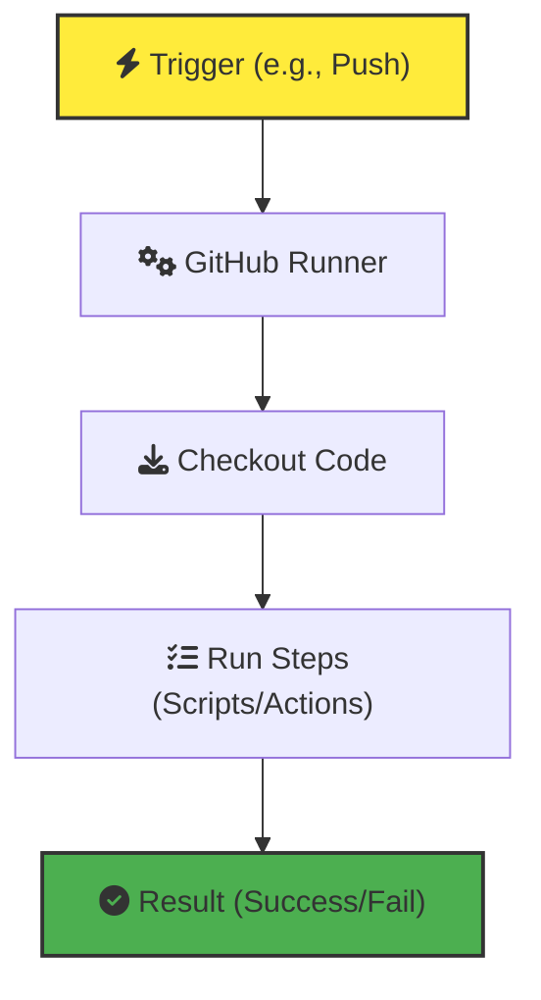

CI/CD stands for Continuous Integration and Continuous Delivery (or Deployment). For a beginner, this is the process of automating the testing and shipping of your code so you don't have to do it manually every time.

### 📐 The Three Pillars
*   **Continuous Integration (CI)**: Focuses on the developer workflow. Every time you push code, it's automatically built and tested. The goal is to catch bugs early—**Integrate often, fail fast.**
*   **Continuous Delivery (CD)**: Automatically prepares your code for a release. After CI passes, the code is deployed to a "Staging" environment. It's ready to go to production at the click of a button.
*   **Continuous Deployment (CD)**: The ultimate automation. If all tests pass, the code is automatically deployed to live users without any manual intervention.

---

## 🔄 CI vs CD Comparison


---

## � Learning Objectives
- Understand the difference between CI and CD
- Design a basic CI/CD pipeline
- Implement automated linting and testing
- Troubleshoot failed builds using logs
- Secure pipelines with secrets management

## 📖 Essential CI/CD Pipeline Stages


Every modern pipeline follows a structured set of steps to ensure code quality and safety.

1.  **Checkout**: The runner (the server running your pipeline) clones your Git repository so it has access to the latest code.
2.  **Linting**: Static analysis tools (e.g., `ESLint`, `Pylint`) scan your code without running it. They catch syntax errors, "smelly" code, and style inconsistencies.
3.  **Unit Testing**: Small, automated tests verify that individual functions or logic blocks work as expected. If a test fails, the pipeline stops—preventing broken code from moving forward.
4.  **Security Scanning**: Tools like `Snyk` or `Trivy` scan your dependencies for known vulnerabilities and check if you accidentally committed secrets (like API keys) to Git.
5.  **Build**: The code is compiled or packaged into a "Build Artifact"—a single, versioned file (like a .zip or a Docker image) that is ready to be deployed.
6.  **Deploy**: The artifact is pushed to a server, cloud provider, or container registry. In Continuous Deployment, this happens automatically to Production.

---

## 🏗️ Essential CI/CD Context

### 🚀 GitHub Actions Basics



GitHub Actions uses **YAML** files stored in `.github/workflows/` to define your automation.

#### Key Components:
*   **Workflow**: The entire automated process (e.g., "Main CI").
*   **Event (`on`)**: What triggers the workflow (e.g., `push`, `pull_request`, or a schedule).
*   **Jobs**: A group of steps that run on the same **Runner** (virtual machine). Jobs can run in parallel.
*   **Steps**: Individual tasks like "Checkout code" or "Run npm test".
*   **Actions**: Pre-built reusable code blocks for common tasks (e.g., `actions/checkout`).

```yaml
# Example breakdown
name: CI                      # Workflow Name
on: [push]                    # Trigger Event
jobs:                         # Container for jobs
  test:                       # Job ID
    runs-on: ubuntu-latest    # The Runner OS
    steps:                    # List of steps
      - uses: actions/checkout@v3
      - name: Run Tests
        run: npm test
```

---

## 🔒 Secrets Management
Never hardcode API keys, passwords, or database credentials in your code! CI/CD platforms provide **Secrets** stores.

1.  **Define**: In GitHub, go to `Settings > Secrets and variables > Actions`.
2.  **Access**: Use the `${{ secrets.NAME }}` syntax in your YAML.
3.  **Security**: Secrets are masked in logs (shown as `***`) and never exposed to unauthorized users.

```yaml
- name: Login to Docker Hub
  run: docker login -u ${{ secrets.DOCKER_USER }} -p ${{ secrets.DOCKER_PASSWORD }}
```

---

## 💡 CI/CD Best Practices & Concepts

### 📦 What is a Build Artifact?
An artifact is the **output** of your build process. It is a single, versioned package that contains everything needed to run your application.
*   Examples: A compiled `.jar` file, a `.zip` of your website, or a **Docker Image**.
*   **Immutability**: Once an artifact is built, it should **never** be changed. If you find a bug, fix the code and build a *new* artifact (v1.0.1). This ensures that what you tested in Staging is *exactly* what goes to Production.

### 🌟 Core Best Practices
- **Automate Early**: Don't wait for your project to be "finished." Start with a simple pipeline that just runs one test or linter.
- **Fail Fast**: Put the fastest tests (Linting/Unit Tests) at the beginning of the pipeline. If they fail, you shouldn't waste time building images.
- **Keep it Fast**: Your CI pipeline should provide feedback in minutes. If it takes hours, developers will start ignoring it.
- **Immutable Artifacts**: Always deploy the exact same version from Staging to Production.
- **Fail Clearly**: If a build fails, it should be obvious from the logs whether it was a code error, a test failure, or a network issue.

---

## 🧠 Training & Assessment

## 🧪 Practical Labs

### Lab 1: The "It Works on My Machine" Build Failure
**Scenario**: Your tests pass locally, but the CI pipeline fails.
**Task**: align environments.
**Solution**:
1.  **Check Version**: Validate Node/Python versions match.
2.  **Dependencies**: Check `package.json` lockfiles.
3.  **Secrets**: Ensure keys exist in CI environment variables.

### Lab 2: Flaky Tests
**Scenario**: The pipeline sometimes passes and sometimes fails without any code changes.
**Task**: Isolate the test environment.
**Solution**:
1.  **Mocking**: Don't call real external APIs in unit tests.
2.  **Concurrency**: Ensure unique IDs for database records.

## 🧠 Knowledge Quiz

**1. What is the primary purpose of Continuous Integration (CI)?**
- A) To automatically deploy code to production
- B) To frequently integrate code changes and verify them with automated tests
- C) To write documentation for the code
- D) To manage project budgets

**2. What is a "Build Artifact"?**
- A) An ancient piece of code no one understands
- B) The final packaged version of your app (e.g., .jar, .zip, .exe) ready for deployment
- C) A bug that has been in the system for years
- D) A temporary log file

**3. If a pipeline's "Lint" stage fails, what should happen?**
- A) The pipeline should continue to the "Deploy" stage
- B) The developer should be fired
- C) The pipeline should stop immediately and notify the developer
- D) The linting errors should be automatically ignored

---

## ✅ Knowledge Check
- [ ] Define the difference between CI and CD
- [ ] Understand the concept of a Pipeline and its stages
- [ ] Create a "Hello World" GitHub Actions workflow
- [ ] Identify common artifacts (Docker images, Zip files)
- [ ] Troubleshoot a failed build using logs

---

**Next Step**: Learn how to scale these pipelines for enterprise applications in the [Intermediate CI/CD Module](../../2-Intermediate/05-CI-CD/README.md).