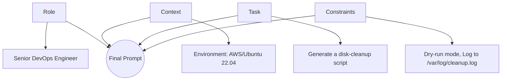

Prompt Engineering is the practice of crafting effective inputs (prompts) to get the most accurate and useful output from an AI model. For DevOps, this means faster script generation, cleaner documentation, and quicker troubleshooting.

---

## 1. The Anatomy of a Great Prompt

A "Good" prompt gives the AI enough context and structure to succeed. Use the **RTC (Role-Task-Constraint)** framework.

### The RTC Framework
- **Role**: Tell the AI who it is (e.g., "You are a Senior SRE").
- **Task**: Describe exactly what needs to be done.
- **Constraint**: Define limits (e.g., "Use Bash 4.0+", "No external dependencies").

### Prompt Structure

---

## 2. Practical Example: Script Generation
**Poor Prompt:** "Write a script to delete old logs."
*Result: Might delete everything, uses wrong path, no safety checks.*

**Better Prompt:**
> "You are a Linux SysAdmin. Write a Bash script for Ubuntu that finds and deletes `.log` files in `/var/log/myapp/` that are older than 7 days. 
> **Constraints**: 
> - First, perform a dry-run and print the filenames to be deleted.
> - Add a `--force` flag to actually perform the deletion.
> - Include comments explaining each line."

---

## 3. Interview Questions (Beginner)

1. **What is 'Zero-Shot' prompting?**
   - Giving a task to the AI without any examples of how to do it.
2. **Why is 'Context' important in DevOps prompts?**
   - Because commands vary by OS (Ubuntu vs. RHEL), cloud provider (AWS vs. Azure), and version (Python 2 vs. 3).
3. **What happens if you don't provide constraints?**
   - The AI might suggest insecure practices, deprecated commands, or tools not installed in your environment.

---

## 4. Knowledge Quiz

1. **What does RTC stand for in prompt engineering?**
   - A) Run-Time Command
   - B) Role-Task-Constraint
   - C) Real-Time Context
   - D) Remote-Task-Control

2. **Which part of the prompt defines the 'Persona'?**
   - A) Constraint
   - B) Task
   - C) Role
   - D) Example

3. **True/False: AI models always suggest the most secure code by default.**
   - Answer: **False**. You must explicitly constrain it to use security best practices.

---

## Next Steps
Proceed to the **[Intermediate Level](../../2-Intermediate/12-Prompt-Engineering/README.md)** to learn Chain-of-Thought and Runbook automation.

