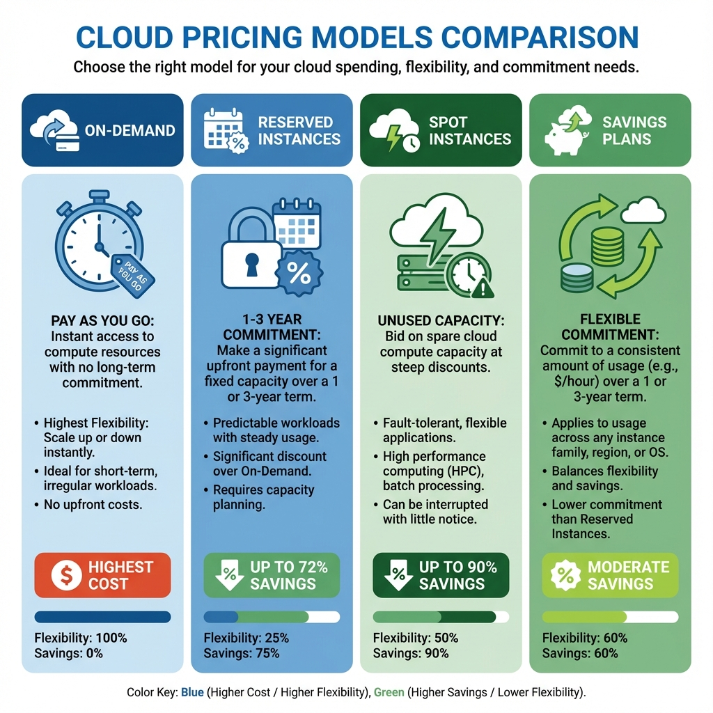
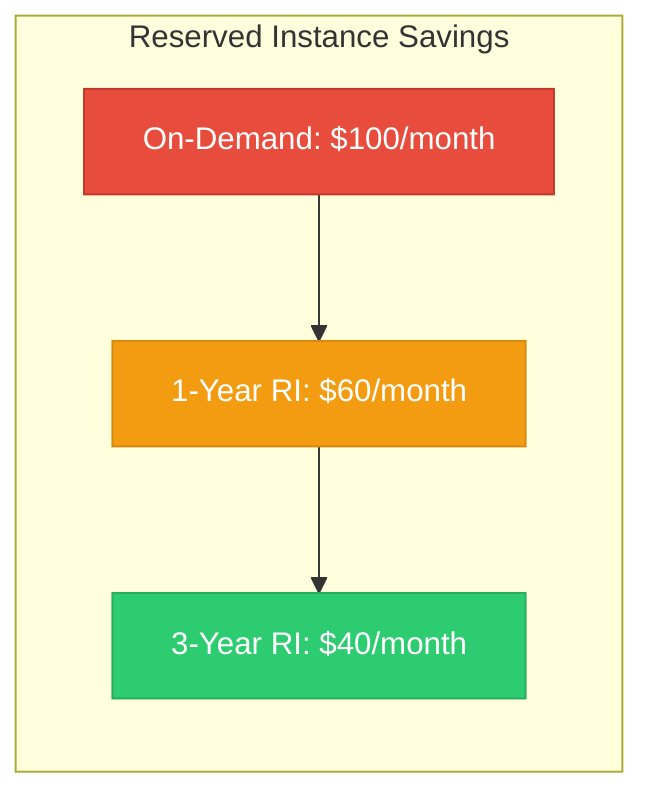
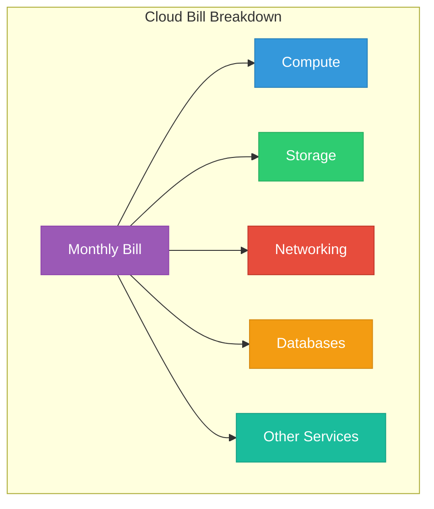
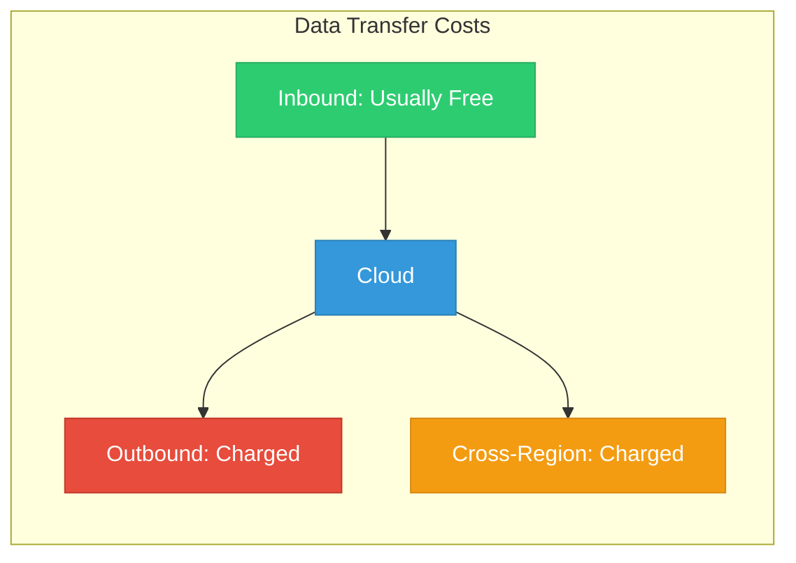

# Lesson 02: Cloud Billing Basics

## Learning Objectives

By the end of this lesson, you will:
- Understand how cloud providers charge for services
- Know the different pricing models available
- Read and interpret a cloud bill
- Identify common cost drivers

---

## How Cloud Pricing Works

Unlike traditional IT where you buy hardware upfront, cloud computing uses a **pay-as-you-go** model. You're billed based on:

- **Usage** - How much you use
- **Duration** - How long you use it
- **Location** - Which region you deploy in

---

## Cloud Pricing Models

### 1. On-Demand Pricing

Pay for resources by the hour or second with no long-term commitment.

| Pros | Cons |
|------|------|
| ✅ Maximum flexibility | ❌ Highest cost |
| ✅ No upfront payment | ❌ Unpredictable bills |
| ✅ Scale up/down instantly | ❌ No discount |

**Best For:** Variable workloads, testing, short-term projects

### 2. Reserved Instances / Savings Plans

Commit to using resources for 1-3 years at a discounted rate.

| Commitment | AWS Savings | Azure Savings | GCP Savings |
|------------|-------------|---------------|-------------|
| 1 Year | Up to 40% | Up to 40% | N/A |
| 3 Year | Up to 72% | Up to 72% | Up to 57% |

### 3. Spot / Preemptible Instances

Use spare cloud capacity at steep discounts (up to 90% off).

| Provider | Name | Max Savings |
|----------|------|-------------|
| AWS | Spot Instances | Up to 90% |
| Azure | Spot VMs | Up to 90% |
| GCP | Preemptible VMs | Up to 80% |

> ⚠️ **Warning**: Spot instances can be terminated with little notice. Only use for fault-tolerant workloads.

### 4. Committed Use Discounts (GCP)

GCP's alternative to reserved instances with flexible commitment options.

---

## Understanding Your Cloud Bill

### Bill Components

### Common Cost Categories

| Category | Examples | Typical % of Bill |
|----------|----------|-------------------|
| **Compute** | VMs, containers, serverless | 40-60% |
| **Storage** | Object storage, block storage | 15-25% |
| **Networking** | Data transfer, load balancers | 10-20% |
| **Databases** | RDS, DynamoDB, Cloud SQL | 10-15% |
| **Other** | DNS, monitoring, security | 5-10% |

---

## Cost Drivers by Service

### Compute Costs

| Factor | Impact |
|--------|--------|
| Instance type/size | Larger = more expensive |
| Running hours | 24/7 vs. scheduled |
| Region | Some regions cost more |
| Operating system | Windows costs more than Linux |

### Storage Costs

| Factor | Impact |
|--------|--------|
| Storage class | Hot > Warm > Cold |
| Data volume | More GB = more cost |
| IOPS | High performance = premium |
| Snapshots | Accumulate over time |

### Networking Costs

| Type | AWS | Azure | GCP |
|------|-----|-------|-----|
| Inbound | Free | Free | Free |
| Outbound (first 100GB) | Free | Free | Free |
| Outbound (after free tier) | $0.09/GB | $0.087/GB | $0.12/GB |
| Cross-region | $0.02/GB | $0.02/GB | $0.01/GB |

---

## Reading Your Bill: Step by Step

### Step 1: Access Your Billing Console

| Provider | Location |
|----------|----------|
| AWS | Console → Billing Dashboard |
| Azure | Portal → Cost Management + Billing |
| GCP | Console → Billing |

### Step 2: Review Summary

Look at:
- Total spend this month
- Comparison to previous month
- Forecasted end-of-month spend

### Step 3: Analyze by Service

Identify:
- Top spending services
- Unexpected charges
- Services with unusual growth

### Step 4: Check by Region

Some regions are more expensive:
| Region Type | Cost Level |
|-------------|------------|
| US East/West | Standard |
| Europe | +10-20% |
| Asia Pacific | +15-25% |
| South America | +25-40% |

---

## Common Billing Surprises

| Surprise | Cause | Prevention |
|----------|-------|------------|
| Unused EBS volumes | Deleted instance, kept storage | Regular cleanup |
| Idle load balancers | Charged even without traffic | Remove unused LBs |
| Snapshot accumulation | Old snapshots not deleted | Lifecycle policies |
| Data transfer out | Underestimated egress | Monitor transfer |
| NAT Gateway charges | High data volume | Optimize architecture |

---

## Free Tier Limits

Most cloud providers offer free tiers with limits:

### AWS Free Tier (12 months)
| Service | Free Limit |
|---------|------------|
| EC2 | 750 hours/month t2.micro |
| S3 | 5GB storage |
| RDS | 750 hours/month db.t2.micro |
| Lambda | 1M requests/month |

### Azure Free Tier
| Service | Free Limit |
|---------|------------|
| VMs | 750 hours B1S |
| Blob Storage | 5GB |
| SQL Database | 250GB |
| Functions | 1M requests/month |

### GCP Free Tier
| Service | Free Limit |
|---------|------------|
| Compute Engine | 1 e2-micro (US regions) |
| Cloud Storage | 5GB |
| BigQuery | 1TB queries/month |
| Cloud Functions | 2M invocations/month |

---

## Hands-On Exercise

1. **Log into your cloud provider's billing console**

2. **Answer these questions:**
   - What's your total spend this month?
   - What's your top spending service?
   - Are there any services you don't recognize?

3. **Find your detailed usage:**
   - Identify the instance types you're using
   - Check your data transfer costs

---

## Key Takeaways

- ✅ Cloud billing is based on usage, duration, and location
- ✅ Multiple pricing models exist: On-Demand, Reserved, Spot
- ✅ Compute and storage typically drive most costs
- ✅ Data transfer out (egress) is often underestimated
- ✅ Always monitor free tier limits

---

## Next Lesson

Continue to **[Lesson 03: Cost Visibility](../03-Cost-Visibility/README.md)** to learn how to gain visibility into your cloud spending.
