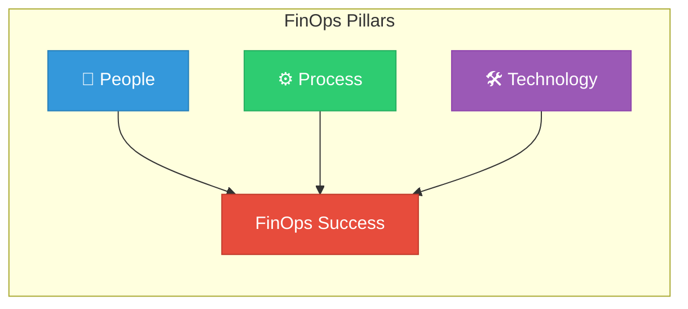
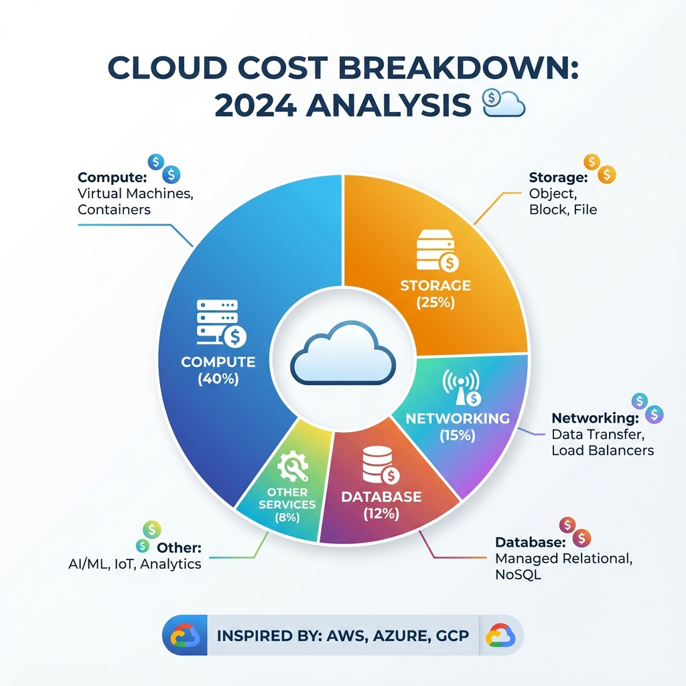
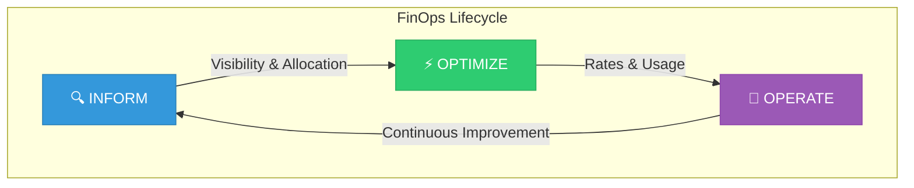

# FinOps - Beginner Level

## Welcome to FinOps Fundamentals

FinOps (Cloud Financial Operations) is the practice of bringing financial accountability to cloud spending. This beginner guide will teach you the foundational concepts needed to understand and manage cloud costs effectively.

---

## Learning Path Overview

| Lesson | Topic | Duration |
|--------|-------|----------|
| 01 | [Introduction to FinOps](Introduction%20to%20FinOps.md) | 45 min |
| 02 | [Cloud Billing Basics](Lesson%2002-Cloud%20Billing%20Basics.md) | 60 min |
| 03 | [Cost Visibility](Lesson%2003-Cost%20Visibility.md) | 45 min |
| 04 | [Budgeting Basics](Lesson%2004-Budgeting%20Basics.md) | 45 min |

---

## What is FinOps?

FinOps is a cultural practice that brings financial accountability to the variable spend model of cloud computing. It's about enabling distributed teams to make business trade-offs between speed, cost, and quality.

### The Three Pillars of FinOps

| Pillar | Description |
|--------|-------------|
| **People** | Cross-functional teams including Finance, Engineering, and Business |
| **Process** | Standardized workflows for cost management and optimization |
| **Technology** | Tools for visibility, allocation, and automation |

---

## Why FinOps Matters

### The Cloud Spending Problem

| Challenge | Impact |
|-----------|--------|
| **Unpredictable Costs** | Budget overruns and surprise bills |
| **Lack of Visibility** | Teams don't know what they're spending |
| **No Accountability** | No one owns the cloud bill |
| **Waste** | 30-35% of cloud spend is typically wasted |

### FinOps Benefits

- ✅ **Cost Visibility**: See where every dollar goes
- ✅ **Accountability**: Teams own their spend
- ✅ **Optimization**: Reduce waste by 20-30%
- ✅ **Predictability**: Accurate forecasting
- ✅ **Business Alignment**: Tech spending tied to business value

---

## FinOps Lifecycle

The FinOps journey follows a continuous cycle:

| Phase | Activities | Outcomes |
|-------|------------|----------|
| **Inform** | Visibility, allocation, benchmarking | Understanding costs |
| **Optimize** | Right-sizing, reserved instances, waste elimination | Reduced spending |
| **Operate** | Governance, automation, continuous improvement | Sustained savings |

---

## Key Terminology

| Term | Definition |
|------|------------|
| **Cloud Spend** | Total cost of cloud resources and services |
| **Cost Allocation** | Assigning costs to teams, projects, or applications |
| **Tagging** | Labeling resources for tracking and organization |
| **Right-sizing** | Matching resource capacity to actual needs |
| **Reserved Instances** | Pre-committed capacity at discounted rates |
| **Showback** | Showing teams their costs (informational) |
| **Chargeback** | Billing teams for their actual usage |

---

## FinOps Tools for Beginners

### Cloud Provider Native Tools

| Provider | Tool | Purpose |
|----------|------|---------|
| **AWS** | Cost Explorer | Visualize and analyze AWS costs |
| **AWS** | Budgets | Set cost and usage budgets with alerts |
| **Azure** | Cost Management | Azure cost analysis and optimization |
| **GCP** | Cloud Billing | Google Cloud cost management |

### Third-Party Tools

| Tool | Description | Best For |
|------|-------------|----------|
| **CloudHealth** | Multi-cloud cost management | Enterprise |
| **Spot.io** | Cost optimization automation | Compute savings |
| **Kubecost** | Kubernetes cost monitoring | K8s environments |
| **Infracost** | Infrastructure cost estimation | IaC workflows |

---

## Prerequisites

Before diving into the lessons, ensure you have:

- [ ] Basic understanding of cloud computing concepts
- [ ] Access to a cloud provider account (AWS, Azure, or GCP)
- [ ] Familiarity with basic financial terms (budget, cost, expense)

---

## 🏆 Related Certifications

- **FinOps Certified Practitioner**: Validates your knowledge of the FinOps deployment, framework, and terminology.

---

## Next Steps

Start with **[Lesson 01: Introduction to FinOps](Introduction%20to%20FinOps.md)** to begin your FinOps journey!

After completing the Beginner level, proceed to:
- 📘 [Intermediate FinOps](../../2-Intermediate/14-FinOps/README.md) - Cost optimization strategies
- 📕 [Advanced FinOps](../../3-Advanced/12-FinOps/README.md) - Enterprise FinOps frameworks
