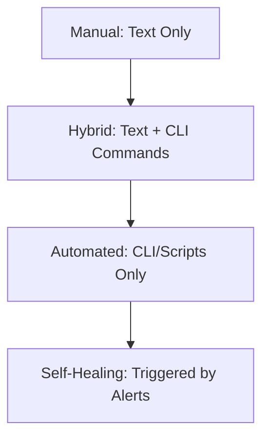

# Manual vs. Automated Runbooks

The evolution of a runbook follows a path from human scribbles to machine intelligence.

## 1. Manual Runbooks (Static)
- **Form**: Markdown files, Wiki pages, PDFs.
- **Execution**: 100% Human.
- **Best For**: Complex, one-off migrations or physical hardware tasks.
- **Risk**: They get outdated quickly ("Documentation Rot").

## 2. Hybrid Runbooks (Semi-Automated)
- **Form**: Human instructions mixed with code snippets.
- **Execution**: Human reads, Human copy-pastes/runs commands.
- **Best For**: Regular maintenance tasks where human judgment is required (e.g., checking if it's safe to drain traffic).

## 3. Automated Runbooks (Executable)
- **Form**: Scripted workflows, Jupyter Notebooks.
- **Execution**: Machine-led, human-supervised.
- **Best For**: Routine, low-risk fixes like log rotation or server restarts.

## The Automation Curve

---

## 🏗️ Real-Life Scenario: The "Nightmare" Update
**Problem**: An engineer follows a 2-year-old manual runbook to update a database schema.
**Event**: Step 4 says "Run `rm -rf /cache/*`." The cache directory structure was changed in the last version of the app. The command accidentally deletes the database config files instead.
**Outcome**: A 4-hour outage.
**Lesson**: Manual runbooks must be tested like code. A better approach would be a **Hybrid** runbook with an idempotent script that checks the path before deleting.

---

## ❓ Interview Questions
1.  **What is 'Documentation Rot' and how do you prevent it?**
    *   *Answer*: Rot happens when the system changes but the doc doesn't. Prevent it by making documentation updates a mandatory part of every Pull Request and conducting regular "Gameday" tests.
2.  **When is an 'Automated' runbook a bad idea?**
    *   *Answer*: For extremely high-risk, irreversible operations (like deleting all backups) or situations requiring complex business judgment that a machine can't replicate.

---

## 🧠 Quiz Snippet (5/50+)
1.  **Which type of runbook is most prone to 'Rot'?** (Manual)
2.  **True/False: All runbooks should be fully automated.** (False - some require human judgment)
3.  **What is a 'Self-Healing' system?** (A system where an automated runbook is triggered directly by an alarm without human input)
4.  **Is a Markdown file with code snippets considered Hybrid?** (Yes)
5.  **What is 'Idempotency' in automation?** (Making sure running the script twice has the same effect as running it once)
