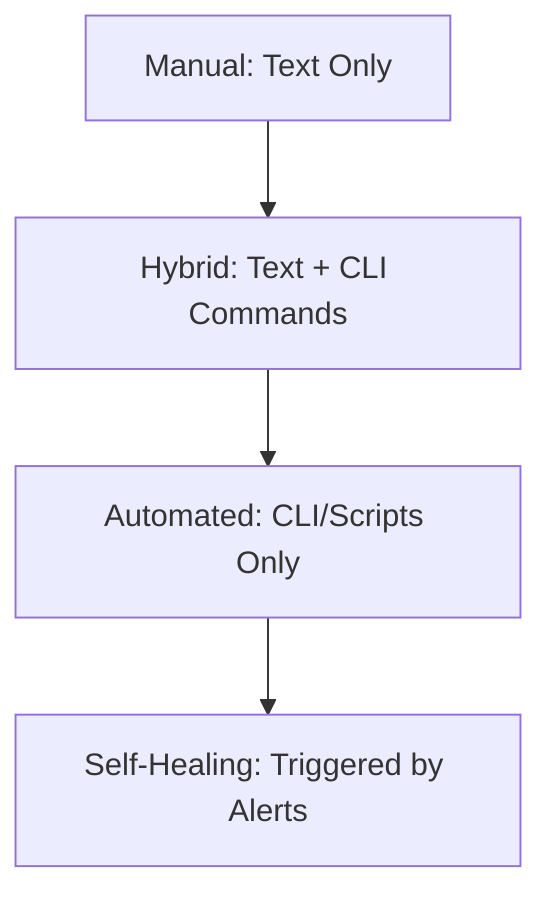
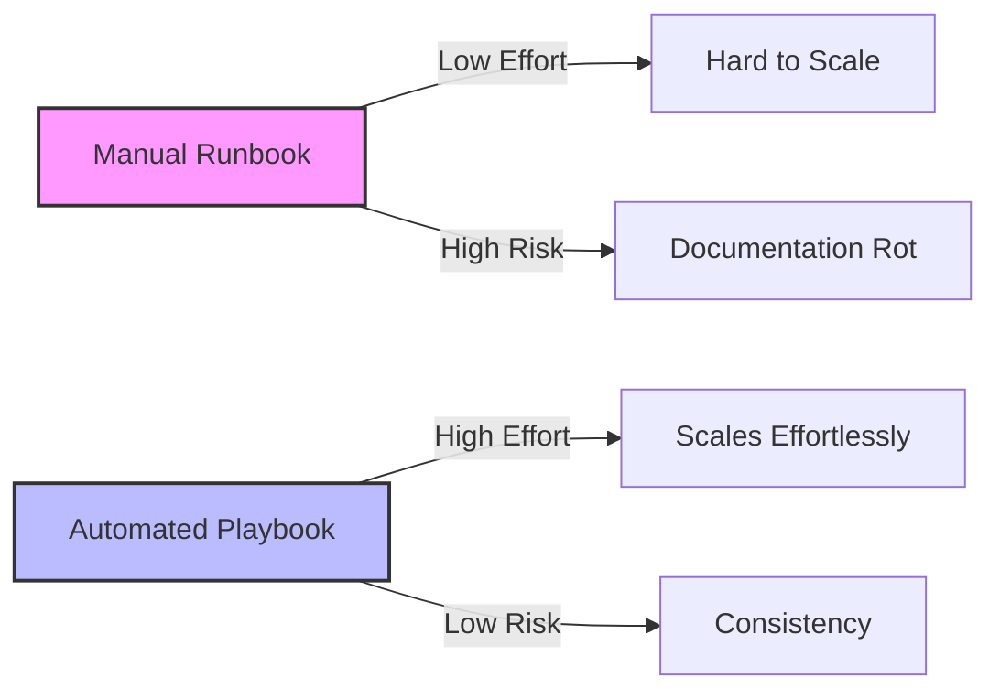

# Manual vs. Automated Runbooks

The evolution of a runbook follows a path from human scribbles to machine intelligence.

## 1. Manual Runbooks (Static)
- **Form**: Markdown files, Wiki pages, PDFs.
- **Execution**: 100% Human.
- **Best For**: Complex, one-off migrations or physical hardware tasks.
- **Risk**: They get outdated quickly ("Documentation Rot").

## 2. Hybrid Runbooks (Semi-Automated)
- **Form**: Human instructions mixed with code snippets.
- **Execution**: Human reads, Human copy-pastes/runs commands.
- **Best For**: Regular maintenance tasks where human judgment is required (e.g., checking if it's safe to drain traffic).

## 3. Automated Runbooks (Executable)
- **Form**: Scripted workflows, Jupyter Notebooks.
- **Execution**: Machine-led, human-supervised.
- **Best For**: Routine, low-risk fixes like log rotation or server restarts.

## The Automation Curve

---

## The Automation Trade-off

---

## 🏗️ Real-Life Scenarios

### Scenario 1: The "Nightmare" Update
**Problem**: An engineer follows a 2-year-old manual runbook to update a database schema.
**Event**: Step 4 says "Run `rm -rf /cache/*`." The cache directory structure was changed in the last version of the app. The command accidentally deletes the database config files instead.
**Outcome**: A 4-hour outage.
**Lesson**: Manual runbooks must be tested like code. A better approach would be a **Hybrid** runbook with an idempotent script that checks the path before deleting.

### Scenario 2: The "Safe-Fail" Traffic Drain
**Problem**: An organization automated their regional traffic failover (Auto-Remediation). One night, a false positive alarm triggered the automation, which drained traffic from the only healthy region, causing a global outage.
**Solution**: Move back to a **Hybrid** approach for high-impact regional changes. The automation prepares the failover, but a human must click "Confirm" after reviewing a health dashboard.
**Result**: No more false-positive outages. Human judgment provides the safety catch that the script lacked.

### Scenario 3: The Log Rotation Success
**Problem**: DevOps engineers were spending 5 hours a week manually clearing logs on legacy servers that didn't have logrotate configured correctly.
**Solution**: Deploy an **Automated Runbook** (Cron job script). The script checks disk usage and compresses logs older than 7 days.
**Result**: 20 hours a month saved. Since this is a low-risk, repetitive task, it was a perfect candidate for full automation.

---

## ❓ Interview Questions

1.  **What is 'Documentation Rot' and how do you prevent it in manual runbooks?**
    - *Answer*: Rot occurs when the system evolves but the documentation isn't updated. Prevent it by making doc updates part of the Definition of Done (DoD) for PRs and holding regular "Gameday" simulations to test the docs.
2.  **When is an 'Automated' runbook a bad idea?**
    - *Answer*: For extremely high-risk, irreversible operations (like deleting all backups) or situations requiring complex human empathy or business judgment that code cannot replicate.
3.  **What is Idempotency and why is it critical for automated runbooks?**
    - *Answer*: Idempotency means that running a script multiple times has the same outcome as running it once. It's critical because scripts often fail midway and need to be retried without causing side effects.
4.  **Describe a 'Self-Healing' infrastructure.**
    - *Answer*: It's a system where monitoring tools (like Prometheus) detect an issue and automatically trigger a Playbook (like a Lambda function or Ansible job) to fix the issue without human intervention.
5.  **What are the main costs associated with fully automated runbooks?**
    - *Answer*: High initial development time, continuous maintenance of scripts as APIs change, and the risk of automated "wide-scale" mistakes if the logic is flawed.
6.  **Why do 'Hybrid' runbooks often provide the best ROI?**
    - *Answer*: They balance the speed and accuracy of machines with the judgment and error-handling capabilities of humans, making them stable and easier to maintain than full automation.

---

## 🧠 Comprehensive Quiz (25 Questions)

**1. Which type of runbook is most prone to 'Documentation Rot'?**
- A) Automated
- B) Hybrid
- C) Manual
- D) Self-Healing

Show Answer

**Answer: C** - Because manual text is often forgotten during code updates.

**2. True/False: Every operational task in a company should be 100% automated.**
- A) True
- B) False

Show Answer

**Answer: B** - High-risk or rare tasks often benefit from human oversight or are too expensive to automate.

**3. What is the fundamental requirement for 'Self-Healing' systems?**
- A) A fast internet connection
- B) Automated monitoring alerts tied to executable scripts
- C) many junior engineers
- D) A physical handbook

Show Answer

**Answer: B**

**4. A Markdown file containing 'bash' commands to copy-paste is considered:**
- A) Fully Automated
- B) Manual
- C) Hybrid
- D) Legacy

Show Answer

**Answer: C**

**5. Which of these is an example of 'Idempotency'?**
- A) A script that deletes a file only if it exists
- B) A script that adds the same line to a file every time it runs
- C) A script that changes its behavior based on the date
- D) A script that runs only at night

Show Answer

**Answer: A**

**6. What is 'Documentation as Code'?**
- A) Writing your docs in Word and saving as PDF
- B) Managing documentation in Git alongside your application code
- C) Writing docs in the middle of Python files
- D) Not writing docs at all

Show Answer

**Answer: B**

**7. Why is 'Human Judgment' still valuable in troubleshooting?**
- A) Humans are faster than machines
- B) Humans can recognize patterns and edge cases that automation logic might miss
- C) Humans don't need coffee
- D) Machines don't have screens

Show Answer

**Answer: B**

**8. Which task is the BEST candidate for full automation?**
- A) Deleting a production database
- B) Renaming 1,000 log files every Sunday at midnight
- C) Negotiating with a vendor
- D) Designing a new architecture

Show Answer

**Answer: B** - Low risk, high frequency, repetitive.

**9. What is a 'Gameday' in SRE?**
- A) A sports event
- B) A planned simulation of a system failure to test our runbooks and team response
- C) A day off
- D) A meeting about cost

Show Answer

**Answer: B**

**10. "Copy-Paste" errors are most common in which runbook type?**
- A) Automated
- B) Hybrid
- C) Native
- D) Virtual

Show Answer

**Answer: B** - Relying on humans to select and paste the correct snippets.

**11. What does 'MTTR' benefit most from?**
- A) More meetings
- B) Moving from Manual to Automated/Hybrid runbooks
- C) Writing long emails
- D) Using older hardware

Show Answer

**Answer: B**

**12. A Jupyter Notebook used for troubleshooting is an example of:**
- A) Manual documentation
- B) An interactive, executable (Hybrid/Auto) runbook
- C) A static PDF
- D) An operating system

Show Answer

**Answer: B**

**13. What is 'Fragility' in automation?**
- A) The script being too long
- B) The script breaking as soon as the environment or API changes slightly
- C) The script being written in Python
- D) The script having too many comments

Show Answer

**Answer: B**

**14. Automated runbooks should always include:**
- A) Jokes
- B) Error handling and logging
- C) The CEO's email
- D) Personal notes

Show Answer

**Answer: B**

**15. 'Manual Gates' are often added to automation for:**
- A) Making it slower
- B) Safety and compliance approvals for high-impact changes
- C) Charging more money
- D) reducing the number of users

Show Answer

**Answer: B**

**16. Which tool can help 'Automate' a runbook task on a server?**
- A) Ansible
- B) Notepad
- C) Chrome
- D) Excel

Show Answer

**Answer: A**

**17. 'Stale' documentation refers to:**
- A) Old food
- B) Outdated information that no longer works with the current system
- C) Documentation without images
- D) Documentation in a foreign language

Show Answer

**Answer: B**

**18. Why do 'One-off' tasks usually stay manual?**
- A) To save time
- B) The cost to automate them exceeds the time saved by doing them once
- C) Automation is too fast
- D) manual is better

Show Answer

**Answer: B**

**19. What is 'Orchestration'?**
- A) Playing music
- B) Managing multiple automated tasks across many servers in a specific order
- C) Typing fast
- D) Deleting code

Show Answer

**Answer: B**

**20. A 'Drift' in documentation occurs when:**
- A) The paper moves
- B) The system changes but the document remains the same
- C) The link is broken
- D) The server is renamed

Show Answer

**Answer: B**

**21. "Standardization" is a prerequisite for:**
- A) Manual work
- B) Successful Automation
- C) Hiring people
- D) Billing

Show Answer

**Answer: B**

**22. Which language is considered standard for many DevOps automation scripts?**
- A) Python / Bash
- B) HTML
- C) CSS
- D) SQL

Show Answer

**Answer: A**

**23. What is a 'Dry Run'?**
- A) Running the script in the desert
- B) Testing the automation logic without actually making changes to the system
- C) Drinking no water
- D) deleting only empty files

Show Answer

**Answer: B**

**24. The 'Bus Factor' is improved by:**
- A) Having fewer people
- B) Moving tribal knowledge into Runbooks (Manual or Auto)
- C) buying a bus
- D) using public transport

Show Answer

**Answer: B**

**25. Automation reduces 'Burnout' by:**
- A) Handling boring, repetitive tasks so humans can focus on interesting problems
- B) Doing all the work
- C) Turning off the computer
- D) Automating the email responses

Show Answer

**Answer: A**

