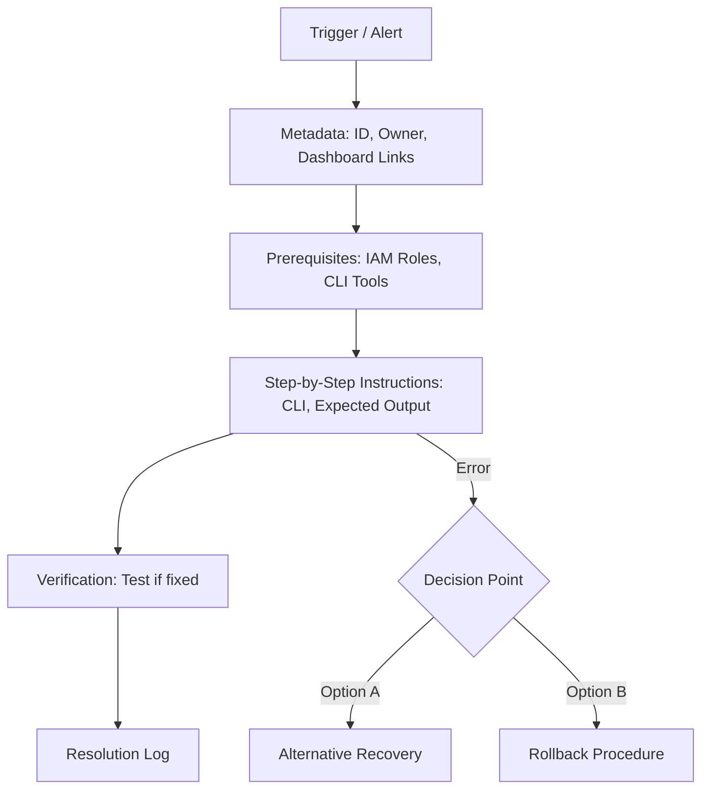

# Runbook Anatomy

A professional runbook isn't just a list of steps. It's a structured document designed for speed and safety.

## Required Sections

### 1. Metadata
- **Title**: Clear and searchable (e.g., `RB-NET-01: VPC Peering Failure`).
- **Owner**: The team responsible for maintaining it.
- **Version**: Last updated date.
- **Context**: Link to the specific Dashboard or Alert that triggers this runbook.

### 2. Prerequisites
- **Permissions**: What access do I need? (e.g., `Administrator` or `ReadOnly`).
- **Tools**: What software do I need? (e.g., `aws-cli`, `kubectl`).

### 3. Step-by-Step Instructions
- **Clear Commands**: Use copy-pasteable blocks.
- **Expected Output**: Tell the user what they *should* see after each step.
- **Decision Points**: "If you see Error A, go to Step 10. If you see Success, go to Step 5."

### 4. Verification & Rollback
- **How to verify**: How do I know it's fixed?
- **Rollback**: If this makes things worse, how do I undo it?

---

## The Standard Anatomy

---

## 🏗️ Real-Life Scenarios

### Scenario 1: The "No Escape" Runbook
**Problem**: An engineer follows a runbook to restart a Kubernetes deployment. In the middle of the process, the cluster starts crashing harder.
**Crisis**: The engineer looks for the "Undo" section of the runbook. It's empty. They panic and start randomly deleting pods.
**Recovery**: A senior engineer joins and has to manually restore from a backup.
**Fix**: Update the **Runbook Template**. Every runbook MUST have a "Rollback Procedure" section or it will be rejected in code review.

### Scenario 2: The "Blind" Command execution
**Problem**: A runbook instructed an engineer to run `kubectl apply -f manifest.yaml`. The command appeared to work, so the engineer closed the ticket. However, the pods were stuck in `ImagePullBackOff`.
**Solution**: Add an **Expected Output** block to the runbook: "After running the apply, run `kubectl get pods`. Verify status is `Running`. If status is anything else, do NOT close the ticket; proceed to Section 5: Troubleshooting Image Pulls."
**Result**: Subsequent engineers verified the *result*, not just the *command*, preventing silent failures.

### Scenario 3: The "ID Mystery"
**Problem**: A runbook for "Resizing EBS Volumes" didn't clarify which AWS account to use. An engineer resized a volume in the *Production* account instead of the *Staging* account as intended.
**Solution**: Improve the **Metadata** and **Prerequisites** sections. Require a "Service Context" variable at the top of the runbook that explicitly lists the AWS Account ID and Region.
**Result**: The explicit context check prevented engineers from running commands in the wrong environment.

---

## ❓ Interview Questions

1.  **Why is it important to include 'Expected Output' in a runbook?**
    - *Answer*: It prevents "Blind Execution." If the actual output differs from the "Expected Output," the engineer knows to stop and reassess rather than continuing and potentially worsening the incident.
2.  **What is 'Metadata' in a runbook and why does an SRE care?**
    - *Answer*: Metadata includes ownership, last updated date, and links to monitoring dashboards. It helps SREs find accountable teams and provides the data context needed to solve the problem.
3.  **Explain the role of a 'Rollback Procedure' in an operational document.**
    - *Answer*: It provides a safety net. If the primary fix fails or causes side effects, the rollback provides a pre-validated way to return the system to its previous (even if degraded) state.
4.  **What types of 'Prerequisites' should every technical runbook list?**
    - *Answer*: Required permissions (IAM/RBAC), specific CLI tools and versions, environment variables, and connectivity requirements (VPN/Access).
5.  **How do 'Decision Points' improve runbook quality?**
    - *Answer*: They account for internal system variables. Instead of a linear path that might fail, decision points provide "If/Then/Else" logic that handles common error codes or environmental differences.
6.  **Why is a 'Verification' step mandatory at the end of a runbook?**
    - *Answer*: Because a "Successful Command" does not always mean a "Fixed System." Verification checks the actual business metrics (e.g., HTTP 200s, Latency) to prove resolution.

---

## 🧠 Comprehensive Quiz (25 Questions)

**1. Which section identifies the team responsible for a runbook?**
- A) Prerequisites
- B) Metadata
- C) Rollback
- D) Introduction

Show Answer

**Answer: B**

**2. True/False: You should use screenshots for every step in a runbook.**
- A) True
- B) False

Show Answer

**Answer: B** - Screenshots become outdated (rot) quickly. Text-based expected output is more durable.

**3. What is the purpose of the 'Prerequisites' section?**
- A) To tell a story
- B) To list IAM permissions, required tools, and environment access
- C) To list the history of the system
- D) To show the cost

Show Answer

**Answer: B**

**4. A 'Decision Point' in a runbook is best represented as:**
- A) A single command
- B) An "If/Then" logic block based on output observation
- C) A link to a blog
- D) A meeting invite

Show Answer

**Answer: B**

**5. Which section provides instructions on how to return to a safe state if the fix fails?**
- A) Metadata
- B) Verification
- C) Rollback
- D) Header

Show Answer

**Answer: C**

**6. 'Expected Output' helps prevent what common error?**
- A) Typing too slow
- B) Blindly continuing a broken or failing process
- C) Saving too much data
- D) Closing the laptop

Show Answer

**Answer: B**

**7. Why is a 'Runbook ID' (e.g., RB-NET-01) useful?**
- A) It looks cool
- B) It allows for easy search and cross-referencing in alerts and tickets
- C) It's required by law
- D) It's for the database

Show Answer

**Answer: B**

**8. The 'Verification' step should ideally check:**
- A) Only the command exit code
- B) Actual end-user metrics or system health indicators
- C) The teammate's opinion
- D) The clock

Show Answer

**Answer: B**

**9. What should an engineer do if the output of a command does NOT match the 'Expected Output'?**
- A) Run it again 10 times
- B) Stop immediately and escalate or follow the error branch
- C) Ignore it and continue
- D) Delete the runbook

Show Answer

**Answer: B**

**10. Which of these belongs in 'Metadata'?**
- A) The raw password
- B) Date last updated and Dashboard Links
- C) The entire source code
- D) A list of all employees

Show Answer

**Answer: B**

**11. Is 'Fix the database' a good runbook step?**
- A) Yes
- B) No - it is not actionable or specific
- C) Only for senior devs
- D) If it's 3 AM

Show Answer

**Answer: B**

**12. Prerequisites should be checked:**
- A) At the end
- B) Before starting any technical steps
- C) Only if there is an error
- D) By the manager

Show Answer

**Answer: B**

**13. A 'Clean Up' section at the end is used for:**
- A) Deleting the documentation
- B) Removing temporary debug files, logs, or credentials used during the fix
- C) hiring a janitor
- D) formatting the text

Show Answer

**Answer: B**

**14. True/False: A Rollback procedure can be as simple as "Abort and Restore from Backup X".**
- A) True
- B) False

Show Answer

**Answer: A**

**15. 'Actionable' language uses:**
- A) Passive voice ("The server may be restarted")
- B) Imperative verbs ("Restart the server using command X")
- C) Long paragraphs
- D) Future tense

Show Answer

**Answer: B**

**16. 'Copy-Pasteable' code blocks should avoid:**
- A) Syntax highlighting
- B) Hardcoded unique IDs (like `i-12345678`) that change per incident
- C) Newlines
- D) Comments

Show Answer

**Answer: B** - Use variables like `<INSTANCE_ID>` instead.

**17. What is 'Contextual Linking'?**
- A) Linking to a random website
- B) Linking from an alert directly to the relevant section of the runbook
- C) Linking to a Slack channel
- D) Linking to a PDF

Show Answer

**Answer: B**

**18. Why include a 'Troubleshooting' section within a runbook?**
- A) To make it longer
- B) To handle common "What if this command fails" scenarios
- C) To list all possible Linux commands
- D) To host a FAQ

Show Answer

**Answer: B**

**19. Prerequisites for a Cloud runbook often include:**
- A) A specific VPN connection
- B) A physical key
- C) A phone call
- D) A cup of coffee

Show Answer

**Answer: A**

**20. A 'Post-Resolution' section often asks the engineer to:**
- A) Delete the runbook
- B) Update the Jira ticket and notify stakeholders
- C) Go on vacation
- D) Change their password

Show Answer

**Answer: B**

**21. "Idempotent Steps" in a runbook allow:**
- A) Running the same step twice without breaking the system
- B) Running steps in reverse order
- C) running steps faster
- D) skipping steps

Show Answer

**Answer: A**

**22. Which section is most important for 'Audit' trails?**
- A) Prerequisites
- B) Resolution Log / Verification
- C) Table of Contents
- D) Footer

Show Answer

**Answer: B**

**23. 'Dry Run' instructions should be listed:**
- A) Only in the header
- B) Within the steps, if the command supports it (e.g., `-dry-run`)
- C) At the very end
- D) verbally

Show Answer

**Answer: B**

**24. A good runbook title should start with:**
- A) The developer's name
- B) The failure symptom or resource name (e.g., "High CPU - WebApp")
- C) A random number
- D) "Please help"

Show Answer

**Answer: B**

**25. The ultimate 'Anatomy' of a runbook favors:**
- A) Completeness over clarity
- B) Actionable speed and operational safety
- C) Many images
- D) Long explanations

Show Answer

**Answer: B**

