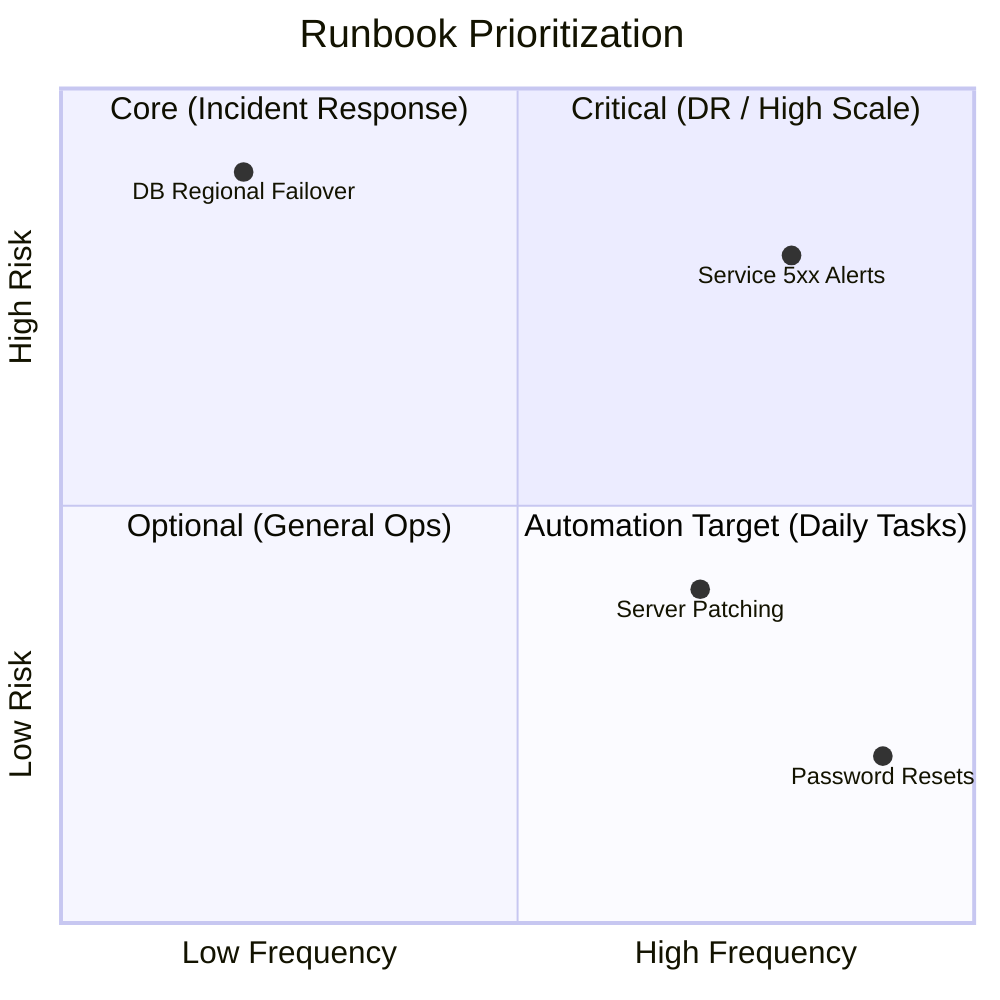

# Operational Scenarios

When do you actually open a runbook? Identifying the right scenarios prevents documentation bloat.

## 1. Incident Response (The "Firefighter" Runbooks)
- **Trigger**: P0/P1 High-priority alerts.
- **Focus**: Speed to recovery.
- **Example**: `Service 5xx Error Spike`, `Memory Leak in Worker-Node`.

## 2. Service Requests (The "Service Desk" Runbooks)
- **Trigger**: Internal tickets from other teams.
- **Focus**: Accuracy and standardized outcomes.
- **Example**: `Provision a new developer sandbox`, `Rotate SSL certificates`.

## 3. Disaster Recovery (The "Lifeboat" Runbooks)
- **Trigger**: Total region outage, large-scale data loss.
- **Focus**: Massive scale orchestration.
- **Example**: `Failover from US-East-1 to US-West-2`.

## 4. Routine Maintenance (The "Health" Runbooks)
- **Trigger**: Scheduled calendar events.
- **Focus**: Preventing future incidents.
- **Example**: `Monthly patch of Linux kernels`, `Database vacuuming`.

---

## The Scenario Matrix (Frequency vs. Risk)

---

## 🏗️ Real-Life Scenarios

### Scenario 1: The Alert Storm
**Problem**: An SRE team receives 50 alerts in 10 minutes. They have 2,000 runbooks.
**The Struggle**: They can't find which runbook corresponds to the specific alert "DiskPressure-NodeA."
**The Fix**: Tag-based mapping. Every Alert in Prometheus now has a link in its description to the exact Runbook URL in GitHub.
**Outcome**: Engineer clicks the alert -> Runbook opens instantly -> Resolution starts in seconds.

### Scenario 2: The "Hidden" Disaster Recovery
**Problem**: A company had a Disaster Recovery (DR) plan in a PDF on a manager's laptop. When the primary data center flooded, the manager was offline, and no one else knew how to trigger the failover.
**Solution**: Move DR scenarios into **Git-based Runbooks** that are shared with the entire engineering team. Conduct quarterly **Gamedays** where the team practices the scenario.
**Result**: In the next minor regional glitch, the team executed the failover in 20 minutes without needing the manager.

### Scenario 3: Routine Maintenance "Drift"
**Problem**: Certificates were expiring every 90 days. The "Rotation Runbook" was manual. One engineer skipped Step 3 (restarting nginx), so the site still served the old certificate and eventually went down.
**Solution**: Reclassify Certificate Rotation from a "Routine Manual" scenario to an **Automated Service Request**. The runbook was replaced by a script that performs the rotation and restart automatically.
**Result**: 100% success rate on rotations and zero human error outages.

---

## ❓ Interview Questions

1.  **How do you decide which operational tasks deserve a dedicated runbook?**
    - *Answer*: Use the **Frequency vs. Risk** matrix. Tasks that are high-risk (Disaster Recovery) or high-frequency (Daily patch management) are the top priorities. Low-risk, low-frequency tasks are better suited for general Wiki notes to avoid "Documentation Bloat."
2.  **What is a 'Gameday' and how does it relate to operational scenarios?**
    - *Answer*: A Gameday is a scheduled, simulated failure where a team practices a specific scenario (e.g., database failure) using their runbooks. It validates both the documentation and the team's ability to execute it under pressure.
3.  **Explain the importance of 'Contextual Linking' in incident scenarios.**
    - *Answer*: It means embedding a direct link to the runbook within the alert itself (e.g., in the PagerDuty or Slack notification). This eliminates the time wasted searching for documentation during a high-stress incident.
4.  **How would you categorize a 'Service Request' runbook compared to an 'Incident' runbook?**
    - *Answer*: Service requests are proactive and planned (e.g., onboarding a user), focusing on accuracy. Incident runbooks are reactive and unplanned (e.g., site is down), focusing on speed to recovery.
5.  **What is 'Documentation Bloat' and why is it dangerous for SRE teams?**
    - *Answer*: It occurs when there are too many low-quality or redundant runbooks. It makes it harder to find the *right* information during an incident, increasing cognitive load and MTTR.
6.  **Can 'Disaster Recovery' scenarios be fully automated?**
    - *Answer*: Technically yes, but usually they are "Hybrid" or "Orchestrated" because they involve massive business impact. A human typically triggers the "Big Red Button" after verifying the situation.

---

## 🧠 Comprehensive Quiz (25 Questions)

**1. Which scenario focuses most on speed to recovery?**
- A) Service Request
- B) Incident Response
- C) Disaster Recovery
- D) Maintenance

Show Answer

**Answer: B**

**2. True/False: You should have a runbook for every single possible action in your company.**
- A) True
- B) False

Show Answer

**Answer: B** - Avoid documentation bloat; focus on high-risk and high-frequency tasks.

**3. What is the primary focus of 'Disaster Recovery' runbooks?**
- A) Changing passwords
- B) Large-scale system restoration (e.g., regional failover)
- C) Deleting logs
- D) Onboarding interns

Show Answer

**Answer: B**

**4. A 'Service Request' scenario usually starts with:**
- A) A system crash
- B) An internal ticket or user request
- C) A power outage
- D) A physical fire

Show Answer

**Answer: B**

**5. Which tool is best for linking an Alert to its corresponding Runbook?**
- A) Microsoft Word
- B) Monitoring Dashboards (Grafana, PagerDuty, Datadog)
- C) Excel
- D) Email

Show Answer

**Answer: B**

**6. 'Documentation Bloat' leads to:**
- A) Faster resolution
- B) Increased MTTR due to difficulty in finding relevant documents
- C) Lower costs
- D) Better morale

Show Answer

**Answer: B**

**7. In the 'Frequency vs. Risk' matrix, which quadrant is the best candidate for FULL automation?**
- A) Low Frequency / Low Risk
- B) High Frequency / Low Risk
- C) Low Frequency / High Risk
- D) High Frequency / High Risk

Show Answer

**Answer: B** - Low risk makes it safe to automate, and high frequency makes it worth the effort.

**8. What is the goal of a 'Gameday'?**
- A) To win a prize
- B) To validate runbooks and team readiness by simulating real failure scenarios
- C) To play video games
- D) To fix real production bugs

Show Answer

**Answer: B**

**9. 'Routine Maintenance' runbooks are triggered by:**
- A) Alarms
- B) Scheduled calendar events or intervals
- C) Security breaches
- D) New hires

Show Answer

**Answer: B**

**10. What is 'Contextual Linking'?**
- A) Using many links
- B) Placing a direct runbook link inside an alert notification
- C) Linking to the company home page
- D) Linking to a PDF

Show Answer

**Answer: B**

**11. Which scenario type is most likely to be audited for compliance?**
- A) Disaster Recovery and Security Incident Response
- B) Checking the weather
- C) Coffee machine maintenance
- D) Internal blog posting

Show Answer

**Answer: A**

**12. A 'Firefighter' runbook refers to:**
- A) A runbook for people puting out real fires
- B) A runbook for urgent, high-stress incident response
- C) A legal document
- D) A training manual

Show Answer

**Answer: B**

**13. Why is 'Tag-based mapping' useful for runbooks?**
- A) It's for social media
- B) It allows alerts to automatically find and link to the correct runbook
- C) It makes files smaller
- D) It's required by Git

Show Answer

**Answer: B**

**14. An 'Operational Scenario' is:**
- A) A movie script
- B) A specific situation that requires a documented procedure to handle
- C) A type of server
- D) A cloud region

Show Answer

**Answer: B**

**15. True/False: Service Requests are usually reactive.**
- A) True
- B) False - They are often predictable and proactive.

Show Answer

**Answer: B**

**16. 'Disaster Recovery' usually involves:**
- A) Fixing a typo
- B) Restoring service after major infrastructure failure
- C) Updating the RAM on one server
- D) changing a password

Show Answer

**Answer: B**

**17. 'Analysis Paralysis' in SRE is caused by:**
- A) Too many clear runbooks
- B) Too many alerts without clear guidance or documentation
- C) Not enough servers
- D) Fast internet

Show Answer

**Answer: B**

**18. Which scenario is most critical for 'Business Continuity'?**
- A) Patching a dev server
- B) Disaster Recovery
- C) Renaming a repository
- D) Updating a Slack profile

Show Answer

**Answer: B**

**19. Why should you review your 'Scenarios' periodically?**
- A) To make sure they are still relevant and use current tech
- B) To save disk space
- C) To change the font
- D) To add more words

Show Answer

**Answer: A**

**20. A 'P1 Incident' usually corresponds to:**
- A) A minor bug
- B) A critical system outage affecting many users
- C) A new feature request
- D) An internal meeting

Show Answer

**Answer: B**

**21. 'Reactive' maintenance happens:**
- A) Before an error
- B) After an error has occurred
- C) During lunch
- D) Monthly

Show Answer

**Answer: B**

**22. Which role is most likely to execute a 'Service Request' runbook?**
- A) A Security Auditor
- B) An Operations/DevOps Engineer or Service Desk analyst
- C) The Marketing team
- D) The CFO

Show Answer

**Answer: B**

**23. 'Shadow IT' occurs when:**
- A) You work at night
- B) Teams create their own undocumented procedures because official ones are too slow/complex
- C) The power is off
- D) You use dark mode

Show Answer

**Answer: B**

**24. 'Playbook' in many organizations is synonymous with:**
- A) A game
- B) An automated runbook
- C) A social media post
- D) a resume

Show Answer

**Answer: B**

**25. The goal of mapping scenarios to runbooks is:**
- A) To have 1,000 links
- B) To provide the right information at the right time
- C) to make the team read more
- D) to satisfy management

Show Answer

**Answer: B**

