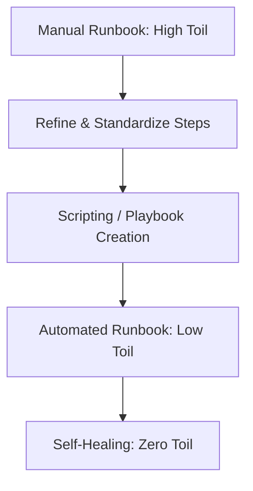

# The SRE Standard for Runbooks

The Google SRE Handbook transformed runbooks from "Optional Notes" to "Operational Requirements." 

## Google's "Golden Rules" for Runbooks
1.  **Specificity**: A runbook must be for a specific alert.
2.  **Actionability**: Every step must lead to a result. No "Read this 50-page paper to find the answer."
3.  **Low Friction**: No passwords or complicated logins to access the docs during an outage.
4.  **Feedback-Driven**: After every incident, the first question is: "Was the runbook helpful? If not, fix it."

## Toil Reduction
SREs strive to eliminate **Toil** (repetitive, manual, boring work).
- If a runbook is used 20 times a week, it is a candidate for **Automation (Playbook)**.
- The Runbook is the bridge between Toil and Automation.

## Mermaid Diagram: Toil to Automation Flow

---

## 🏗️ Real-Life Scenario: The "Read the Manual" Trap
**Problem**: An outage occurs. The engineer opens the "Recovery Guide." It is a 40-page PDF containing the history of the database, the architecture of the cloud, and lastly, the 3 commands needed to fix it.
**Outcome**: The engineer takes 30 minutes to find the commands. The site stays down.
**SRE Fix**: Break the PDF into 10 smaller, title-specific Runbooks. Use a "Quick Start" section at the top of each.
**Result**: Time to find the fix drops from 30 minutes to 30 seconds.

---

## ❓ Interview Questions
1.  **What is 'Toil' and how do runbooks help manage it?**
    *   *Answer*: Toil is manual, repetitive work that has no long-term value. Runbooks document the toil so it can be performed consistently and eventually automated. They "Capture" the logic before it's turned into code.
2.  **Describe the 'SRE mindset' towards documentation.**
    *   *Answer*: SREs view documentation as code. It must be versioned, tested (via Gamedays), and kept in the same repository as the infrastructure for consistency.

---

## 🧠 Quiz Snippet (5/50+)
1.  **What is the SRE term for repetitive manual work?** (Toil)
2.  **True/False: Runbooks should be as long as possible to include all history.** (False - stay specific)
3.  **Which company popularized the modern SRE approach to runbooks?** (Google)
4.  **What should you do with a runbook that is used very frequently?** (Automate it)
5.  **Which metric is most affected by high-quality runbooks?** (MTTR)
