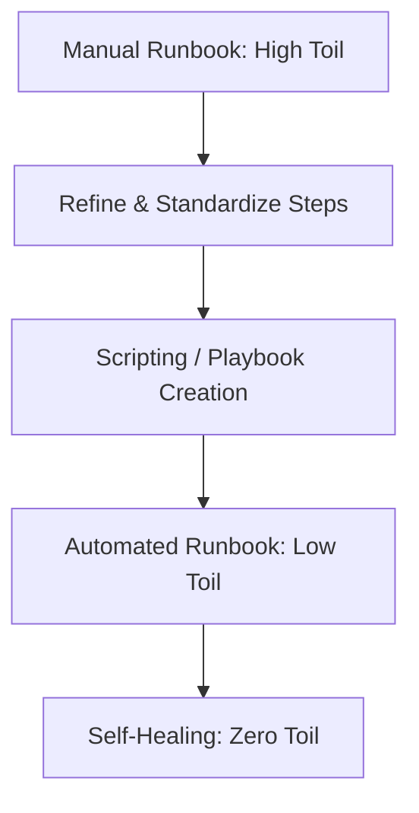
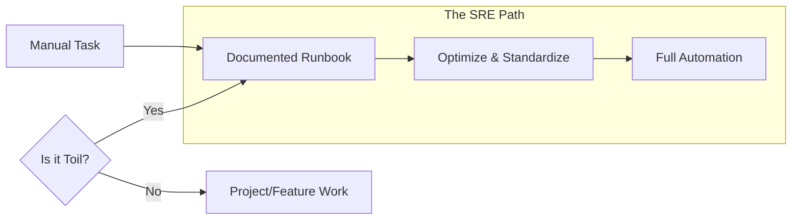

# The SRE Standard for Runbooks

The Google SRE Handbook transformed runbooks from "Optional Notes" to "Operational Requirements." 

## Google's "Golden Rules" for Runbooks
1.  **Specificity**: A runbook must be for a specific alert.
2.  **Actionability**: Every step must lead to a result. No "Read this 50-page paper to find the answer."
3.  **Low Friction**: No passwords or complicated logins to access the docs during an outage.
4.  **Feedback-Driven**: After every incident, the first question is: "Was the runbook helpful? If not, fix it."

## Toil Reduction
SREs strive to eliminate **Toil** (repetitive, manual, boring work).
- If a runbook is used 20 times a week, it is a candidate for **Automation (Playbook)**.
- The Runbook is the bridge between Toil and Automation.

## Mermaid Diagram: Toil to Automation Flow

---

## Toil Reduction Strategy

---

## 🏗️ Real-Life Scenarios

### Scenario 1: The "Read the Manual" Trap
**Problem**: An outage occurs. The engineer opens the "Recovery Guide." It is a 40-page PDF containing the history of the database, the architecture of the cloud, and lastly, the 3 commands needed to fix it.
**Outcome**: The engineer takes 30 minutes to find the commands. The site stays down.
**SRE Solution**: Break the PDF into 10 smaller, title-specific Runbooks. Use a "Quick Start" section at the top of each.
**Result**: Time to find the fix drops from 30 minutes to 30 seconds.

### Scenario 2: The "Toil" Tipping Point
**Problem**: An SRE team spent 40% of their week manually resetting stale database connections. The senior manager realized this was "Toil"—repetitive, manual, and has no long-term value.
**Solution**: The team was mandated to spend one "Sprint" automating this. They wrote an automated runbook in Python that cleans connections when they exceed a certain age.
**Result**: Toil dropped from 40% to 5%. The team used the saved time to build a new monitoring platform.

### Scenario 3: The "Feedback Loop" Failure
**Problem**: A runbook for "Updating Nginx" had a typo in the config path. Three different engineers encountered the typo over a month, but no one fixed the runbook because "it wasn't their job."
**Solution**: Implement a "Mandatory Feedback" policy. After every runbook execution, the engineer must provide a Thumbs Up/Down and a comment.
**Result**: The typo was fixed within 1 hour of the next execution, preventing further frustration and errors.

---

## ❓ Interview Questions

1.  **What is 'Toil' and how do runbooks help manage it?**
    - *Answer*: Toil is manual, repetitive, tactical work that lacks enduring value and scales linearly with service size. Runbooks document toil so it can be performed consistently by anyone and serves as the blueprint for future automation.
2.  **Describe the 'SRE mindset' towards documentation.**
    - *Answer*: SREs treat documentation like code. It must be versioned, reviewed by peers, kept in the same repository as the service, and validated through regular testing or "Gamedays."
3.  **What are the Google SRE 'Golden Rules' for Runbooks?**
    - *Answer*: Specificity (one runbook per alert), Actionability (clear steps, no fluff), Low Friction (easy to access and read), and Feedback-Driven (continuously improved).
4.  **How do you measure the 'Effectiveness' of a runbook?**
    - *Answer*: Key metrics include the reduction in MTTR (Mean Time to Recovery), the success rate of junior engineers using it, and the frequency of updates based on new learnings.
5.  **Why should SREs aim to spend only 50% of their time on Ops work?**
    - *Answer*: To prevent burnout and ensure they have enough time for "Project Work" (Engineering) that actually reduces future operational burden through automation and system improvements.
6.  **What is a 'Runbook Review' in a Post-Mortem?**
    - *Answer*: After a major incident, the team reviews if the runbook was accurate, easy to find, and helpful. If it failed to assist the engineer, updating the runbook becomes a P0 follow-up action.

---

## 🧠 Comprehensive Quiz (25 Questions)

**1. What is the SRE term for repetitive, manual, tactical work?**
- A) Craft
- B) Toil
- C) Engineering
- D) Support

Show Answer

**Answer: B**

**2. True/False: SREs should aim to spend 100% of their time on operational tasks.**
- A) True
- B) False

Show Answer

**Answer: B** - Google recommends a cap of 50% to allow for engineering/projects.

**3. Which company is credited with formalizing the modern SRE role?**
- A) Amazon
- B) Microsoft
- C) Google
- D) Netflix

Show Answer

**Answer: C**

**4. A runbook should be "Actionable," meaning:**
- A) It has a lot of text
- B) Every step is clearly defined and leads toward resolving the issue
- C) It is written in a foreign language
- D) It's stored in a safe

Show Answer

**Answer: B**

**5. "Toil scales linearly" means:**
- A) As the system grows, the amount of manual work stays the same
- B) As the system grows, the amount of manual work grows at the same rate
- C) The work gets easier
- D) The work gets faster

Show Answer

**Answer: B** - This is why automation is required to "break the linear curve."

**6. Which of these is NOT a characteristic of Toil?**
- A) Manual
- B) Tactical
- C) Strategy and Architectural Design
- D) Repetitive

Show Answer

**Answer: C**

**7. "No Friction" access to runbooks means:**
- A) The docs are encrypted with 10 passwords
- B) The docs are easy to find and read instantly during an emergency
- C) The docs are written in pencil
- D) The docs are on a physical shelf

Show Answer

**Answer: B**

**8. After an incident, if a runbook was found to be outdated, what is the SRE priority?**
- A) Ignore it
- B) Immediately update the runbook with the new findings
- C) Delete the runbook
- D) Blame the author

Show Answer

**Answer: B**

**9. Why is 'Feedback' critical in the SRE standard?**
- A) To make people feel good
- B) To ensure the documentation evolves as the system evolves
- C) To meet legal requirements
- D) To fill up the database

Show Answer

**Answer: B**

**10. What is a 'Blameless Post-Mortem'?**
- A) A meeting where we find someone to fire
- B) An incident review focused on system failures and process improvements rather than human error
- C) A party
- D) A coding session

Show Answer

**Answer: B**

**11. A 'Quick Start' section at the top of a runbook follows which SRE principle?**
- A) Toil elimination
- B) Reducing MTTR / Actionability
- C) Cost saving
- D) Aesthetics

Show Answer

**Answer: B**

**12. True/False: High-quality runbooks allow junior engineers to handle senior-level incidents safely.**
- A) True
- B) False

Show Answer

**Answer: A** - This is the "Democratization of Knowledge."

**13. Which metric measures the 'Reliability' of a service?**
- A) Number of lines of code
- B) SLO (Service Level Objective)
- C) Employee salary
- D) Office size

Show Answer

**Answer: B**

**14. Documentation should live:**
- A) In a separate silo
- B) In the same repository as the code (Docs-as-Code)
- C) On a manager's local drive
- D) Only in Slack history

Show Answer

**Answer: B**

**15. SRE stands for:**
- A) System Repair Engineer
- B) Site Reliability Engineering
- C) Software Resource Expert
- D) Simple Recovery Expert

Show Answer

**Answer: B**

**16. 'Operational Debt' is another term for:**
- A) Money owed to a cloud provider
- B) Accumulated toil and unaddressed system fragility
- C) The cost of computers
- D) A loan for the company

Show Answer

**Answer: B**

**17. Why is 'Specificity' important in SRE runbooks?**
- A) To make them look professional
- B) To ensure the engineer isn't overwhelmed with irrelevant information during a crisis
- C) To follow the law
- D) To use more words

Show Answer

**Answer: B**

**18. A 'Human-in-the-Loop' system implies:**
- A) Total manual work
- B) Automation that asks a human for final approval/judgment
- C) No automation at all
- D) No people at all

Show Answer

**Answer: B**

**19. What is 'SLI'?**
- A) Service Level Interface
- B) Service Level Indicator (a specific metric like latency)
- C) Software Lego Interface
- D) Simple Link Internal

Show Answer

**Answer: B**

**20. Runbooks help bridge the gap between:**
- A) Marketing and Sales
- B) Development and Operations (SRE)
- C) Hardware and Software
- D) Old and New

Show Answer

**Answer: B**

**21. To 'Eliminate Toil,' we primarily use:**
- A) Force
- B) Automation
- C) More meetings
- D) Less code

Show Answer

**Answer: B**

**22. True/False: An SRE should avoid 'Tactical' work in favor of 'Strategic' work whenever possible.**
- A) True
- B) False

Show Answer

**Answer: A**

**23. What is 'Error Budget'?**
- A) The money you spend on bugs
- B) The allowed amount of system unreliability before feature work must stop
- C) A list of all errors
- D) A fine for the developers

Show Answer

**Answer: B**

**24. A 'Runbook feedback loop' is triggered when:**
- A) The doc is written
- B) The doc is used during an incident
- C) The doc is deleted
- D) The server is bought

Show Answer

**Answer: B**

**25. The core philosophy of SRE is:**
- A) Build things as fast as possible
- B) Hope for the best
- C) Engineering approach to Operations
- D) Manual everything

Show Answer

**Answer: C**

