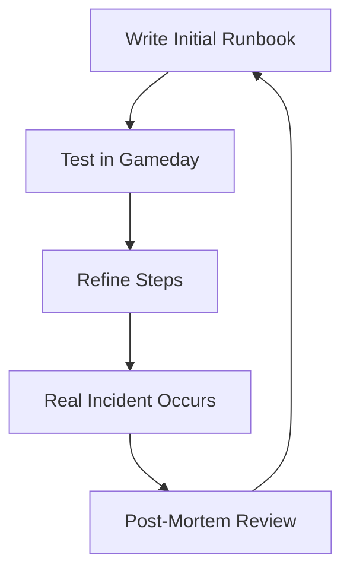
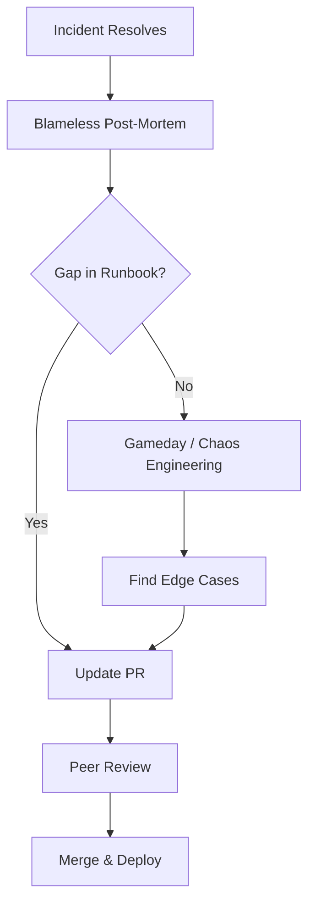

# Feedback and Iteration

A runbook that is never updated is a liability. Continuous improvement is the secret to operational excellence.

## The Feedback Loop

### 1. The Post-Mortem (Incident Report)
After every P1 incident:
- Check: Did the runbook exist?
- Check: Were the steps accurate?
- Action: If the runbook failed, the *first* follow-up item is to fix the doc.

### 2. Gamedays (Simulated Chaos)
Schedule a session where a team follows a runbook in a staging environment.
- Goal: Find "Implicit Knowledge" (steps the author assumed the user knew but didn't write down).

### 3. "Docs or It Didn't Happen"
Establish a culture where a feature is not considered "Done" until the corresponding runbook is updated.

## Mermaid Diagram: The Iterative Cycle

---

## The Feedback Ecosystem

---

## 🏗️ Real-Life Scenarios

### Scenario 1: The "Silent" Fix
**Problem**: A senior engineer fixes a recurring bug every week. They know a "trick" involving a specific flag in the CLI. They never update the runbook.
**Crisis**: The senior engineer leaves the company. The bug occurs again. The team follows the runbook, it doesn't work, and they spend 6 hours finding the "trick" themselves.
**Fix**: Implement a rule: "If you find a trick, it belongs in the HCL or the Runbook."
**Outcome**: The knowledge is institutionalized and saved for the next generation.

### Scenario 2: The "Junior Pivot" Test
**Problem**: A runbook for "Restoring an RDS Snapshot" was written by the lead DBA. It assumed the reader knew the VPC ID and Subnet IDs. A junior engineer tried to follow it during an emergency and got stuck on Step 1.
**Solution**: Conduct a **Gameday** where the junior engineer used the runbook while the lead DBA watched.
**Result**: The lead DBA realized their "Implicit Knowledge" was causing a bottleneck. The runbook was updated to include look-up commands for the VPC and Subnet IDs.

### Scenario 3: The Automated Feedback "Thumb"
**Problem**: The documentation Wiki had 5,000 pages, and 70% of them were outdated. No one knew which ones were still reliable.
**Solution**: Integrated a "Feedback Widget" (Thumbs Up/Down) at the bottom of every runbook. Any document with more than 3 "Thumbs Down" or no updates in 6 months was automatically flagged for review.
**Result**: The team successfully purged 2,000 pages of "Doc Rot" and focused on keeping the high-traffic runbooks accurate.

---

## ❓ Interview Questions

1.  **What is a 'Blameless Post-Mortem' and why is it important for runbooks?**
    - *Answer*: It is an incident review focused on system failures and process improvements rather than individual blame. It provides the most critical feedback for runbooks, highlighting where documentation failed the engineer under pressure.
2.  **How do you ensure your team actually maintains and updates documentation?**
    - *Answer*: By making it part of the "Definition of Done" for all features, including doc checks in Pull Request reviews, and conducting regular Gameday simulations to prove the docs work.
3.  **What is 'Implicit Knowledge' (or Tribal Knowledge) and how do you eliminate it?**
    - *Answer*: It is information that experts assume "everyone knows" and thus omit from documentation. You eliminate it by having non-experts (junior members) test the runbooks while the experts observe and document the missing steps.
4.  **How do 'Gamedays' differ from real incidents as feedback sources?**
    - *Answer*: Gamedays are proactive and controlled, allowing you to find flaws in documentation without the stress of downtime. Real incidents are reactive but reveal how docs actually perform under maximum stress.
5.  **What is the 'Documentation-as-Code' (DaC) benefit for iteration?**
    - *Answer*: DaC allows documentation to follow the same lifecycle as code: branching, peer review, and automated deployment. This ensures that a code change and its matching doc change are merged together.
6.  **At what frequency should a 'Critical' runbook be reviewed?**
    - *Answer*: At minimum, after every incident where it was used, or at least quarterly during routine Gamedays or operational audits.

---

## 🧠 Comprehensive Quiz (25 Questions)

**1. What is the primary source of feedback for runbooks in a mature SRE team?**
- A) Customer reviews
- B) Blameless Post-Mortems
- C) Twitter/X
- D) The marketing department

Show Answer

**Answer: B**

**2. True/False: If a runbook is clear to the person who wrote it, it is considered complete.**
- A) True
- B) False

Show Answer

**Answer: B** - It must be clear to the person who will *use* it during an emergency.

**3. 'Implicit Knowledge' is dangerous because:**
- A) It is encrypted
- B) It is not written down, making it inaccessible to the rest of the team
- C) It is too long
- D) It's stored in a database

Show Answer

**Answer: B**

**4. A 'Gameday' is a simulated failure exercise used to:**
- A) Play games
- B) Validate that runbooks are accurate and the team is prepared
- C) Test the internet speed
- D) Fire people

Show Answer

**Answer: B**

**5. What should happen to a runbook that is found to be 2 years old and never used?**
- A) Keep it just in case
- B) Re-verify its accuracy and delete if no longer relevant (Clean up Doc Rot)
- C) Rename it to "Old"
- D) Print it

Show Answer

**Answer: B**

**6. Which policy ensures documentation is updated alongside features?**
- A) HR Policy
- B) Definition of Done (DoD)
- C) Password Policy
- D) Dress Code

Show Answer

**Answer: B**

**7. 'Blameless' feedback focuses on:**
- A) Who messed up
- B) Why the system and documentation allowed the mistake to happen
- C) The cost of the mistake
- D) Finding a new hire

Show Answer

**Answer: B**

**8. What does "Iterative" indicate in runbook maintenance?**
- A) Doing it once
- B) Constant, small improvements over time based on real usage
- C) Deleting and starting over every week
- D) hiring a writer

Show Answer

**Answer: B**

**9. Why should junior engineers be involved in runbook testing?**
- A) To give them busy work
- B) They lack the "Implicit Knowledge" of seniors and can spot missing steps easily
- C) They can type faster
- D) They don't have PR review rights

Show Answer

**Answer: B**

**10. 'Documentation Rot' is best prevented by:**
- A) More servers
- B) Regular testing, PR-based reviews, and automated feedback loops
- C) Longer documents
- D) Less code

Show Answer

**Answer: B**

**11. A 'Follow-up Action' in a post-mortem often includes:**
- A) A vacation
- B) A specific task to update or create a runbook for the failure mode
- C) A party
- D) A password reset

Show Answer

**Answer: B**

**12. True/False: You should wait for a real outage to test your runbooks.**
- A) True
- B) False

Show Answer

**Answer: B** - Proactive Gamedays are much safer.

**13. Which of these is a sign of a high-quality feedback culture?**
- A) Fear of suggesting changes
- B) Engineers proactively fixing typos they find in docs
- C) Ignoring errors
- D) Long Slack threads instead of doc updates

Show Answer

**Answer: B**

**14. 'Feedback Fatigue' occurs when:**
- A) There are too many people helping
- B) There are too many noisy, irrelevant requests for feedback
- C) The server is down
- D) The doc is too short

Show Answer

**Answer: B**

**15. Peer Review for documentation:**
- A) Slows things down for no reason
- B) Increases accuracy and spreads knowledge across the team
- C) Is only for code
- D) Is optional

Show Answer

**Answer: B**

**16. 'Stale' documentation often leads to:**
- A) Higher salaries
- B) Incorrect actions that worsen an incident
- C) Fast resolution
- D) better coffee

Show Answer

**Answer: B**

**17. What is 'Validation' in the context of a runbook?**
- A) Checking the spelling
- B) Proving the steps actually resolve the issue in a real or staging environment
- C) Sending it to the CEO
- D) Printing it

Show Answer

**Answer: B**

**18. Why would you 'Sunset' (Delete) a runbook?**
- A) The sun went down
- B) The service it describes has been decommissioned or fully automated
- C) To save space in Git
- D) To hide history

Show Answer

**Answer: B**

**19. A 'Version History' in documentation helps:**
- A) Show off
- B) Contextualize changes and allow for rollbacks if a new procedure is wrong
- C) hide errors
- D) increase cost

Show Answer

**Answer: B**

**20. What is a 'Documentation Audit'?**
- A) A tax review
- B) A periodic review to ensure all critical services have accurate, up-to-date runbooks
- C) A meeting about Slack
- D) A hardware check

Show Answer

**Answer: B**

**21. 'Institutional Knowledge' is knowledge that is:**
- A) Kept by one person
- B) Shared across the organization via documentation and culture
- C) In a museum
- D) on the internet

Show Answer

**Answer: B**

**22. How does automation simplify feedback?**
- A) It removes human feedback entirely
- B) It can automatically flag docs that haven't been modified in a long time
- C) It writes the docs for you
- D) It doesn't

Show Answer

**Answer: B**

**23. 'Shadow IT' documentation should be:**
- A) Banned
- B) Integrated into the official, searchable knowledge base
- C) Deleted
- D) Ignored

Show Answer

**Answer: B**

**24. Which metric shows if your feedback loop is working?**
- A) Document count
- B) Average age of documentation and MTTR trends
- C) Ticket count
- D) Employee age

Show Answer

**Answer: B**

**25. The ultimate goal of Feedback and Iteration is:**
- A) To have a 100% perfect document
- B) To minimize risk and maximize speed to resolution over time
- C) to make people work harder
- D) to satisfy auditors

Show Answer

**Answer: B**

