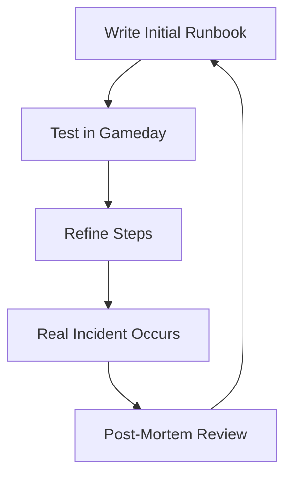

# Feedback and Iteration

A runbook that is never updated is a liability. Continuous improvement is the secret to operational excellence.

## The Feedback Loop

### 1. The Post-Mortem (Incident Report)
After every P1 incident:
- Check: Did the runbook exist?
- Check: Were the steps accurate?
- Action: If the runbook failed, the *first* follow-up item is to fix the doc.

### 2. Gamedays (Simulated Chaos)
Schedule a session where a team follows a runbook in a staging environment.
- Goal: Find "Implicit Knowledge" (steps the author assumed the user knew but didn't write down).

### 3. "Docs or It Didn't Happen"
Establish a culture where a feature is not considered "Done" until the corresponding runbook is updated.

## Mermaid Diagram: The Iterative Cycle

---

## 🏗️ Real-Life Scenario: The "Silent" Fix
**Problem**: A senior engineer fixes a recurring bug every week. They know a "trick" involving a specific flag in the CLI. They never update the runbook.
**Crisis**: The senior engineer leaves the company. The bug occurs again. The team follows the runbook, it doesn't work, and they spend 6 hours finding the "trick" themselves.
**Fix**: Implement a rule: "If you find a trick, it belongs in the HCL or the Runbook." 
**Outcome**: The knowledge is institutionalized and saved for the next generation.

---

## ❓ Interview Questions
1.  **What is a 'Post-Mortem' and why is it important for runbooks?**
    *   *Answer*: It is a blameless review of an incident. It is the primary source of feedback for runbooks, identifying where the instructions were confusing or incorrect under pressure.
2.  **How do you ensure your team actually updates the documentation?**
    *   *Answer*: By making it part of the Definition of Done (DoD), including it in code reviews, and automating the documentation generation wherever possible.

---

## 🧠 Quiz Snippet (5/50+)
1.  **What is the best way to find 'Implicit Knowledge' bugs?** (Gamedays / Testing with a junior engineer)
2.  **True/False: Post-mortems should focus on who made the mistake.** (False - they should be blameless)
3.  **When should a runbook be updated?** (After every incident where it was used or failed)
4.  **What does 'Iterative' mean?** (Continuous improvement over time)
5.  **Should a junior engineer be able to follow a senior engineer's runbook?** (Yes - that is the gold standard)
