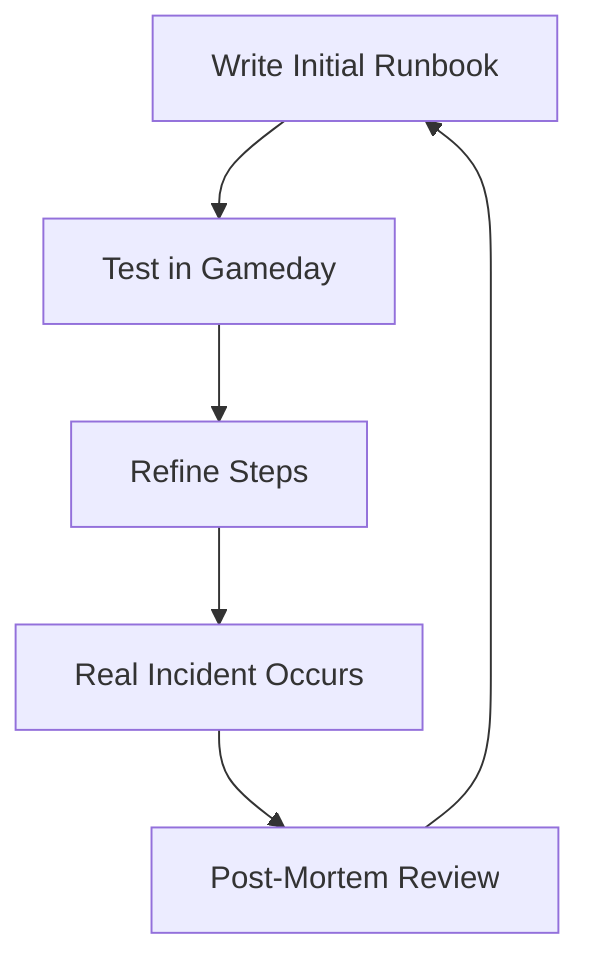
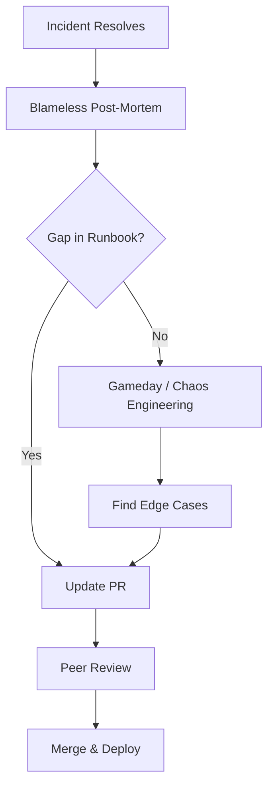

# Feedback and Iteration

A runbook that is never updated is a liability. Continuous improvement is the secret to operational excellence.

## The Feedback Loop

### 1. The Post-Mortem (Incident Report)
After every P1 incident:
- Check: Did the runbook exist?
- Check: Were the steps accurate?
- Action: If the runbook failed, the *first* follow-up item is to fix the doc.

### 2. Gamedays (Simulated Chaos)
Schedule a session where a team follows a runbook in a staging environment.
- Goal: Find "Implicit Knowledge" (steps the author assumed the user knew but didn't write down).

### 3. "Docs or It Didn't Happen"
Establish a culture where a feature is not considered "Done" until the corresponding runbook is updated.

## Mermaid Diagram: The Iterative Cycle

---

## The Feedback Ecosystem

---

## 🏗️ Real-Life Scenarios

### Scenario 1: The "Silent" Fix
**Problem**: A senior engineer fixes a recurring bug every week. They know a "trick" involving a specific flag in the CLI. They never update the runbook.
**Crisis**: The senior engineer leaves the company. The bug occurs again. The team follows the runbook, it doesn't work, and they spend 6 hours finding the "trick" themselves.
**Fix**: Implement a rule: "If you find a trick, it belongs in the HCL or the Runbook."
**Outcome**: The knowledge is institutionalized and saved for the next generation.

### Scenario 2: The "Junior Pivot" Test
**Problem**: A runbook for "Restoring an RDS Snapshot" was written by the lead DBA. It assumed the reader knew the VPC ID and Subnet IDs. A junior engineer tried to follow it during an emergency and got stuck on Step 1.
**Solution**: Conduct a **Gameday** where the junior engineer used the runbook while the lead DBA watched.
**Result**: The lead DBA realized their "Implicit Knowledge" was causing a bottleneck. The runbook was updated to include look-up commands for the VPC and Subnet IDs.

### Scenario 3: The Automated Feedback "Thumb"
**Problem**: The documentation Wiki had 5,000 pages, and 70% of them were outdated. No one knew which ones were still reliable.
**Solution**: Integrated a "Feedback Widget" (Thumbs Up/Down) at the bottom of every runbook. Any document with more than 3 "Thumbs Down" or no updates in 6 months was automatically flagged for review.
**Result**: The team successfully purged 2,000 pages of "Doc Rot" and focused on keeping the high-traffic runbooks accurate.

---

## ❓ Interview Questions

1.  **What is a 'Blameless Post-Mortem' and why is it important for runbooks?**
    - *Answer*: It is an incident review focused on system failures and process improvements rather than individual blame. It provides the most critical feedback for runbooks, highlighting where documentation failed the engineer under pressure.
2.  **How do you ensure your team actually maintains and updates documentation?**
    - *Answer*: By making it part of the "Definition of Done" for all features, including doc checks in Pull Request reviews, and conducting regular Gameday simulations to prove the docs work.
3.  **What is 'Implicit Knowledge' (or Tribal Knowledge) and how do you eliminate it?**
    - *Answer*: It is information that experts assume "everyone knows" and thus omit from documentation. You eliminate it by having non-experts (junior members) test the runbooks while the experts observe and document the missing steps.
4.  **How do 'Gamedays' differ from real incidents as feedback sources?**
    - *Answer*: Gamedays are proactive and controlled, allowing you to find flaws in documentation without the stress of downtime. Real incidents are reactive but reveal how docs actually perform under maximum stress.
5.  **What is the 'Documentation-as-Code' (DaC) benefit for iteration?**
    - *Answer*: DaC allows documentation to follow the same lifecycle as code: branching, peer review, and automated deployment. This ensures that a code change and its matching doc change are merged together.
6.  **At what frequency should a 'Critical' runbook be reviewed?**
    - *Answer*: At minimum, after every incident where it was used, or at least quarterly during routine Gamedays or operational audits.

---

## 🧠 Comprehensive Quiz (25 Questions)

<b>1. What is the primary source of feedback for runbooks in a mature SRE team?</b>

Show Answer

Answer: B

<b>2. True/False: If a runbook is clear to the person who wrote it, it is considered complete.</b>

Show Answer

Answer: B** - It must be clear to the person who will *use* it during an emergency.

<b>3. 'Implicit Knowledge' is dangerous because:</b>

Show Answer

Answer: B

<b>4. A 'Gameday' is a simulated failure exercise used to:</b>

Show Answer

Answer: B

<b>5. What should happen to a runbook that is found to be 2 years old and never used?</b>

Show Answer

Answer: B

<b>6. Which policy ensures documentation is updated alongside features?</b>

Show Answer

Answer: B

<b>7. 'Blameless' feedback focuses on:</b>

Show Answer

Answer: B

<b>8. What does "Iterative" indicate in runbook maintenance?</b>

Show Answer

Answer: B

<b>9. Why should junior engineers be involved in runbook testing?</b>

Show Answer

Answer: B

<b>10. 'Documentation Rot' is best prevented by:</b>

Show Answer

Answer: B

<b>11. A 'Follow-up Action' in a post-mortem often includes:</b>

Show Answer

Answer: B

<b>12. True/False: You should wait for a real outage to test your runbooks.</b>

Show Answer

Answer: B** - Proactive Gamedays are much safer.

<b>13. Which of these is a sign of a high-quality feedback culture?</b>

Show Answer

Answer: B

<b>14. 'Feedback Fatigue' occurs when:</b>

Show Answer

Answer: B

<b>15. Peer Review for documentation:</b>

Show Answer

Answer: B

<b>16. 'Stale' documentation often leads to:</b>

Show Answer

Answer: B

<b>17. What is 'Validation' in the context of a runbook?</b>

Show Answer

Answer: B

<b>18. Why would you 'Sunset' (Delete) a runbook?</b>

Show Answer

Answer: B

<b>19. A 'Version History' in documentation helps:</b>

Show Answer

Answer: B

<b>20. What is a 'Documentation Audit'?</b>

Show Answer

Answer: B

<b>21. 'Institutional Knowledge' is knowledge that is:</b>

Show Answer

Answer: B

<b>22. How does automation simplify feedback?</b>

Show Answer

Answer: B

<b>23. 'Shadow IT' documentation should be:</b>

Show Answer

Answer: B

<b>24. Which metric shows if your feedback loop is working?</b>

Show Answer

Answer: B

<b>25. The ultimate goal of Feedback and Iteration is:</b>

Show Answer

Answer: B

