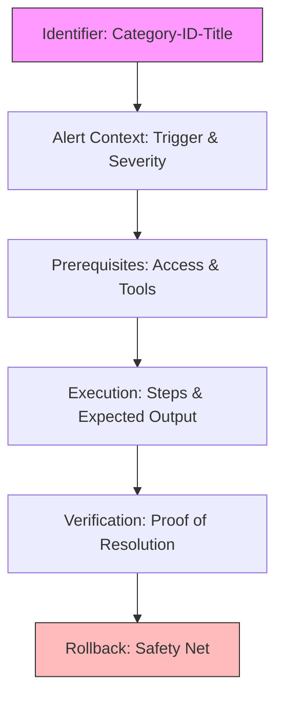

# Standard Runbook Templates

Standardization reduces cognitive load. When every runbook looks the same, your brain knows exactly where to find the answers.

## The "Emergency" Template (Markdown)

```markdown
# RB-[Category]-[ID]: [Brief Title]

## 🚨 Alert Context
- **Condition**: [Describe the problem]
- **Alert Link**: [Link to Monitoring]
- **Severity**: [P0 / P1 / P2]

## 🛠️ Prerequisites
- **Access**: [e.g. AWS Admin]
- **Tools**: [e.g. kubectl, ssh]

## 🏃 Runbook Steps
1. [Condition Check]: Run `command_here`
2. [Expected Output]: You should see `X`
3. [Decision]: If you see `Y`, skip to Step 5.

## ✅ Verification
- Run `check_status.sh` to confirm resolution.

## ⏪ Rollback
- To undo these changes, run `rollback.sh`.
```

## Consistency Checklist
- [ ] Uses clear, active verbs ("Run", "Check", "Stop").
- [ ] No long paragraphs of text. Use bullet points.
- [ ] Version and Owner are clearly marked at the top.
- [ ] All code blocks are copy-pasteable (no screenshots of code).

---

## The Anatomy of the Standard Template



---

## 🏗️ Real-Life Scenarios

### Scenario 1: The Format Chaos
**Problem**: An SRE team has 100 runbooks. Some are in Google Docs, some in Word, some in Markdown. Some start with the "Fix," others start with "History."
**Crisis**: During a critical outage, an engineer spends 2 minutes searching for the "Prerequisites" because they are at the bottom of the document instead of the top.
**Outcome**: The team adopts a "Single Markdown Template" enforcement via a pre-commit hook.
**Result**: Engineers find the information 50% faster because their brains are "Retrained" on the new consistent layout.

### Scenario 2: The "Screenshot" Trap
**Problem**: A runbook for "Resetting API Tokens" used screenshots of the UI. The cloud provider updated their UI, making the screenshots irrelevant and confusing. An engineer followed the old screenshot and deleted a production service by mistake.
**Solution**: Enforce a "Text-Only" template for critical steps. If the UI changes, the text instructions (e.g., "Click the Security tab") are often still more accurate than a visual that has changed.
**Result**: Document rot was reduced, and the team could search the instructions via Ctrl+F.

### Scenario 3: The Missing Rollback
**Problem**: A junior engineer followed a template that lacked a "Rollback" section. They ran a database migration that hung. Fearing the data was corrupted, they didn't know how to safely stop and undo the change, leading to 2 hours of panic.
**Solution**: Update the **Global Runbook Template** to include a mandatory "Rollback" header. Any runbook without this section is automatically rejected in Code Review.
**Result**: Increased psychological safety for engineers, knowing there is always a planned escape route.

---

## ❓ Interview Questions

1.  **Why should we strictly avoid screenshots of code or commands in runbooks?**
    - *Answer*: Screenshots are not copy-pasteable (slowing down resolution), they cannot be indexed for text search (making them hard to find), and they are inaccessible to engineers using screen readers or mobile devices.
2.  **What is the benefit of a standardized naming convention like `RB-NET-01`?**
    - *Answer*: It provides instant categorization and hierarchy. `RB` indicates it's a Runbook, `NET` assigns it to the Networking team, and `01` provides a unique ID for easy referencing in Jira tickets or Prometheus alerts.
3.  **How does a consistent template reduce 'Cognitive Load' during an incident?**
    - *Answer*: During high-stress situations, the brain struggles to process new layouts. A consistent template allows the engineer to "auto-pilot" to the specific section they need (like Prerequisites or Steps) without searching.
4.  **At what point in the document should 'Prerequisites' be listed?**
    - *Answer*: Near the very top. Engineers need to know *before* they start executing if they lack the required IAM permissions or CLI tools, preventing a mid-fix failure.
5.  **What is a 'Runbook Linter' and how does it help?**
    - *Answer*: It is an automated tool (like `markdownlint`) that checks if the document follows the mandatory structure (headers, tags, code blocks). It prevents low-quality or incomplete documentation from entering the system.
6.  **Why include a 'Severity' level in the template?**
    - *Answer*: It sets the tone for the engineer. A P0 runbook implies maximum speed and immediate escalation if steps fail, while a P3 runbook might allow for more investigative time.

---

## 🧠 Comprehensive Quiz (25 Questions)

**1. Which section tells you the severity of the problem?**
- A) Prerequisites
- B) Alert Context
- C) Rollback
- D) Footer

<details>
<summary>Show Answer</summary>

**Answer: B**

</details>

**2. True/False: Runbooks should be written in long, conversational paragraphs to explain the 'Why'.**
- A) True
- B) False

<details>
<summary>Show Answer</summary>

**Answer: B** - Use short, active, imperative verbs and bullet points for speed.

</details>

**3. What tool can be used to automatically enforce a documentation template?**
- A) A Pre-commit hook or Linter
- B) A Spreadsheet
- C) A physical stamp
- D) A phone call

<details>
<summary>Show Answer</summary>

**Answer: A**

</details>

**4. 'Expected Output' in a template should ideally be:**
- A) A screenshot
- B) Text-based code block showing the terminal result
- C) An audio recording
- D) Omitted to save space

<details>
<summary>Show Answer</summary>

**Answer: B**

</details>

**5. Which naming convention is most useful for an SRE team?**
- A) `runbook.doc`
- B) `RB-DB-05: Postgres_Connection_Limit`
- C) `Instructions_v2.txt`
- D) `My_Notes.md`

<details>
<summary>Show Answer</summary>

**Answer: B**

</details>

**6. The 'Rollback' section is critical for:**
- A) Saving money
- B) Returning the system to a safe state if the fix fails or causes side effects
- C) Showing the history of the app
- D) Meeting the CEO

<details>
<summary>Show Answer</summary>

**Answer: B**

</details>

**7. Where should 'Required Permissions' be listed?**
- A) At the very end
- B) In the Prerequisites section near the top
- C) In a separate file
- D) Nowhere

<details>
<summary>Show Answer</summary>

**Answer: B**

</details>

**8. Why are 'Copy-Pasteable' code blocks essential?**
- A) To prevent syntax/manual typing errors during high-stress outages
- B) To make the file look better
- C) To follow legal rules
- D) To save disk space

<details>
<summary>Show Answer</summary>

**Answer: A**

</details>

**9. A template helps 'Standardize' documentation across:**
- A) Only one person
- B) The entire engineering organization
- C) Only the managers
- D) The customers

<details>
<summary>Show Answer</summary>

**Answer: B**

</details>

**10. Which word is an 'Active Verb' suitable for a runbook?**
- A) Consider
- B) Restart
- C) Think
- D) Hope

<details>
<summary>Show Answer</summary>

**Answer: B**

</details>

**11. The 'Alert Link' in the template connects the doc to:**
- A) Social media
- B) The real-time monitoring data that triggered the incident
- C) The company home page
- D) A news article

<details>
<summary>Show Answer</summary>

**Answer: B**

</details>

**12. True/False: Metadata (Owner, Version) should be hidden at the bottom of the page.**
- A) True
- B) False

<details>
<summary>Show Answer</summary>

**Answer: B** - It should be visible at the top for accountability and context.

</details>

**13. A 'Table of Contents' is most useful for:**
- A) Short runbooks (1 page)
- B) Long, complex runbooks (5+ pages) with multiple recovery paths
- C) Every document
- D) No document

<details>
<summary>Show Answer</summary>

**Answer: B**

</details>

**14. 'Redundancy' in a template means:**
- A) Having the same information in two places
- B) Having multiple ways to access the document (Safe but not part of formatting)
- C) Including extra, useless sections (Avoid this)
- D) using images

<details>
<summary>Show Answer</summary>

**Answer: C**

</details>

**15. 'Actionable' steps are the core of which section?**
- A) Metadata
- B) Runbook Steps
- C) Rollback
- D) Glossary

<details>
<summary>Show Answer</summary>

**Answer: B**

</details>

**16. What is the risk of a 'Non-Standard' format?**
- A) The computer will crash
- B) Engineers will waste valuable time during outages searching for basic information
- C) It's cheaper
- D) It's more creative

<details>
<summary>Show Answer</summary>

**Answer: B**

</details>

**17. 'Verification' proves that:**
- A) You read the doc
- B) The issue is actually resolved and the system is healthy
- C) You are at work
- D) The clock is right

<details>
<summary>Show Answer</summary>

**Answer: B**

</details>

**18. Why use 'Markdown' for templates?**
- A) It's colorful
- B) It's lightweight, version-controllable, and renders consistently across tools
- C) It's owned by Microsoft
- D) It's only for Linux

<details>
<summary>Show Answer</summary>

**Answer: B**

</details>

**19. A 'Template Registry' is:**
- A) A list of employees
- B) A central repository where the approved runbook templates are stored
- C) A type of database
- D) A website for news

<details>
<summary>Show Answer</summary>

**Answer: B**

</details>

**20. True/False: 'Rollback' steps should be tested as often as 'Fix' steps.**
- A) True
- B) False

<details>
<summary>Show Answer</summary>

**Answer: A** - An untested rollback is an invisible risk.

</details>

**21. 'Searchability' is improved by:**
- A) Using more images
- B) Using consistent headers and keywords (Metadata) in the template
- C) Making the file private
- D) deleting the file

<details>
<summary>Show Answer</summary>

**Answer: B**

</details>

**22. Which section describes the 'Desired State' after the fix?**
- A) Introduction
- B) Verification
- C) Prerequisites
- D) Footer

<details>
<summary>Show Answer</summary>

**Answer: B**

</details>

**23. 'Bullet Points' are preferred over paragraphs because:**
- A) They are easier to skim and process while under stress
- B) They use less ink
- C) They look like code
- D) paragraphs are illegal

<details>
<summary>Show Answer</summary>

**Answer: A**

</details>

**24. A 'Category' tag (e.g., NET, DB, APP) helps in:**
- A) Naming the team
- B) Faster filtering and navigation in the knowledge base
- C) Billing
- D) Security

<details>
<summary>Show Answer</summary>

**Answer: B**

</details>

**25. The ultimate goal of the Standard Template is:**
- A) To make writing harder
- B) To minimize human error and maximize speed during operational tasks
- C) to please the manager
- D) to have more files

<details>
<summary>Show Answer</summary>

**Answer: B**

</details>
