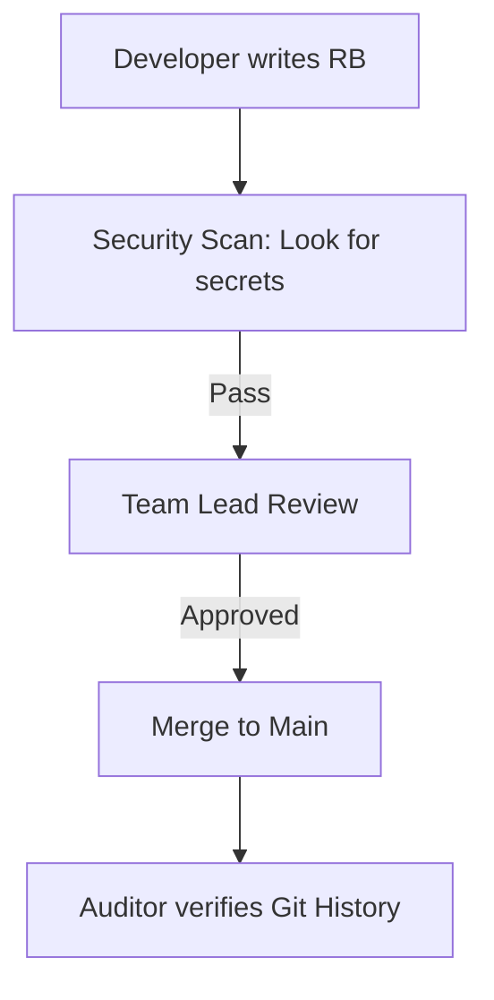

# Runbook Audit and Compliance

In regulated industries (Fintech, Healthcare, Govt), runbooks aren't just for SREs—they are legal requirements.

## 🛡️ Audit Requirements
1.  **Traceability**: Who changed the runbook, and when? (Solved by Git History).
2.  **Approval**: Who authorized the procedure? (Solved by Pull Request reviews).
3.  **Review Cycle**: When was this last checked for accuracy? (Industry standard: Once every 6-12 months).
4.  **Separation of Duties**: The person who writes the runbook shouldn't be the only one who can merge it.

## The Compliance Checklist
- [ ] Document is version-controlled.
- [ ] Sensitive info (passwords) is NOT in the text.
- [ ] Access is restricted to authorized personnel.
- [ ] Review date is set in the metadata.

## Mermaid Diagram: Security & Compliance Flow

---

## 🏗️ Real-Life Scenario: The "Secret" Leak
**Problem**: An engineer adds a runbook for "Database Password Reset." To be helpful, they include the current root password in the doc.
**Outcome**: A month later, a data breach occurs. The hacker didn't break into the DB; they just read the "Database Password Reset" runbook in the internal wiki.
**Fix**: Use **Environment Variables** or **Secrets Manager** links in the runbook. Never write the actual secret.
**Policy**: Run a secret-scanner (like TruffleHog) on your documentation repo.

---

## ❓ Interview Questions
1.  **How do you handle 'Separation of Duties' in documentation?**
    *   *Answer*: By using a Git-based workflow where a different engineer must approve the PR before the new operational procedure is officially adopted.
2.  **What do you do if an auditor finds an outdated runbook?**
    *   *Answer*: Acknowledge the gap, immediately schedule a "Gameday" to validate and update it, and implement a "Last Reviewed" date tracking system to prevent future lapses.

---

## 🧠 Final Module Quiz (5/50+)
1.  **What is the standard review frequency for runbooks?** (6-12 months)
2.  **True/False: You should store production passwords in your runbooks for speed.** (False - High Security Risk)
3.  **Which tool provides a timeline of who changed a document?** (Git)
4.  **Is a 'Draft' runbook compliant for an audit?** (No - it must be approved and finalized)
5.  **Why use an ID (e.g. RB-123) for compliance?** (Consistency and easy cross-referencing in audit reports)
