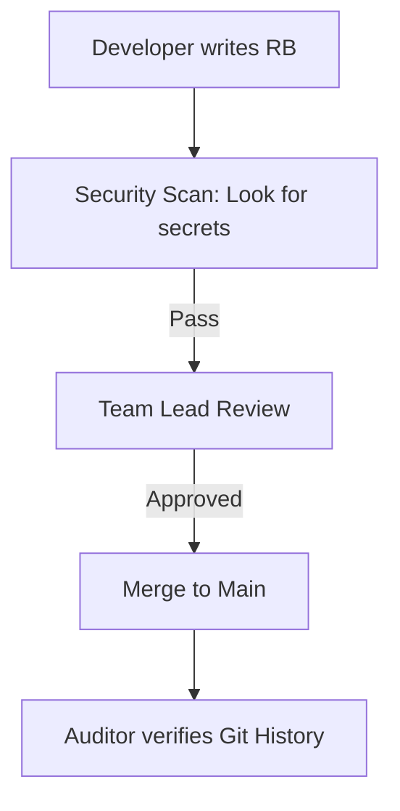
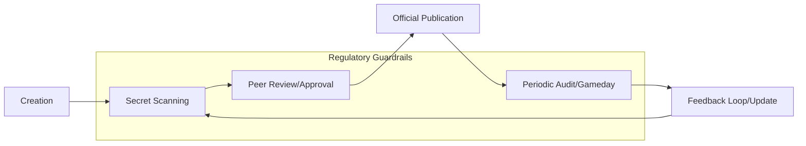

# Runbook Audit and Compliance

In regulated industries (Fintech, Healthcare, Govt), runbooks aren't just for SREs—they are legal requirements.

## 🛡️ Audit Requirements
1.  **Traceability**: Who changed the runbook, and when? (Solved by Git History).
2.  **Approval**: Who authorized the procedure? (Solved by Pull Request reviews).
3.  **Review Cycle**: When was this last checked for accuracy? (Industry standard: Once every 6-12 months).
4.  **Separation of Duties**: The person who writes the runbook shouldn't be the only one who can merge it.

## The Compliance Checklist
- [ ] Document is version-controlled.
- [ ] Sensitive info (passwords) is NOT in the text.
- [ ] Access is restricted to authorized personnel.
- [ ] Review date is set in the metadata.

## Mermaid Diagram: Security & Compliance Flow

---

## The Compliance Lifecycle

---

## 🏗️ Real-Life Scenarios

### Scenario 1: The "Secret" Leak
**Problem**: An engineer adds a runbook for "Database Password Reset." To be helpful, they include the current root password in the doc.
**Outcome**: A month later, a data breach occurs. The hacker didn't break into the DB; they just read the "Database Password Reset" runbook in the internal wiki.
**Solution**: Use **Environment Variables** or **Secrets Manager** links (e.g., `{{secret/db/root_pw}}`) in the runbook. Never write the actual secret.
**Policy**: Run a secret-scanner (like TruffleHog) on your documentation repo.

### Scenario 2: The "Ghost" Procedure
**Problem**: During a SOC2 audit, the auditor asked to see the procedure for "Revoking User Access." The team showed a Slack message from 2022.
**Outcome**: The company failed the audit requirement for "Standardized and Documented Procedures."
**Solution**: Formally document the process in a version-controlled Markdown file, with a clear **Approval Signature** (PR Merge) from the Security Officer.
**Result**: In the follow-up audit, the team presented the Git history showing the documented, reviewed, and approved procedure, passing with zero findings.

### Scenario 3: The "Separation of Duties" Breach
**Problem**: A senior engineer had "Admin" access to both the code and the documentation. They bypassed the review process to change a critical "Deployment Runbook" to allow skipping security scans.
**Solution**: Implement **Protected Branches** for the documentation repo. Even the Admin's PRs now require a second "Approve" from a different team member (Security or QA).
**Result**: The unauthorized change was blocked, preserving the integrity of the release process and satisfying the "Separation of Duties" requirement.

---

## ❓ Interview Questions

1.  **How do you handle 'Separation of Duties' in technical documentation?**
    - *Answer*: By using a Git-based workflow where a different engineer must approve the Pull Request (PR) before the operational procedure is officially adopted. This prevents a single person from unilaterally changing critical processes.
2.  **What steps should you take if an auditor identifies an outdated runbook?**
    - *Answer*: Acknowledge the gap immediately. Create a P0 ticket to validate and update the document via a "Gameday" simulation. Long-term, implement an automated "Review Reminder" system based on the "Last Updated" metadata.
3.  **Why is 'Git History' a powerful tool for compliance auditors?**
    - *Answer*: It provides an immutable, cryptographic audit trail of exactly **who** made **what** change, **when** it was made, and **who** approved it. It replaces the need for manual, signed paper logs.
4.  **Describe how to safely document procedures that involve sensitive credentials.**
    - *Answer*: Reference the *location* of the secret in a secure vault (e.g., HashiCorp Vault, AWS Secrets Manager) rather than the secret itself. Use placeholders like `{{SECRET_PATH}}` and run automated scanners to catch accidents.
5.  **What is the 'Industry Standard' for runbook review frequency?**
    - *Answer*: In highly regulated sectors (Fintech/Healthcare), critical runbooks should be reviewed every 6-12 months. Non-critical docs can be reviewed annually or based on usage feedback.
6.  **How do you prove that a runbook is 'Actionable' to an auditor?**
    - *Answer*: Provide logs or tickets from a "Gameday" or a real incident where the runbook was successfully followed to a verified outcome. This proves the document isn't just "shelfware."

---

## 🧠 Comprehensive Quiz (25 Questions)

**1. What is the standard review frequency for critical runbooks in regulated industries?**
- A) Every week
- B) Every 6-12 months
- C) Only when an error occurs
- D) Every 10 years

Show Answer

**Answer: B**

**2. True/False: Storing passwords in a runbook is acceptable if the wiki is private.**
- A) True
- B) False

Show Answer

**Answer: B** - Privacy is not security; use a dedicated Secrets Manager.

**3. Which Git feature provides a timeline of who changed a document?**
- A) git push
- B) git blame / History
- C) git clone
- D) git init

Show Answer

**Answer: B**

**4. 'Separation of Duties' means:**
- A) Working in different offices
- B) Ensuring the person who writes a procedure cannot approve it themselves
- C) Working at different times
- D) Having two computers

Show Answer

**Answer: B**

**5. Why is a 'Draft' runbook usually not compliant for an audit?**
- A) It's too short
- B) It hasn't been officially reviewed, approved, and finalized
- C) It's written in pencil
- D) It's on a local drive

Show Answer

**Answer: B**

**6. 'Traceability' in an audit refers to:**
- A) Drawing lines
- B) Being able to track a procedure back to its source, author, and approval history
- C) Finding a file
- D) Printing a doc

Show Answer

**Answer: B**

**7. Which tool can automatically find secrets (passwords) leaked in documentation?**
- A) Excel
- B) TruffleHog / GitLeaks
- C) Calculator
- D) Chrome

Show Answer

**Answer: B**

**8. SOC2 and ISO 27001 are examples of:**
- A) Programming languages
- B) Security and Compliance Frameworks
- C) Operating systems
- D) Cloud providers

Show Answer

**Answer: B**

**9. In a 'Compliance Lifecycle', what follows 'Peer Review'?**
- A) Deletion
- B) Publication/Approval
- C) Writing more
- D) Vacation

Show Answer

**Answer: B**

**10. Metadata like 'Last Reviewed Date' is important for:**
- A) Aesthetics
- B) Proving to auditors that the documentation is actively maintained
- C) Making the file larger
- D) Hiding history

Show Answer

**Answer: B**

**11. An 'Immutable' audit log means the log:**
- A) Can be changed by anyone
- B) Cannot be changed or deleted once written
- C) Is written in code
- D) Is very long

Show Answer

**Answer: B**

**12. True/False: Auditors prefer manual signatures on paper over digital Git logs.**
- A) True
- B) False - Digital logs are more precise and harder to forge.

Show Answer

**Answer: B**

**13. 'Read-Only' access for runbooks should be given to:**
- A) Everyone in the company (if appropriate)
- B) Only the CEO
- C) Only the auditors
- D) Nobody

Show Answer

**Answer: A** - Broad read access democratizes knowledge, while write access is restricted for compliance.

**14. What is a 'Findings Report' from an auditor?**
- A) A list of things they liked
- B) A document detailing gaps or non-compliance issues (e.g., outdated runbooks)
- C) A bill
- D) A news article

Show Answer

**Answer: B**

**15. 'Least Privilege' applies to documentation by:**
- A) Giving everyone Admin rights
- B) Only giving 'Write' or 'Edit' access to those who strictly need it for their role
- C) Giving no one access
- D) Using one shared password

Show Answer

**Answer: B**

**16. 'Governance' in SRE refers to:**
- A) The company's legal department
- B) The rules and processes that ensure systems are reliable, secure, and compliant
- C) The government
- D) the office manager

Show Answer

**Answer: B**

**17. Why is referencing a 'Secrets Manager' better than hardcoding a password?**
- A) It's faster to type
- B) It ensures credentials can be rotated without updating every single runbook
- C) It's free
- D) It's required by Git

Show Answer

**Answer: B**

**18. A 'Stale' runbook is a compliance risk because:**
- A) It uses old fonts
- B) It might describe an insecure or deprecated process
- C) It's too short
- D) It's in Markdown

Show Answer

**Answer: B**

**19. 'Role-Based Access Control' (RBAC) helps manage:**
- A) Salary
- B) Permissions to view or edit specific categories of runbooks
- C) The office layout
- D) The lunch menu

Show Answer

**Answer: B**

**20. True/False: Compliance is only necessary for large banks.**
- A) True
- B) False - Any company handling user data or requiring high reliability (SaaS, Healthcare, etc.) needs it.

Show Answer

**Answer: B**

**21. A 'Pre-commit hook' can assist compliance by:**
- A) Deleting code
- B) Blocking commits that contain plain-text passwords or lack required headers
- C) Sending emails
- D) checking the time

Show Answer

**Answer: B**

**22. 'Evidence' in a documentation audit includes:**
- A) Screenshots of Git PRs and Gameday logs
- B) Verbal promises
- C) Coffee cups
- D) the company logo

Show Answer

**Answer: A**

**23. 'Auditor Access' means:**
- A) Giving the auditor full Admin rights
- B) Providing restricted, Read-Only access to the documentation and its history
- C) Letting them use your desk
- D) Sending them a hard drive

Show Answer

**Answer: B**

**24. 'Version Pinning' in a runbook refers to:**
- A) Using the same version of a tool forever
- B) Specifying exactly which version of a script or binary the runbook was tested with
- C) Pinning a file in Slack
- D) using a physical pin

Show Answer

**Answer: B**

**25. The ultimate goal of Runbook Compliance is:**
- A) To pass an audit
- B) To ensure operational safety, security, and institutional reliability
- C) To make more work
- D) to use Git

Show Answer

**Answer: B**

