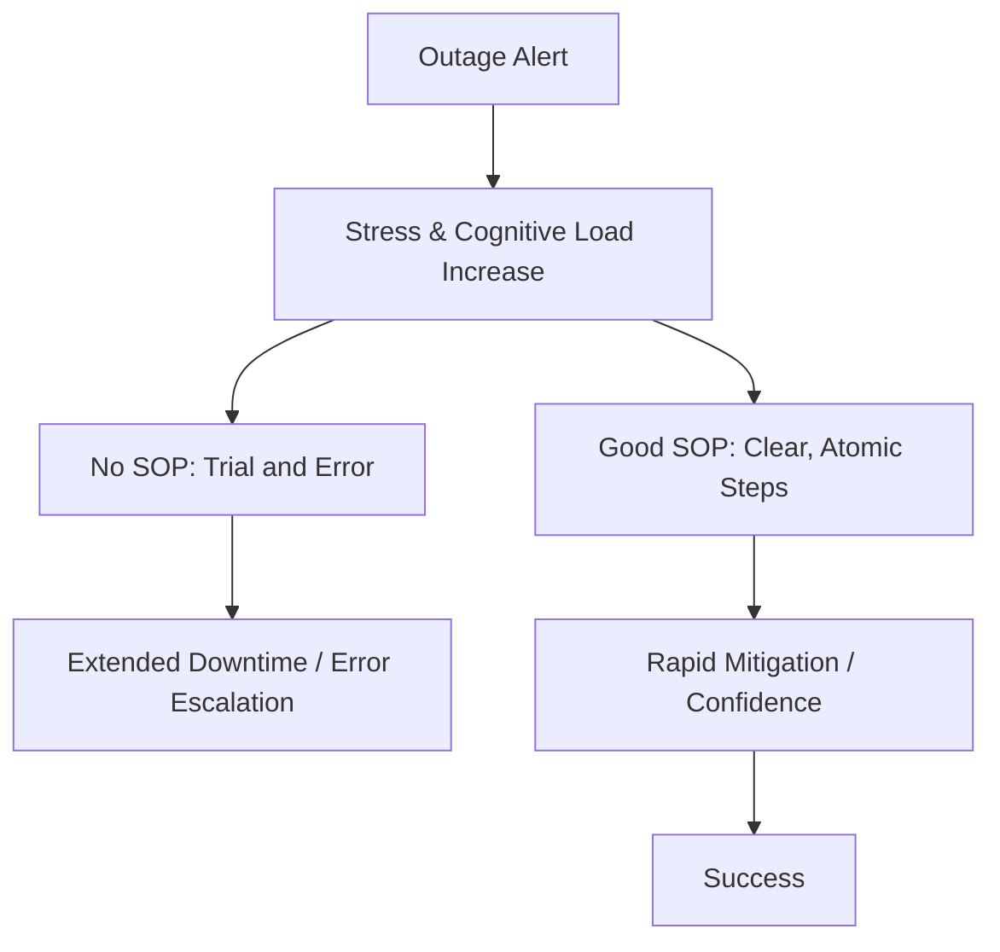

# Philosophy and Mindset

In a high-velocity DevOps environment, the value of a Standard Operating Procedure (SOP) lies in its ability to **reduce cognitive load** and **ensure predictably**.

## The Core Philosophy
1.  **Documentation as a Security Control**: A missing or incorrect SOP is a security risk. If a human has to "guess" a database password or a firewall setting, the system is compromised.
2.  **Scalability through Silence**: A great SOP allows a junior engineer to perform a task without asking a senior, effectively "cloning" the senior's expertise.
3.  **Blameless Documentation**: If an incident occurs because an SOP was followed correctly but failed, the document is at fault, not the person.

## The "3 AM Test"
A professional SOP must be able to be followed by a competent but exhausted engineer at 3 AM during a critical outage. If they have to search through 10 pages of history to find a single command, the SOP has failed.

## Mermaid Diagram: Cognitive Load Reduction

---

## 🏗️ Real-Life Scenario: The "Knowledge Silo" Collapse
**Problem**: An insurance firm relies on one SRE who has been there for 10 years. He knows every "hook and crook" of the legacy system. He goes on a sabbatical. 
**Crisis**: The middleware server crashes. The new team looks for an SOP. They find a Word document from 2018 that is 50 pages long. They spend 2 hours reading it only to find the instructions for the wrong version of the OS.
**Outcome**: A 6-hour outage and a $50k fine.
**Fix**: The team adopts a "Documentation First" philosophy, breaking large documents into atomic, versioned sub-SOPs.

---

## ❓ Interview Questions
1.  **Why is documentation considered a 'Scalability' tool for SRE teams?**
    *   *Answer*: It allows teams to grow without increasing the communication overhead. By documenting procedures, you turn "Tribal Knowledge" into "Institutional Knowledge," enabling anyone to handle routine or critical tasks.
2.  **What does 'Cognitive Load' mean in the context of an incident?**
    *   *Answer*: It refers to the amount of mental effort required to process information. During an incident, stress reduces mental capacity. High-quality documentation reduces this load by providing pre-calculated steps, preventing the need for deep thinking under pressure.

---

## 🧠 Quiz Snippet (5/50+)
1.  **What is the primary goal of an SOP?** (Predictable consistency and reduced cognitive load)
2.  **True/False: A 100-page historical doc is better than a 1-page action guide.** (False)
3.  **The '3 AM Test' measures what quality of a document?** (Actionability and clarity under stress)
4.  **If a person follows a bad SOP and mistakes happen, who is primarily responsible?** (The document / process)
5.  **What is 'Siloed Knowledge'?** (Information only known by one person or a small group)
