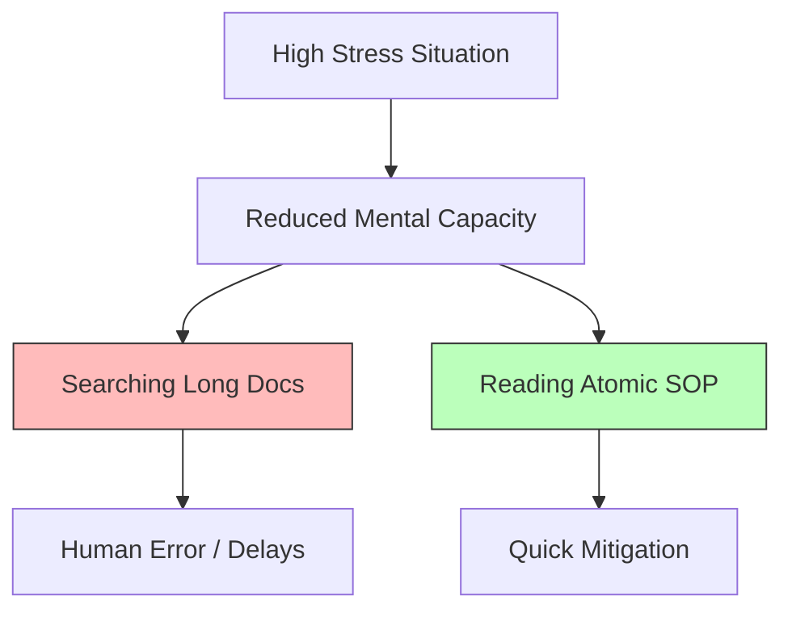

## The Cognitive Load Gap

---

## 🏗️ Real-Life Scenarios

### Scenario 1: The "Knowledge Silo" Collapse
**Problem**: An insurance firm relies on one SRE who has been there for 10 years. He knows every "hook and crook" of the legacy system. He goes on a sabbatical.
**Crisis**: The middleware server crashes. The new team looks for an SOP. They find a Word document from 2018 that is 50 pages long. They spend 2 hours reading it only to find the instructions for the wrong version of the OS.
**Outcome**: A 6-hour outage and a $50k fine.
**Fix**: The team adopts a "Documentation First" philosophy, breaking large documents into atomic, versioned sub-SOPs.
**Result**: In a subsequent failure, a junior member recovered the system in 15 minutes using the new atomic SOP.

### Scenario 2: The "3 AM" Verification
**Problem**: A startup had a "Recovery Guide" that required the reader to explain *why* they were taking an action before they were allowed to see the command.
**Crisis**: At 3 AM, an engineer was too tired to write a valid explanation. The site stayed down because the "Helpful" security feature blocked the tired engineer.
**Solution**: Pivoted to the **Atomic Mindset**. Commands are presented immediately, with the "Why" placed in an optional footer or link for post-incident review.
**Result**: Recovery time dropped from 40 minutes to 5 minutes.

### Scenario 3: The Blameless Failure
**Problem**: An outage occurred because an SOP step said "Run script.sh." The script accidentally deleted the database because it wasn't tested for the new OS version.
**Solution**: Instead of blaming the engineer who ran it, the company held a **Blameless Post-Mortem**. They identified that the SOP failed to specify the OS verification step.
**Result**: The SOP was updated with a pre-check command, and the culture shifted from "Fear of Mistakes" to "Rigorous Process Improvement."

---

## ❓ Interview Questions

1.  **Why is documentation considered a 'Scalability' tool for SRE teams?**
    - *Answer*: It allows teams to grow without increasing the communication overhead proportionally. By documenting procedures, you turn "Tribal Knowledge" into "Institutional Knowledge," enabling any competent engineer to handle routine or critical tasks without blocking senior members.
2.  **What does 'Cognitive Load' mean in the context of an incident, and how does an SOP address it?**
    - *Answer*: Cognitive Load is the mental effort required to process information. Under stress, mental capacity drops. A high-quality SOP reduces this load by providing "pre-calculated" solutions and atomic steps, allowing the engineer to focus on execution rather than deep theory.
3.  **Explain the '3 AM Test' for operational documentation.**
    - *Answer*: It's a benchmark for clarity. A document passes the test if a competent but exhausted engineer can follow it at 3 AM and resolve an incident without needing external help or spending time searching for basic information.
4.  **How do you reconcile 'Security' with 'Actionable Documentation'?**
    - *Answer*: Documentation is a security control. Missing or vague docs force engineers to guess (a major security risk). Secure docs reference secret paths (e.g., in Vault) rather than the secrets themselves, ensuring the engineer has the *process* without exposing sensitive data.
5.  **What is 'Siloed Knowledge' and how does an SRE mindset combat it?**
    - *Answer*: Siloed knowledge is information locked in the heads of a few individuals. SREs combat this by creating "SOPs as Code," versioning everything, and making it a requirement that no production change is "Done" until the SOP is updated and shared.
6.  **Why is the concept of 'Blame' counterproductive in documentation culture?**
    - *Answer*: If people are blamed for following a bad document, they will stop using documentation or stop documenting their own tricks. Blameless culture focuses on the *process failure*, ensuring the document is fixed so the same mistake can't happen again.

---

## 🧠 Comprehensive Quiz (25 Questions)

**1. What is the primary goal of an SOP in a DevOps environment?**
- A) To write a book
- B) To reduce cognitive load and ensure predictable outcomes
- C) To fill up the hard drive
- D) To satisfy the boss

Show Answer

**Answer: B**

**2. True/False: A longer document is always better than a shorter one for incident response.**
- A) True
- B) False

Show Answer

**Answer: B** - Short, atomic, and clear is the goal for outages.

**3. The '3 AM Test' measures:**
- A) If the document is colorful
- B) If the document is actionable and clear under maximum stress/exhaustion
- C) If the engineer is awake
- D) If the server time is correct

Show Answer

**Answer: B**

**4. Documentation acts as a 'Security Control' because:**
- A) It is encrypted
- B) It prevents engineers from having to 'guess' security-sensitive configurations
- C) It is written by the security team
- D) It's kept in a safe

Show Answer

**Answer: B**

**5. 'Scalability through Silence' means:**
- A) Not talking to your teammates
- B) Using docs to allow juniors to work independently without interrupting seniors
- C) Working at night
- D) Using silent computers

Show Answer

**Answer: B**

**6. If an engineer follows a flawed SOP and causes an outage, a 'Blameless' culture blames:**
- A) The engineer
- B) The Documentation / Process
- C) The manager
- D) The weather

Show Answer

**Answer: B**

**7. 'Cognitive Load' increases when:**
- A) Information is well-organized
- B) Information is scattered, long-winded, or confusing during a crisis
- C) You go to sleep
- D) The server is fast

Show Answer

**Answer: B**

**8. 'Tribal Knowledge' refers to:**
- A) Knowledge of history
- B) Information known only to a few individuals and not documented
- C) A type of database
- D) Public documentation

Show Answer

**Answer: B**

**9. Atomic SOPs are:**
- A) Large and radioactive
- B) Small, focused on a single specific task or alert
- C) Scientific papers
- D) General notes

Show Answer

**Answer: B**

**10. Why is 'Guessing' a database password a security risk?**
- A) It's hard to do
- B) It indicates a failure in documentation and secret management that leads to drift
- C) It's fun
- D) It's not a risk

Show Answer

**Answer: B**

**11. The 'Definition of Done' for a new feature should include:**
- A) A party
- B) Updated and tested documentation (SOP)
- C) A new keyboard
- D) deleting old code

Show Answer

**Answer: B**

**12. True/False: Theory and history should be the first sections in an emergency SOP.**
- A) True
- B) False - Action steps should be first.

Show Answer

**Answer: B**

**13. A 'Knowledge Silo' usually causes:**
- A) More money
- B) Increased MTTR when the 'expert' is unavailable
- C) Faster deployments
- D) Better security

Show Answer

**Answer: B**

**14. What is 'Institutional Knowledge'?**
- A) Knowledge stored in a museum
- B) Knowledge that is documented and shared across the entire organization
- C) Knowledge known by the CEO only
- D) Knowledge in a book

Show Answer

**Answer: B**

**15. 'Stress-resilient' documentation works best when it is:**
- A) Complicated
- B) Visual and step-by-step
- C) Secret
- D) Long

Show Answer

**Answer: B**

**16. 'Predictability' in SRE means:**
- A) Knowing what will happen at 5 PM
- B) Ensuring the same action always results in the same outcome via standardized SOPs
- C) Predicting stock prices
- D) Having no errors

Show Answer

**Answer: B**

**17. Why is 'Cloning Expertise' through SOPs valuable?**
- A) For biological science
- B) To enable everyone to perform at the level of the most experienced engineer
- C) To fire experts
- D) To make people work faster

Show Answer

**Answer: B**

**18. An 'Operational Requirement' is:**
- A) A recommendation
- B) A mandatory standard for how a system is managed and documented
- C) A type of server
- D) A legal contract

Show Answer

**Answer: B**

**19. 'Document Rot' describes:**
- A) Physical paper getting old
- B) Digital documentation that is no longer accurate as the system evolves
- C) Deleted files
- D) new files

Show Answer

**Answer: B**

**20. True/False: Empathy for the 'tired' engineer is a core part of the SOP mindset.**
- A) True
- B) False

Show Answer

**Answer: A**

**21. 'Drift' occurs when the real system state differs from:**
- A) The cloud
- B) The documented SOP or expected state
- C) The target market
- D) the past

Show Answer

**Answer: B**

**22. Which role is responsible for maintaining the SOP 'Philosophy'?**
- A) The SRE Lead / Manager
- B) The Marketing intern
- C) The janitor
- D) Only the new hires

Show Answer

**Answer: A** - Culture starts from the top.

**23. 'Shadow Procedures' are:**
- A) Nighttime work
- B) Undocumented habits that haven't been peer-reviewed or standardized
- C) Security tricks
- D) Automated scripts

Show Answer

**Answer: B**

**24. The 'Cognitive Load' gap is bridged by:**
- A) Taking a nap
- B) High-quality, searchable, and atomic documentation
- C) Faster computers
- D) More meetings

Show Answer

**Answer: B**

**25. The ultimate result of a documentation-first philosophy is:**
- A) More files
- B) Higher reliability and a lower-stress environment for engineers
- C) Higher costs
- D) slower deployments

Show Answer

**Answer: B**

