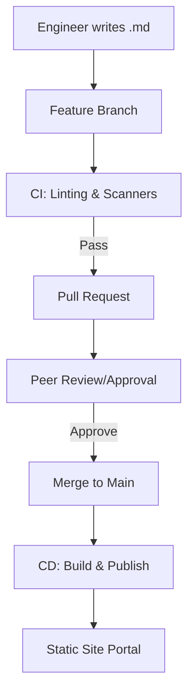

## The Docs-as-Code Feedback Loop

---

## 🏗️ Real-Life Scenarios

### Scenario 1: The "Which Version?" Nightmare
**Problem**: A developer updates the API to version 2.0. They update the Wiki manually. A week later, they have to rollback the API to version 1.9 due to a bug.
**Conflict**: The Wiki is now "stuck" on version 2.0 instructions. The next person who tries to deploy is following the wrong guide, causing further errors.
**Solution**: Switch to **Docs-as-Code**. The `deployment.md` is in the same repository as the code.
**Outcome**: When the code rolls back to version 1.9, the documentation automatically rolls back with it. Perfect synchronization.

### Scenario 2: The "Broken Link" Outage
**Problem**: An SOP for "Database Scaling" had a link to a dashboard that was deleted. No one noticed until a real incident occurred. The engineer was unable to find the correct dashboard during the outage.
**Solution**: Implement **CI Validation** for documentation. A "Link Checker" script runs on every PR and fails if any internal or external links are broken.
**Result**: Dead links are caught before they ever reach the "Main" documentation site, ensuring high reliability during stress.

### Scenario 3: The Secret in the Wiki
**Problem**: An engineer pasted a production API key into a Wiki page to "help others" test a CLI command. The Wiki had no version control or scanning.
**Solution**: Move to **Docs-as-Code** with **Automated Scanners** (e.g., GitLeaks).
**Result**: When the next engineer tried to commit a secret, the CI pipeline blocked the commit and notified security, preventing a breach.

---

## ❓ Interview Questions

1.  **What are the primary benefits of keeping documentation in the same repository as the code?**
    - *Answer*: Atomic changes (code and docs update together), version synchronization (docs always match the specific code version/branch), and improved discoverability (developers don't have to leave their IDE to update docs).
2.  **How can Continuous Integration (CI) improve documentation quality?**
    - *Answer*: CI pipelines can run automated linters for formatting, link checkers for dead links, and security scanners to ensure secrets aren't accidentally exposed. It ensures docs meet a "Minimum Viable Quality" before being published.
3.  **Explain the role of a 'Static Site Generator' (SSG) in a DaC workflow.**
    - *Answer*: SSGs (like MkDocs, Hugo, or Docusaurus) take simple Markdown files from Git and transform them into a fast, searchable, and professional web portal. This balances "Markdown simplicity" with "Web-based accessibility."
4.  **How do you handle 'Approvals' for operational changes in a DaC model?**
    - *Answer*: Using Pull Request (PR) reviews. A change to a critical SOP requires a mandatory review and approval from a peer or a team lead before it can be merged into the master documentation.
5.  **What is 'Git Blame' and why is it useful for documentation?**
    - *Answer*: It is a Git command that shows exactly who modified each line of a file and in which commit. For docs, it helps identify the "Subject Matter Expert" (SME) who last updated a procedure if the steps are unclear.
6.  **Why is Markdown preferred over Word or PDF for DevOps documentation?**
    - *Answer*: Markdown is lightweight, text-based (easy for Git to diff), platform-independent, and can be rendered by almost any modern tool, including VS Code and GitHub/GitLab.

---

## 🧠 Comprehensive Quiz (25 Questions)

**1. Which format is the industry standard for Docs-as-Code?**
- A) .pdf
- B) .md (Markdown)
- C) .docx
- D) .txt

Show Answer

**Answer: B**

**2. True/False: In a DaC model, documentation updates should skip the peer-review process to save time.**
- A) True
- B) False

Show Answer

**Answer: B** - Peer review via Pull Requests is critical for accuracy.

**3. What is the main purpose of a 'Linter' in the documentation pipeline?**
- A) To compress files
- B) To check for formatting, syntax, and style consistency
- C) To delete old versions
- D) To add images

Show Answer

**Answer: B**

**4. 'Atomic Updates' means that:**
- A) Changes are very fast
- B) Code and matching documentation are updated in a single commit/PR
- C) Documents are very small
- D) Documents are radioactive

Show Answer

**Answer: B**

**5. Which tool turns Markdown into a searchable website?**
- A) SQL Server
- B) Static Site Generator (SSG)
- C) Photoshop
- D) Excel

Show Answer

**Answer: B** (e.g., MkDocs, Hugo)

**6. 'Syncing Docs with Code' is easiest when:**
- A) They are in different countries
- B) They are in the same Git repository
- C) You use paper
- D) You never update them

Show Answer

**Answer: B**

**7. A 'Link Checker' in a CI pipeline prevents:**
- A) Too many links
- B) "Dead Links" that lead to 404 errors
- C) Links to the competition
- D) Faster internet

Show Answer

**Answer: B**

**8. Pull Request (PR) logs provide what for an auditor?**
- A) Money
- B) An immutable record of approvals and changes
- C) A list of jokes
- D) A new computer

Show Answer

**Answer: B**

**9. Why is a 'Binary' format (like .docx) bad for Git?**
- A) Git cannot track it
- B) Git cannot easily "Diff" it to show line-by-line changes
- C) It makes Git faster
- D) It's free

Show Answer

**Answer: B**

**10. What is 'Git Blame'?**
- A) A command to find who to fire
- B) A command to see who last changed specific lines in a file
- C) A type of error
- D) A cloud provider

Show Answer

**Answer: B**

**11. The 'Cycle Time' of documentation refers to:**
- A) How long it takes to read
- B) The time from writing a doc change to it being live in production
- C) The rotation of the earth
- D) server speed

Show Answer

**Answer: B**

**12. True/False: Markdown supports diagrams through tools like Mermaid.**
- A) True
- B) False

Show Answer

**Answer: A**

**13. Which of these is a popular SSG?**
- A) MySQL
- B) MkDocs
- C) Windows
- D) Slack

Show Answer

**Answer: B**

**14. An 'Internal Doc Portal' improves:**
- A) Coffee quality
- B) Discoverability and searchability for all engineers
- C) Server heat
- D) CPU usage

Show Answer

**Answer: B**

**15. 'Branching' for documentation allows you to:**
- A) Work on new procedures without affecting the 'Live' documentation
- B) Save space
- C) Delete files
- D) share passwords

Show Answer

**Answer: A**

**16. 'Secret Scanning' in DaC protects against:**
- A) Too much light
- B) Accidental exposure of credentials (API keys, etc.) in Git
- C) Fast deployments
- D) slow internet

Show Answer

**Answer: B**

**17. Why is 'Version Control' essential for runbooks?**
- A) To make them longer
- B) To allow rollbacks to old procedures if a new one is found to be incorrect
- C) To hide errors
- D) To satisfy management

Show Answer

**Answer: B**

**18. A 'Headless CMS' is which type of approach?**
- A) Traditional Wiki
- B) Often used with DaC to separate content from presentation
- C) No content at all
- D) Only for experts

Show Answer

**Answer: B**

**19. 'YAML Front Matter' is used in Markdown files to:**
- A) Write code
- B) Store metadata like Title, Author, and Tags
- C) Add images
- D) delete files

Show Answer

**Answer: B**

**20. True/False: DaC works best when documentation is automated where possible.**
- A) True
- B) False

Show Answer

**Answer: A** (e.g., auto-generating API docs)

**21. What is 'Documentation Debt'?**
- A) Money owed for printing
- B) The accumulation of outdated, inaccurate, or missing documentation
- C) The cost of Git
- D) A loan

Show Answer

**Answer: B**

**22. 'Pre-commit hooks' can check:**
- A) The weather
- B) Documentation quality/formatting BEFORE the code is even pushed to Git
- C) The server status
- D) The time

Show Answer

**Answer: B**

**23. Which role usually manages the 'Docs Pipeline'?**
- A) Marketing
- B) DevOps / SRE / Platform Engineer
- C) The CEO
- D) Only interns

Show Answer

**Answer: B**

**24. 'Contextual Docs' means:**
- A) Docs that are very long
- B) Docs that live right where the work happens (IDE, Code Repo)
- C) Docs in a different country
- D) Docs in a book

Show Answer

**Answer: B**

**25. The final goal of the Docs-as-Code Lifecycle is:**
- A) To use more tools
- B) To make high-quality, reliable information an integral part of the software development process
- C) To spend more money
- D) To have more Git repos

Show Answer

**Answer: B**

