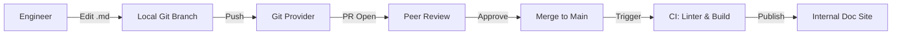

# Docs-as-Code Lifecycle

In modern DevOps, we treat documentation with the same rigor, tools, and respect as our application code.

## The Pipeline
Documentation shouldn't live in a separate wiki that falls behind the code. It belongs in **Git**.

1.  **Write (Markdown)**: Use a lightweight, text-based format.
2.  **Control (Git)**: Version every change. Branch for new procedures.
3.  **Review (PR)**: At least one other engineer must validate the procedure.
4.  **Test (CI)**: Automated linters check for broken links, syntax errors, and style.
5.  **Deploy (CD)**: Automatically publish to an internal docs portal (e.g., MkDocs, Hugo).

## Why Git for Docs?
- **Blame**: See exactly who changed a command last Tuesday.
- **Rollback**: If a procedure is updated incorrectly, you can "Revert" just like code.
- **Side-by-Side**: Keep the `setup-guide.md` in the same repo as the `setup-script.sh`.

## Mermaid Diagram: The Docs-as-Code Flow

---

## 🏗️ Real-Life Scenario: The "Which Version?" Nightmare
**Problem**: A developer updates the API to version 2.0. They update the Wiki. A week later, they have to rollback the API to version 1.9 due to a bug. 
**Conflict**: The Wiki is now "stuck" on version 2.0 instructions. The next person who tries to deploy is following the wrong guide.
**Solution**: Switch to **Docs-as-Code**. The `deployment.md` is in the نفس repo as the code. When code rolls back to version 1.9, the documentation automatically rolls back with it.
**Outcome**: Perfect synchronization between code and instructions.

---

## ❓ Interview Questions
1.  **What are the benefits of keeping documentation in the same repository as the code?**
    *   *Answer*: Atomic changes (code and docs update in the same commit), version synchronization (docs match the code version), and ease of discovery for developers.
2.  **How can CI (Continuous Integration) be used to improve documentation quality?**
    *   *Answer*: CI can run linters to check for formatting errors, scanners to ensure no secrets (passwords) are accidentally included, and link-checkers to prevent "dead links" to external tools.

---

## 🧠 Quiz Snippet (5/50+)
1.  **Which format is the standard for Docs-as-Code?** (Markdown)
2.  **True/False: Documentation should be peer-reviewed via Pull Requests.** (True)
3.  **What does a 'Linter' do for a markdown file?** (Checks for formatting, style, and syntax errors)
4.  **How do you see who last changed a line in a Git-based doc?** (Git Blame)
5.  **What is a 'Static Site Generator' (SSG)?** (A tool that turns Markdown files into a fast website)
