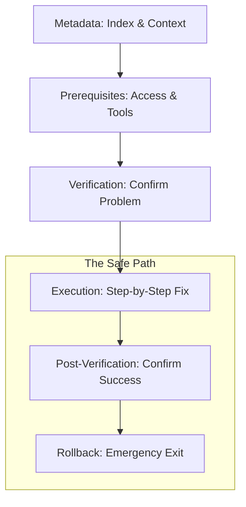

## The SOP Structural Map

---

## 🏗️ Real-Life Scenarios

### Scenario 1: The "Missing Step" Chaos
**Problem**: An SOP for "Rotating API Keys" forgotten to mention that the old keys must be disabled *after* the new ones are confirmed.
**Crisis**: An engineer follows the guide, adds new keys, but leaves the old compromised keys active. The hacker continues the attack.
**Outcome**: A security breach that could have been prevented with a clearer "Verification" section.
**Solution**: Add an "Audit Verification" step to the SOP template to ensure all old credentials are destroyed.
**Result**: In future rotations, the security team verified 100% deletion of legacy tokens.

### Scenario 2: The "Version Drift" Lockout
**Problem**: A runbook for "Updating Kubernetes Deployments" didn't specify the `kubectl` version. An engineer used a version 3 levels ahead of the cluster, causing a syntax error that failed the deployment midway.
**Solution**: Include a **Prerequisites** section that specifies exact tool versions (e.g., `kubectl v1.25.x`) and provides a command to check the version (`kubectl version --client`).
**Result**: Engineers now verify their local tools before touching production, eliminating "Client vs. Server" incompatibility outages.

### Scenario 3: The Ghost of the Rollback
**Problem**: A junior engineer ran a database migration from an SOP that lacked a rollback section. The migration slowed down the site, but the engineer was too afraid to cancel it because they didn't know if "Control-C" would corrupt the data.
**Solution**: Enforce a mandatory **Rollback** section in every SOP. It must include explicit instructions for safe cancellation and reversal.
**Result**: Increased team confidence; the next time a migration stalled, the engineer followed the rollback steps, reverted the change in 2 minutes, and investigated the issue safely.

---

## ❓ Interview Questions

1.  **What is the 'Anatomy' of a professional SOP in your experience?**
    - *Answer*: A robust SOP includes six core sections: Metadata (Context/Ownership), Prerequisites (Access/Tools), Initial Verification (Confirming the issue), Remediation (Atomic steps with expected output), Final Verification (Confirming success), and a Rollback Plan (Emergency exit).
2.  **Why is a 'Rollback' section mandatory for production SOPs?**
    - *Answer*: Because even "proven" fixes can have unexpected side effects due to environmental drift. A rollback plan provides an immediate path to safety, preventing "Action Bias" from making an incident worse during a panic.
3.  **Explain the importance of 'Expected Output' in a step-by-step guide.**
    - *Answer*: It serves as a validation checkpoint. If the output doesn't match the guide, it tells the engineer to "Stop" before they proceed to the next step, catching errors early and preventing a cascading failure.
4.  **How do 'Prerequisites' act as a safety gate?**
    - *Answer*: They ensure the operator has the correct IAM permissions, VPN access, and tool versions *before* they start. This prevents a scenario where a fix is 50% complete but fails because a tool is missing, leaving the system in an unstable state.
5.  **Should 'Self-Correction' loops be included in the remediation steps?**
    - *Answer*: Yes. High-quality SOPs include "If/Then" logic. For example: "If the service fails to restart, check logs at /var/log/app.log before proceeding to Step 4."
6.  **Where should 'High Risk' warnings (e.g., Data Deletion) be placed?**
    - *Answer*: At the beginning of the specific step, often formatted in bold or as an alert box, ensuring the engineer sees the risk *immediately* before taking the action.

---

## 🧠 Comprehensive Quiz (25 Questions)

**1. Which section lists the required IAM permissions and CLI tools?**
- A) Metadata
- B) Prerequisites
- C) Resolution
- D) Footer

Show Answer

**Answer: B**

**2. True/False: Metadata should include the 'Owner' or team responsible for the document.**
- A) True
- B) False

Show Answer

**Answer: A** - This ensures you know who to contact if the SDR needs updating.

**3. Why include 'Expected Output' after a terminal command?**
- A) To make the doc longer
- B) To provide a checkpoint that confirms the step was successful before moving on
- C) To show off the code
- D) It's optional

Show Answer

**Answer: B**

**4. The 'Remediation' section is primarily for:**
- A) Explaining the history of the app
- B) Step-by-step instructions to fix the problem
- C) Listing team members
- D) Budgeting

Show Answer

**Answer: B**

**5. A 'Rollback' plan is essential because:**
- A) It saves money
- B) It provides a safe exit strategy if the remediation steps fail or cause new issues
- C) It's required by the CEO
- D) It's for juniors only

Show Answer

**Answer: B**

**6. 'Initial Verification' helps confirm:**
- A) The engineer is awake
- B) That the problem described in the alert is actually happening
- C) The date
- D) The server location

Show Answer

**Answer: B**

**7. Metadata like 'SLO Impact' tells the reader:**
- A) How much money the site makes
- B) Which service level objectives are at risk during or after this procedure
- C) The server OS
- D) The author's name only

Show Answer

**Answer: B**

**8. Code blocks in an SOP should be:**
- A) Screenshots
- B) Plain text / Markdown code blocks for easy copy-pasting
- C) Links to other files
- D) Avoided

Show Answer

**Answer: B**

**9. 'Atomic Steps' means each numbered step should:**
- A) Contain 10 different tasks
- B) Be a single, clear action that leads to a measurable result
- C) Be a paragraph of text
- D) use complex language

Show Answer

**Answer: B**

**10. A 'Warning' about production downtime should be placed:**
- A) At the very end of the document
- B) Clearly at the top or immediately before the high-risk step
- C) In the footer
- D) In a separate email

Show Answer

**Answer: B**

**11. 'Final Verification' occurs:**
- A) Before the fix
- B) After the remediation steps to prove the system is back to healthy state
- C) Once a year
- D) Only for auditors

Show Answer

**Answer: B**

**12. True/False: An SOP Identifier (e.g., SOP-DB-01) makes documentation searchable.**
- A) True
- B) False

Show Answer

**Answer: A**

**13. Which section is best for 'Critical Safety' notices?**
- A) Glossary
- B) Prerequisites / Alerts
- C) History
- D) Appendix

Show Answer

**Answer: B**

**14. If a step fails, the 'Rollback' instructions are used to:**
- A) Delete the logs
- B) Safely undo changes and return to the last known good state
- C) Fix the document
- D) call a meeting

Show Answer

**Answer: B**

**15. 'Subject Matter Experts' (SMEs) are usually listed in:**
- A) The Rollback
- B) The Metadata (Owner/Author section)
- C) The Code blocks
- D) The header image

Show Answer

**Answer: B**

**16. Why use 'Imperative' verbs (Check, Run, Stop) in steps?**
- A) To be mean
- B) To provide clear, directive instructions that reduce ambiguity
- C) They look cooler
- D) No reason

Show Answer

**Answer: B**

**17. 'Environment Specific' instructions belong in:**
- A) Every SOP regardless
- B) Specific sections or separate SOPs for Dev/Staging/Prod
- C) Only in the code
- D) Nowhere

Show Answer

**Answer: B**

**18. A 'Troubleshooting' section within an SOP handles:**
- A) New feature ideas
- B) Common edge cases or "What if this step fails?" scenarios
- C) Personnel issues
- D) Payroll

Show Answer

**Answer: B**

**19. 'Linkability' in an SOP refers to:**
- A) Linking to social media
- B) Providing deep links to relevant dashboards, logs, or external tools
- C) Using many files
- D) deleting links

Show Answer

**Answer: B**

**20. True/False: Standardizing the anatomy of all SOPs reduces 'Cognitive Load' for engineers.**
- A) True
- B) False

Show Answer

**Answer: A**

**21. 'Visual Aids' (like Mermaid diagrams) are best used for:**
- A) Decoration
- B) Explaining complex logical flows or decision trees in the SOP
- C) Hiding text
- D) printing

Show Answer

**Answer: B**

**22. 'Pre-flight Checks' is another term for:**
- A) Vacation
- B) Prerequisites and initial verification
- C) Final cleanup
- D) Salary review

Show Answer

**Answer: B**

**23. Why specify 'Tool Versions' (e.g., Python 3.9+)?**
- A) To be difficult
- B) To avoid compatibility issues where an older/newer tool fails to run the command correctly
- C) It's a Git rule
- D) To use more numbers

Show Answer

**Answer: B**

**24. The 'Audience' of an SOP should be:**
- A) Only the CEO
- B) Clearly defined (e.g., "For SRE On-Call Engineers")
- C) Everyone in the world
- D) Nobody

Show Answer

**Answer: B**

**25. The core purpose of the SOP structure is:**
- A) To make writing harder
- B) To guide the user from a state of 'Problem' to 'Resolved' with maximum safety
- C) To fill up a Wiki
- D) to show off

Show Answer

**Answer: B**

