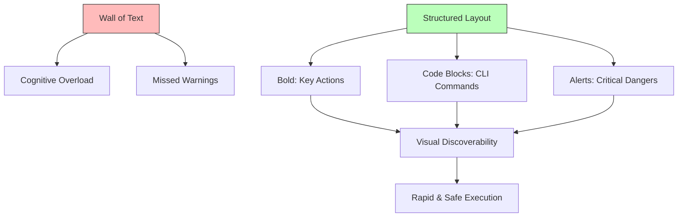

## The Visual Hierarchy of Clarity

---

## 🏗️ Real-Life Scenarios

### Scenario 1: The "Paragraph of Death"
**Problem**: An engineer is in the middle of a P0 outage. The SOP is a wall of text: "First you go to the console and find the EC2 dashboard and look for the instance ID then you might want to stop it but make sure you have a backup first but if you don't then call Bob..."
**Outcome**: The engineer misses the "make sure you have a backup" part in the middle of the paragraph. They stop the server, and data is lost forever because there was no backup.
**Fix**: Rewrite the doc using **Atomic Numbered Steps** and a **Warning Alert** at the top.
**Result**: In the next incident, the engineer saw the backup warning first, verified the snapshot, and proceeded safely.

### Scenario 2: The "Passive Risk"
**Problem**: A security procedure was written as: "It is generally expected that the firewall rules should be evaluated for potential vulnerabilities by the team."
**Outcome**: Because no one was directly told to "Evaluate," the task was ignored for months. A breach occurred through an open port that was "supposed" to be evaluated.
**Solution**: Changed to **Imperative Mood**: "**Evaluate** firewall rules for open ports monthly. **Close** any unused port immediately."
**Result**: Accountability increased, and the task was completed on time every month.

### Scenario 3: The Combined Crisis
**Problem**: An SOP step stated: "Download the patch and then restart the server and update the database."
**Crisis**: The engineer downloaded the patch, but the restart failed mid-way. Because the steps were grouped, the engineer didn't know whether to proceed to the database update or fix the restart first.
**Solution**: **One Thought, One Number**. Split into three distinct steps with verification after each.
**Result**: During the next patch, when the restart failed, the engineer stopped at Step 2 and followed the troubleshooting sub-guide, preventing a database corruption.

---

## ❓ Interview Questions

1.  **What is the 'Imperative Mood' and why is it preferred for SRE documentation?**
    - *Answer*: It is an authoritative, direct way of writing (e.g., "Run this command" instead of "You should run this command"). It removes ambiguity, doubt, and "wordiness," which is critical during the high-stress environment of an incident.
2.  **Explain the concept of 'Visual Discoverability' in technical documentation.**
    - *Answer*: It's the ability for a reader to "scan" a structure and find the most important information (commands, warnings, conclusions) without reading every word. This is achieved through formatting like bolding, code blocks, bullet points, and alert boxes.
3.  **Why should we avoid 'Combining Actions' in a single numbered step?**
    - *Answer*: Combining actions (e.g., "Restart and Update") makes it impossible to know where you are if a partial failure occurs. "One Thought, One Number" ensures that if Step 2 fails, the operator knows exactly where they are in the lifecycle.
4.  **How do you handle 'Negative Constraints' (things you should NOT do) in writing?**
    - *Answer*: They should be highlighted using specialized "Warning" or "Caution" alerts. Placing them in standard text increases the risk of them being skipped during a fast-paced outage.
5.  **What is 'Plain Language' and how does it help in an international team?**
    - *Answer*: Plain language avoids jargon, idioms, and complex sentence structures. It ensures that engineers whose first language might not be English can follow the instructions accurately without misunderstanding "flowery" language.
6.  **Why include 'Subject-Verb-Object' (SVO) structure in steps?**
    - *Answer*: SVO is the most direct way to communicate. E.g., "The Engineer [Subject] must Restart [Verb] the Service [Object]." It creates clear accountability for who does what.

---

## 🧠 Comprehensive Quiz (25 Questions)

**1. Which mood is preferred for operational commands?**
- A) Passive
- B) Imperative (Active)
- C) Questioning
- D) Poetic

Show Answer

**Answer: B**（e.g., "Run the script"）

**2. True/False: You should combine as many actions as possible into one step to save space.**
- A) True
- B) False

Show Answer

**Answer: B** - Use "One Thought, One Number" for clarity.

**3. 'Visual Discoverability' is improved by using:**
- A) Invisible text
- B) Bolding, code blocks, and alerts
- C) Only one font
- D) No images

Show Answer

**Answer: B**

**4. A 'Wall of Text' is dangerous because:**
- A) It's too long to read
- B) Critical warnings and steps can be easily missed during a high-stress outage
- C) It uses too much memory
- D) It's hard to print

Show Answer

**Answer: B**

**5. 'Code Blocks' are essential for CLI commands because:**
- A) They are colorful
- B) They make the command stand out from the text and are easy to copy-paste
- C) They hide the code
- D) they use less ink

Show Answer

**Answer: B**

**6. Which of these is an 'Atomic' step?**
- A) "Fix the server and call Bob"
- B) "**Verify** the CPU usage is below 80%"
- C) "Go to the website and look for the error then try to fix it"
- D) "Think about the problem"

Show Answer

**Answer: B**

**7. Why use '> [!WARNING]' or alert boxes?**
- A) To make the doc more exciting
- B) To physically separate dangerous steps from the standard flow
- C) To use up space
- D) to hide text

Show Answer

**Answer: B**

**8. 'Plain Language' ensures:**
- A) The doc is boring
- B) The instructions are understood by everyone, including non-native speakers
- C) No one reads it
- D) computers can't read it

Show Answer

**Answer: B**

**9. In 'Step 1: Restart App', the word 'Restart' is a:**
- A) Noun
- B) Verb (Imperative)
- C) Adjective
- D) Pronoun

Show Answer

**Answer: B**

**10. True/False: You should use 'We' or 'I' frequently in an SOP.**
- A) True
- B) False - SOPs should be objective and task-focused.

Show Answer

**Answer: B**

**11. 'Scanning' a document means:**
- A) Using a scanner machine
- B) Quickly reading headers and bold text to find the relevant section
- C) Deleting the file
- D) reading every word slowly

Show Answer

**Answer: B**

**12. 'Active' writing (John ran) is better than 'Passive' (The race was run by John) because:**
- A) It is shorter and more direct
- B) It's more formal
- C) It's more creative
- D) it's for juniors

Show Answer

**Answer: A**

**13. A 'Decision Point' in writing should be represented by:**
- A) A long paragraph
- B) A clear 'If/Then/Else' structure or a diagram
- C) A secret code
- D) nothing

Show Answer

**Answer: B**

**14. 'Redundancy' in writing (using too many words to say the same thing) should be:**
- A) Encouraged
- B) Eliminated for speed and clarity
- C) Used only in headings
- D) ignored

Show Answer

**Answer: B**

**15. Technical writing for operations is optimized for:**
- A) Entertainment
- B) Utility and Speed
- C) Legal reasons only
- D) marketing

Show Answer

**Answer: B**

**16. Why avoid idioms like 'Piece of cake' or 'Down the drain'?**
- A) They are too funny
- B) They can be confusing for non-native speakers or translated incorrectly by tools
- C) They take up too much space
- D) they are not allowed by Git

Show Answer

**Answer: B**

**17. 'Numbered Lists' imply:**
- A) A random order
- B) A specific, sequential order of operations
- C) A grocery list
- D) unimportant info

Show Answer

**Answer: B**

**18. 'Bullet Points' are used for:**
- A) Unordered lists or collections of items
- B) Strict sequences
- C) Only for titles
- D) to kill the text

Show Answer

**Answer: A**

**19. True/False: Jargon should always be explained or avoided in a general SOP.**
- A) True
- B) False

Show Answer

**Answer: A** - Never assume everyone knows the acronyms.

**20. A 'Call to Action' (CTA) in an SOP is:**
- A) A phone call
- B) The specific command the user must run
- C) A request for help
- D) a link to a website

Show Answer

**Answer: B**

**21. 'Cognitive Overload' occurs when the text is:**
- A) Too simple
- B) Dense, disorganized, and lacks clear hierarchy
- C) In Markdown
- D) in colors

Show Answer

**Answer: B**

**22. Which part of 'Check logs for Errors' is the object?**
- A) Check
- B) Logs
- C) Errors
- D) For

Show Answer

**Answer: B**

**23. Why use 'Bold' for UI elements (e.g., "**Click the OK button**")?**
- A) To make the text darker
- B) To clearly distinguish between what to type and what to click in the UI
- C) To hide the text
- D) it's a rule

Show Answer

**Answer: B**

**24. The 'Verb' in a step should ideally be:**
- A) At the end
- B) At the beginning (Imperative)
- C) Omitted
- D) capitalized

Show Answer

**Answer: B**

**25. Excellence in technical writing leads to:**
- A) More pages
- B) Lower MTTR and higher psychological safety for the team
- C) Lower salary
- D) boring work

Show Answer

**Answer: B**

