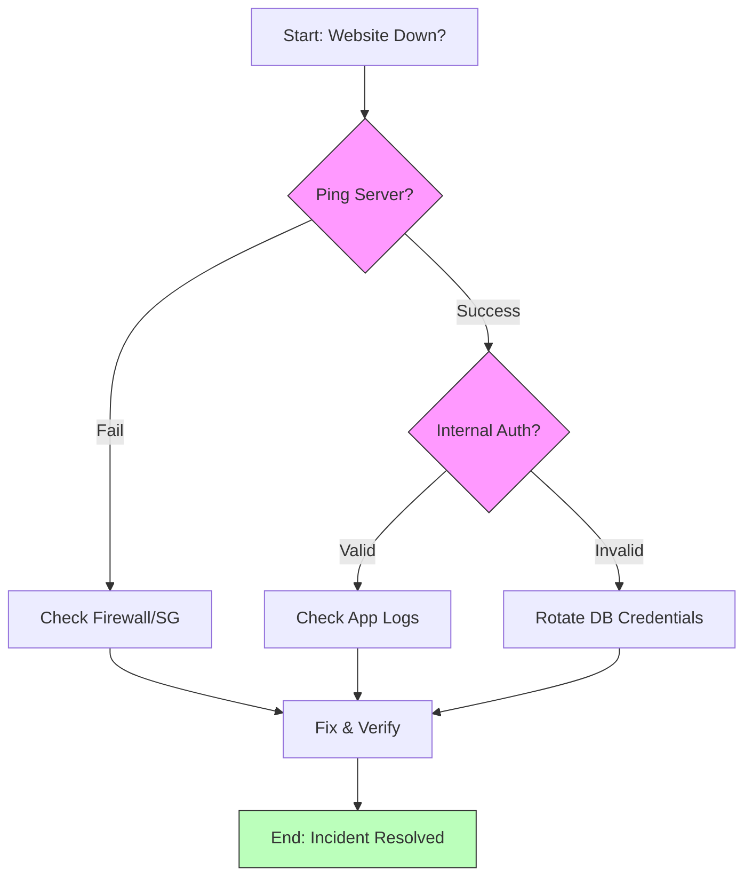

# Visualizing Workflows (Mermaid)

A picture is worth a thousand words, but only if that picture is easy to update. In DevOps, we use **Diagrams-as-Code**.

## Why Mermaid?
- **Text-Based**: Diagrams are written in simple text within your Markdown files.
- **Version Controlled**: You can see exactly how a workflow "evolved" in Git history.
- **No Extra Tools**: Renders automatically in GitHub, GitLab, and most IDEs.

## The Power of Decision Logic

---

## 🏗️ Real-Life Scenarios

### Scenario 1: The Outdated PNG
**Problem**: An architecture diagram was created in Visio in 2021 and saved as a `.png`. The architect left the company.
**Crisis**: The system changed in 2023. No one has the original Visio file. The PNG is now a "lie" that confuses new engineers.
**Outcome**: Now, when a developer adds a new server, they update 2 lines of text, and the diagram is updated for the whole team instantly.

### Scenario 2: The Logic Loop Escape
**Problem**: An SOP for "Onboarding Users" had complex manual logic: "If they are in Department X but also in Group Y, then do Z." New HR staff were constantly making mistakes because they couldn't follow the text logic.
**Solution**: Translate the logic into a **Mermaid Flowchart**.
**Result**: Mistakes dropped by 90% because the staff could visually follow the "Yes/No" paths instead of interpreting dense legalistic text.

### Scenario 3: The Sequence of Success
**Problem**: A troubleshooting guide for "OAuth Failures" was just a list of steps. Engineers struggled to understand *where* the failure was happening between the Client, the Proxy, and the Identity Provider.
**Solution**: Added a **Mermaid Sequence Diagram** showing the token exchange flow.
**Result**: MTTR decreased significantly because engineers could pinpoint the specific components involved in the handshake failure.

---

## ❓ Interview Questions

1.  **What are the primary advantages of Diagrams-as-Code (like Mermaid) over traditional GUI tools?**
    - *Answer*: 1. **Version Control**: Unlike binaries (.vsdx, .png), text-based diagrams produce readable diffs in Git. 2. **Accessibility**: Anyone with a text editor can update them. 3. **Synchronization**: The diagram lives inside the documentation, ensuring it's not forgotten during updates.
2.  **How do you decide between a Flowchart and a Sequence Diagram?**
    - *Answer*: Use a **Flowchart** for decision-making logic and branching paths (the "What happens if...?" scenarios). Use a **Sequence Diagram** to visualize the chronological interaction between different entities or services (the "Who talks to whom and when?").
3.  **Explain why 'Simplicity' is a core requirement for operational diagrams.**
    - *Answer*: During an incident, highly complex architecture maps are overwhelming. An operational diagram should be "Task-Specific," mapping only the logic required to resolve the specific alert, not the entire company infrastructure.
4.  **How does Mermaid improve 'Collaboration' in a DevOps team?**
    - *Answer*: It allows developers to propose diagram changes in the same Pull Request (PR) as their code changes. Peer review for documentation becomes as standard as peer review for code.
5.  **What is the benefit of 'Styling' nodes in a Mermaid flowchart?**
    - *Answer*: Styling (colors/shapes) can represent different environments (Prod vs. Dev) or status (Critical vs. Safe), allowing an engineer to visually prioritize pathing under stress.
6.  **At what point should a diagram NOT be used in an SOP?**
    - *Answer*: When the process is purely linear and simple (e.g., just 3 steps). Over-diagramming can lead to "Visual Noise" that distracts from the actual commands.

---

## 🧠 Comprehensive Quiz (25 Questions)

**1. Is Mermaid code-based or image-based?**
- A) Image-based (.png)
- B) Code-based (Diagrams-as-Code)
- C) Binary-based
- D) Only supports video

Show Answer

**Answer: B**

**2. True/False: Mermaid diagrams are stored as separate binary files (.vsdx) in Git.**
- A) True
- B) False

Show Answer

**Answer: B** - They are text blocks inside Markdown files.

**3. Which diagram type is best for visualizing 'Decision Trees'?**
- A) Sequence Diagram
- B) Flowchart
- C) Gantt Chart
- D) Pie Chart

Show Answer

**Answer: B**

**4. The 'TD' in `graph TD` stands for:**
- A) Total Data
- B) Top-Down
- C) Technical Drawing
- D) Terminal Document

Show Answer

**Answer: B**

**5. Which diagram shows interactions between a User, a Load Balancer, and a Database?**
- A) Pie Chart
- B) Sequence Diagram
- C) State Diagram
- D) Class Diagram

Show Answer

**Answer: B**

**6. Why is text-based diagramming better for Git Pull Requests?**
- A) It uses more disk space
- B) It allows reviewers to see exact line-by-line changes in the logic
- C) It's colorful
- D) It's for experts only

Show Answer

**Answer: B**

**7. In a flowchart, curly braces `{ }` usually represent:**
- A) A Starting point
- B) A Decision point (Diamond shape)
- C) A Code block
- D) An End state

Show Answer

**Answer: B**

**8. 'LR' in a Mermaid graph stands for:**
- A) Lower Right
- B) Left-to-Right
- C) Logic Review
- D) Layered Resources

Show Answer

**Answer: B**

**9. True/False: If you don't have the original Visio file, a PNG diagram is hard to update.**
- A) True
- B) False

Show Answer

**Answer: A** - This is why DaC is superior.

**10. Mermaid diagrams are rendered by:**
- A) The browser or a viewer plugin
- B) A physical printer
- C) Moving files to a server
- D) Manual drawing

Show Answer

**Answer: A**

**11. A 'State Diagram' is most useful for:**
- A) Showing a team structure
- B) Showing the lifecycle of a resource (Pending -> Running -> Terminated)
- C) Counting files
- D) making a list

Show Answer

**Answer: B**

**12. 'Styling' a node (e.g., `style A fill:#f9f`) helps:**
- A) Make the file larger
- B) Visually emphasize critical or specific parts of a workflow
- C) Hide the text
- D) It's illegal

Show Answer

**Answer: B**

**13. Which symbol creates a standard box node in a flowchart?**
- A) `{ }`
- B) `[ ]`
- C) `( )`
- D) `(( ))`

Show Answer

**Answer: B**

**14. Multi-system communication is best handled by which diagram?**
- A) Flowchart
- B) Sequence Diagram
- C) Gantt Chart
- D) ER Diagram

Show Answer

**Answer: B**

**15. True/False: You can embed Mermaid diagrams directly in a README.md on GitHub.**
- A) True
- B) False

Show Answer

**Answer: A**

**16. 'Diagrams-as-Code' (DaC) means:**
- A) Drawing with a mouse
- B) Writing text that represents a diagram and versioning it like code
- C) Using AI to draw
- D) Printing code

Show Answer

**Answer: B**

**17. A 'Gantt Chart' in Mermaid is used for:**
- A) Troubleshooting
- B) Project Planning and Timelines
- C) Coding
- D) Deleting servers

Show Answer

**Answer: B**

**18. Why keep diagrams 'Task-Specific'?**
- A) To save time
- B) To minimize clutter and focus on the immediate logical path for the engineer
- C) To make more files
- D) No reason

Show Answer

**Answer: B**

**19. In a flowchart, `-->` represents:**
- A) A secret link
- B) A directed connection or edge between nodes
- C) A comment
- D) A variable

Show Answer

**Answer: B**

**20. 'Subgraphs' in Mermaid are used to:**
- A) Group related nodes together into a cluster
- B) Hide code
- C) Delete parts of a graph
- D) link to Google

Show Answer

**Answer: A**

**21. True/False: Mermaid is only available in VS Code.**
- A) True
- B) False - It's widely supported across GitHub, GitLab, Notion, and many other tools.

Show Answer

**Answer: B**

**22. Which shape represents a 'Starting Node' conventionally in Mermaid?**
- A) Rectangular `[ ]`
- B) Rounded `( )`
- C) Diamond `{ }`
- D) Circle `(( ))`

Show Answer

**Answer: B**

**23. 'Visual Noise' refers to:**
- A) Loud music
- B) Over-complicated diagrams that distract from the main objective
- C) Blurry images
- D) clear text

Show Answer

**Answer: B**

**24. The 'Actor' in a sequence diagram represents:**
- A) A movie star
- B) A system component or user participating in the sequence
- C) A type of file
- D) a server

Show Answer

**Answer: B**

**25. The ultimate result of using Mermaid is:**
- A) Better art
- B) Improved documentation maintainability and faster comprehension during incidents
- C) Lower disk usage
- D) it's mandatory

Show Answer

**Answer: B**

