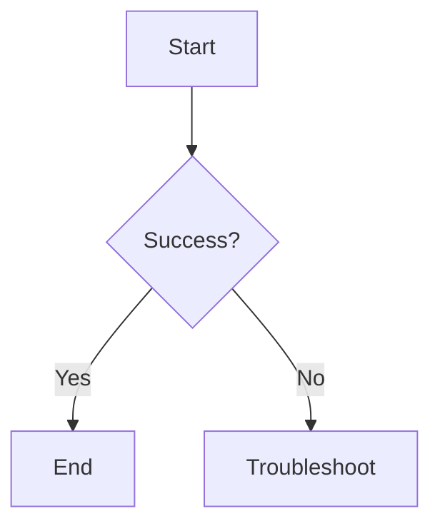

# Visualizing Workflows (Mermaid)

A picture is worth a thousand words, but only if that picture is easy to update. In DevOps, we use **Diagrams-as-Code**.

## Why Mermaid?
- **Text-Based**: Diagrams are written in simple text within your Markdown files.
- **Version Controlled**: You can see exactly how a workflow "evolved" in Git history.
- **No Extra Tools**: Renders automatically in GitHub, GitLab, and most IDEs.

## Common Diagram Types

### 1. Flowcharts
Used for decision trees (e.g., "If A happens, do B").

### 2. Sequence Diagrams
Used to show interactions between systems (e.g., "User -> Load Balancer -> Web Server").

### 3. State Diagrams
Used to show the lifecycle of a resource (e.g., "Pending -> Running -> Stopping").

## Tips for Effective Diagrams
- **Keep it Simple**: Don't try to map the entire architecture in one SOP. Map only the specific workflow for that task.
- **Link it**: Put the diagram at the top of the SOP to provide a "Quick Map" for the reader.

---

## 🏗️ Real-Life Scenario: The Outdated PNG
**Problem**: An architecture diagram was created in Visio in 2021 and saved as a `.png`. The architect left the company.
**Crisis**: The system changed in 2023. No one has the original Visio file. The PNG is now a "lie" that confuses new engineers.
**Fix**: Re-create the diagram in **Mermaid** inside the GitHub README. 
**Outcome**: Now, when a developer adds a new server, they update 2 lines of text, and the diagram is updated for the whole team instantly.

---

## ❓ Interview Questions
1.  **What are the advantages of Diagrams-as-Code (like Mermaid) over traditional diagramming tools?**
    *   *Answer*: Portability, version control (diff-able), ease of maintenance (anyone can edit the text), and synchronization with the documentation itself.
2.  **How do you decide between a Flowchart and a Sequence Diagram for an SOP?**
    *   *Answer*: Use a Flowchart for "Decision Trees" and logic paths. Use a Sequence Diagram when you need to show the step-by-step communication and timing between multiple distinct components (e.g., an Auth flow).

---

## 🧠 Quiz Snippet (5/50+)
1.  **Is Mermaid code-based or image-based?** (Code-based / Diagrams-as-Code)
2.  **True/False: Mermaid diagrams are stored in separate binary files.** (False - they are text inside .md files)
3.  **Which diagram type is best for showing 'Decision Logic'?** (Flowchart)
4.  **Can you see the difference between two versions of a Mermaid diagram in a Git PR?** (Yes, as a text diff)
5.  **Which keyword starts a top-to-bottom flowchart?** (`graph TD`)
