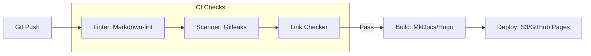

## The Automated Documentation Pipeline

---

## 🏗️ Real-Life Scenarios

### Scenario 1: The Broken Link Disaster
**Problem**: An SOP for "Database Scaling" links to an internal tool. The tool URL changes.
**Crisis**: During an incident, the engineer clicks the link and gets a `404 Not Found`. They waste 15 minutes asking Slack for the new URL while the database is on fire.
**Outcome**: MTTR is increased by 15 minutes, leading to a service breach.
**Fix**: Implement a **Link Checker** in the CI pipeline.
**Result**: Now, if an engineer tries to merge an SOP with a broken link, the CI pipeline fails. The link *must* be fixed before publishing.

### Scenario 2: The "Offline" Wiki
**Problem**: A company hosted their SRE wiki on the same infrastructure it was supposed to document. When the infrastructure went down, the wiki went down too.
**Solution**: Adopted **Static Site Generators** (SSGs) and hosted the documentation on a completely separate cloud provider (Netlify).
**Result**: During a major regional outage of their primary provider, the SRE team still had access to their full recovery documentation, enabling a much faster cross-region failover.

### Scenario 3: The Secret Scanner Save
**Problem**: A developer was documenting how to use a legacy API and accidentally pasted a real `CLIENT_SECRET` into the Markdown file to "make it easier to copy and test."
**Solution**: Implemented **Gitleaks** as a pre-commit hook and a CI step.
**Result**: The secret was detected immediately. The commit was blocked, the developer was educated, and the credentials were rotated before any external hacker could exploit it.

---

## ❓ Interview Questions

1.  **What is a Static Site Generator (SSG) and why is it preferred for SRE documentation over a traditional CMS?**
    - *Answer*: An SSG (like MkDocs or Hugo) converts plain-text Markdown into a fast, pre-built website. It's preferred because it supports "Docs-as-Code," allowing for version control, peer review via PRs, and hosting on low-cost, high-availability storage without the security vulnerabilities of a database-driven CMS.
2.  **How do 'PR Previews' improve the documentation workflow?**
    - *Answer*: They provide a temporary URL showing exactly how the document will look and feel after the merge. This allows reviewers to verify layout, rendering of diagrams (like Mermaid), and the overall "UX" of the documentation before it goes live.
3.  **Explain the difference between a 'Style Linter' and a 'Secret Scanner'.**
    - *Answer*: A **Style Linter** (e.g., Markdown-lint) ensures consistent formatting, heading levels, and syntax. A **Secret Scanner** (e.g., Gitleaks) specifically searches for patterns matching API keys, passwords, and private tokens to prevent data leaks.
4.  **Why is it important to host operational documentation 'Out-of-Band'?**
    - *Answer*: "Out-of-Band" means hosting docs on an infrastructure separate from the one they document. This ensures that even if your primary data center or cloud region is down, your recovery instructions remain accessible.
5.  **What is 'Vale' and why would a large team use it?**
    - *Answer*: Vale is a "Prose Linter." It goes beyond syntax to check for "Brand Voice," technical accuracy, and inclusive language. Large teams use it to ensure that documentation written by 50 different engineers sounds consistent and professional.
6.  **Why is 'Searchability' the most critical feature of a documentation portal?**
    - *Answer*: During an incident, engineers don't have time to browse folders. A portal must have high-performance full-text search (often provided by lunr.js in MkDocs) to surface the correct SOP in seconds.

---

## 🧠 Comprehensive Quiz (25 Questions)

**1. Which SSG is written in Python and is highly popular for SRE documentation?**
- A) Hugo
- B) MkDocs
- C) Docusaurus
- D) WordPress

Show Answer

**Answer: B**（Particularly with the 'Material' theme）

**2. True/False: Static sites require a database to serve content.**
- A) True
- B) False

Show Answer

**Answer: B** - They are pre-built HTML/JS files.

**3. What is the main benefit of 'Hugo' over other SSGs?**
- A) It's easy to learn
- B) Extreme build speed (thousands of pages in seconds)
- C) It uses React
- D) It's owned by Microsoft

Show Answer

**Answer: B**

**4. A 'Markdown Linter' primarily checks for:**
- A) Content accuracy
- B) Formatting, heading levels, and syntax consistency
- C) Spelling only
- D) Secret keys

Show Answer

**Answer: B**

**5. Which tool scans for leaked passwords specifically?**
- A) Markdown-lint
- B) Gitleaks / TruffleHog
- C) Hugo
- D) Google Chrome

Show Answer

**Answer: B**

**6. 'Out-of-Band' hosting means hosting docs:**
- A) On a guitar
- B) On infrastructure separate from the systems being documented
- C) Locally on your laptop only
- D) Hidden from everyone

Show Answer

**Answer: B**

**7. 'Vale' is known as a:**
- A) Prose Linter (checking voice and tone)
- B) Database engine
- C) Compiler
- D) Browser

Show Answer

**Answer: A**

**8. PR Previews are useful because they:**
- A) Save money
- B) Show how the doc will render in the browser before merging
- C) Delete old files
- D) share passwords

Show Answer

**Answer: B**

**9. Why use 'Material for MkDocs'?**
- A) It's the only theme
- B) It provides an industry-standard, clean, and mobile-friendly UI out of the box
- C) It's free of charge for everyone
- D) it uses AI

Show Answer

**Answer: B**

**10. What does 'CI' stand for in a documentation pipeline?**
- A) Code Integration
- B) Continuous Integration
- C) Constant Improvement
- D) Client Input

Show Answer

**Answer: B**

**11. True/False: You can use GitHub Actions to automatically deploy your MkDocs site.**
- A) True
- B) False

Show Answer

**Answer: A**

**12. A 'Link Checker' fails a build if it finds a:**
- A) Long link
- B) Broken or 404 URL
- C) New link
- D) link to the homepage

Show Answer

**Answer: B**

**13. Docusaurus is built on which framework?**
- A) Angular
- B) React
- C) Vue
- D) Django

Show Answer

**Answer: B**

**14. 'In-repository' documentation is easier to keep updated because:**
- A) It's smaller
- B) It changes in the same Pull Request as the code it describes
- C) It's private
- D) it's for juniors

Show Answer

**Answer: B**

**15. Which of these is a hosting provider suitable for static sites?**
- A) Oracle DB
- B) Netlify / Vercel
- C) Slack
- D) Zoom

Show Answer

**Answer: B**

**16. 'Lunr.js' is often used in MkDocs for:**
- A) Sending emails
- B) Client-side full-text search
- C) Generating images
- D) deleting files

Show Answer

**Answer: B**

**17. Why is 'Versioned Documentation' important?**
- A) To make more work
- B) To match the documentation to specific versions of the software (v1 vs v2)
- C) To hide mistakes
- D) it's a legal rule

Show Answer

**Answer: B**

**18. 'Inclusive Language' checks in Vale look for:**
- A) Large files
- B) Bias, gendered terms, or non-inclusive terminology in clinical writing
- C) Fast code
- D) internet speed

Show Answer

**Answer: B**

**19. True/False: Hugo requires a Python environment to run.**
- A) True
- B) False - It's a single binary written in Go.

Show Answer

**Answer: B**

**20. 'Front Matter' is used to define:**
- A) The end of a doc
- B) Metadata (Title, Tags, Layout) for the SSG to use
- C) The code block
- D) images

Show Answer

**Answer: B**

**21. A 'Custom Domain' for documentation helps by:**
- A) Making it look professional and being easy to remember (e.g., docs.company.com)
- B) Speeding up the site
- C) Hiding the host
- D) printing

Show Answer

**Answer: A**

**22. 'Documentation as Code' (DaC) treats docs like:**
- A) Books
- B) Software code (Linting, Testing, Deploying)
- C) Emails
- D) images

Show Answer

**Answer: B**

**23. Why use a 'Dead-Link' checker?**
- A) It looks for zombie movies
- B) To ensure that engineers don't follow broken URLs during a crisis
- C) To delete files
- D) it's a rule

Show Answer

**Answer: B**

**24. The 'Build Artifact' of an SSG is usually:**
- A) A .zip file of the source
- B) A folder containing HTML, CSS, and JS files
- C) A PDF
- D) a video

Show Answer

**Answer: B**

**25. The ultimate goal of specialized documentation tooling is:**
- A) To use fancy tools
- B) To minimize documentation rot and maximize accessibility for the whole engineering team
- C) To save disk space
- D) to satisfy auditors

Show Answer

**Answer: B**

