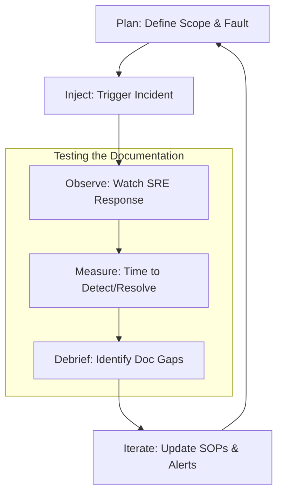

## The Gameday Lifecycle

---

## 🏗️ Real-Life Scenarios

### Scenario 1: The "Blind" Gameday
**Problem**: An SRE team thinks their "Primary Database Failover" SOP is perfect. They wrote it 6 months ago but never ran it.
**Event**: During a Gameday, the senior engineer who wrote the doc is barred from helping. The rest of the team tries to follow it. They discover that a specific CLI tool version was deprecated and the command no longer works.
**Outcome**: The Gameday fails. The data stayed unavailable for 45 minutes because of a single outdated command.
**Lesson**: Better to fail during a Tuesday morning drill than a Saturday night disaster. The SOP is updated immediately after the debrief.

### Scenario 2: The "Hidden Step" Scribe
**Problem**: During a routine Gameday, a "Scribe" (observer) noticed that every engineer was manually SSHing into a server to check a specific log file, even though that step wasn't in the SOP.
**Outcome**: The engineers were relying on "tribal knowledge" rather than the documentation.
**Solution**: The Scribe added a specific step to the SOP listing the `tail -f` command for that log, along with the expected "Healthy" pattern.
**Result**: In the next real incident, a new hire followed the guide perfectly without needing to ask where the logs were.

### Scenario 3: The Rollback Nightmare
**Problem**: An application upgrade SOP had a "Rollback" section that was never tested. During a Gameday, the team attempted to rollback a failed deployment.
**Crisis**: They discovered the rollback script required a database backup that was created *before* the migration, but the SOP didn't tell them to create one.
**Solution**: Updated the **Prerequisites** and **Steps** to include a mandatory snapshot before starting.
**Result**: Increased team confidence; the next real failed deployment was reverted in under 5 minutes because the backup was ready.

---

## ❓ Interview Questions

1.  **What is a 'Gameday' and what is its primary value for an SRE team?**
    - *Answer*: A Gameday is a controlled exercise where a team intentionally injects a fault into a non-production (or staging) environment to test their response systems. Its value lies in identifying gaps in monitoring, alerting, and specifically **documentation** before they cause a real-world outage.
2.  **Explain the role of the 'Scribe' or 'Observer' during a documentation test.**
    - *Answer*: The Scribe does not help fix the issue. Instead, they watch the engineers' behavior. They look for moments of hesitation, "side searches" on Google, or manual steps taken that aren't in the SOP. These represent "Documentation Debt" that needs to be fixed.
3.  **How do you incorporate documentation feedback into a blameless post-mortem?**
    - *Answer*: By making it a standard section of the report. We ask: "Was the documentation discoverable? Was it accurate? Did it include a valid rollback plan?" Any negative responses are converted into prioritized work items for the next sprint.
4.  **What is the 'Junior Test' and why is it effective?**
    - *Answer*: It involves giving a documentation set to a new hire or a junior engineer and asking them to perform the task without assistance. If they struggle, the documentation is too reliant on "Expert Context" and needs to be clarified for general use.
5.  **Should 'Gamedays' be done in Production?**
    - *Answer*: Ideally, you start in Staging to build confidence. More mature organizations (Chaos Engineering) eventually run them in Production (under strict safety protocols) to verify that the environment-specific configs in the SOP are also correct.
6.  **How do 'Failure Modes and Effects Analysis' (FMEA) relate to SOP testing?**
    - *Answer*: FMEA helps identify what *could* go wrong. We then use Gamedays to test the SOPs written for those specific failure modes, closing the loop between theoretical risk and operational readiness.

---

## 🧠 Comprehensive Quiz (25 Questions)

**1. What is the main purpose of a 'Gameday'?**
- A) To play video games
- B) To test response systems, monitoring, and documentation in a safe environment
- C) To find out who to blame for outages
- D) To update HR records

Show Answer

**Answer: B**

**2. True/False: Documentation should be updated after every major incident where it was found to be lacking.**
- A) True
- B) False

Show Answer

**Answer: A** - This is the "Feedback Loop."

**3. The 'Junior Test' verifies documentation by:**
- A) Making sure juniors work harder
- B) Ensuring a person with less context can follow the guide successfully without help
- C) Deleting simple docs
- D) Asking for money

Show Answer

**Answer: B**

**4. When should you ideally test a 'Rollback Plan'?**
- A) Only during a real catastrophe
- B) During a scheduled Gameday or drill
- C) Never
- D) Once a year

Show Answer

**Answer: B**

**5. A 'Scribe' in a Gameday is responsible for:**
- A) Fixing the servers
- B) Documenting gaps in the SOP and observing engineer behavior
- C) Buying lunch
- D) Calling the CEO

Show Answer

**Answer: B**

**6. 'Tribal Knowledge' is dangerous because:**
- A) It is too fast
- B) It exists only in people's heads and is not captured in the documentation
- C) It is always wrong
- D) It's formal

Show Answer

**Answer: B**

**7. Which metric is most improved by regularly tested SOPs?**
- A) Line of code count
- B) MTTR (Mean Time to Repair)
- C) Email volume
- D) CPU temperature

Show Answer

**Answer: B**

**8. In the Gameday Lifecycle, what comes after 'Observe'?**
- A) Plan
- B) Measure (and then Debrief)
- C) Inject
- D) Sleep

Show Answer

**Answer: B**

**9. True/False: A Gameday failure is a bad thing for the team.**
- A) True
- B) False - It's a "Success" if you find a bug before it hits Production.

Show Answer

**Answer: B**

**10. 'Iteration' in the context of documentation means:**
- A) Copying files
- B) Continuously updating and improving docs based on test results
- C) Deleting the whole wiki
- D) writing in Greek

Show Answer

**Answer: B**

**11. Why should the author of an SOP NOT be the one testing it in a Gameday?**
- A) They are too busy
- B) They have "Implicit Knowledge" and will unconsciously skip broken steps without noticing
- C) They aren't allowed in the room
- D) It's a legal rule

Show Answer

**Answer: B**

**12. A 'Debrief' session occurs:**
- A) Before the Gameday
- B) After the Gameday to discuss what was learned and what needs fixing
- C) Once a month
- D) only for seniors

Show Answer

**Answer: B**

**13. 'Stress Testing' documentation refers to:**
- A) Pressing the keyboard hard
- B) Using the doc under time pressure or simulate chaotic environments
- C) Printing it 100 times
- D) hiding it

Show Answer

**Answer: B**

**14. Which document should have a mandatory Gameday test?**
- A) The holiday calendar
- B) Disaster Recovery (DR) plans
- C) The cafeteria menu
- D) Personnel files

Show Answer

**Answer: B**

**15. True/False: Post-mortem reviews should identify specific line numbers or sections in the SOP that failed.**
- A) True
- B) False

Show Answer

**Answer: A**

**16. 'Confidence Inflation' is the risk that:**
- A) Money loses value
- B) Teams *feel* prepared but their documentation is actually stale and untested
- C) Everyone is too happy
- D) documentation is too long

Show Answer

**Answer: B**

**17. 'Chaos Engineering' is related to Gamedays because:**
- A) They both cause chaos
- B) It is the practice of automating the "Inject Fault" part of the cycle
- C) It's a marketing term
- D) it's about deleting users

Show Answer

**Answer: B**

**18. A 'Documentation Bug' is:**
- A) An insect on the paper
- B) An error, missing step, or outdated instruction in the wiki
- C) A typo only
- D) a virus

Show Answer

**Answer: B**

**19. 'Time to Success' is a metric that measures:**
- A) How long a meeting lasts
- B) How long it takes to solve an incident using the documentation
- C) How long it takes to write a page
- D) salary over time

Show Answer

**Answer: B**

**20. True/False: You should test if your 'Communication' steps in the SOP work (e.g., Slack channels).**
- A) True
- B) False

Show Answer

**Answer: A**

**21. 'Drift' in documentation happens because:**
- A) The document moves
- B) The underlying system changes but the documentation is not updated
- C) Of the wind
- D) authors leave

Show Answer

**Answer: B**

**22. 'Gameday Scope' defines:**
- A) The length of the day
- B) Exactly which systems and SOPs are being tested
- C) The budget
- D) the colors of the repo

Show Answer

**Answer: B**

**23. Why include 'Success Criteria' for a Gameday?**
- A) To win a prize
- B) To objectively know if the documentation and response met the goal
- C) To end the meeting
- D) no reason

Show Answer

**Answer: B**

**24. 'Documentation Maintenance' is:**
- A) Cleaning the server
- B) The ongoing effort to keep SOPs tested and current
- C) Typing fast
- D) printing

Show Answer

**Answer: B**

**25. The ultimate result of Testing and Iteration is:**
- A) More files
- B) High Operational Excellence and team psychological safety
- C) More meetings
- D) lower CPU usage

Show Answer

**Answer: B**

