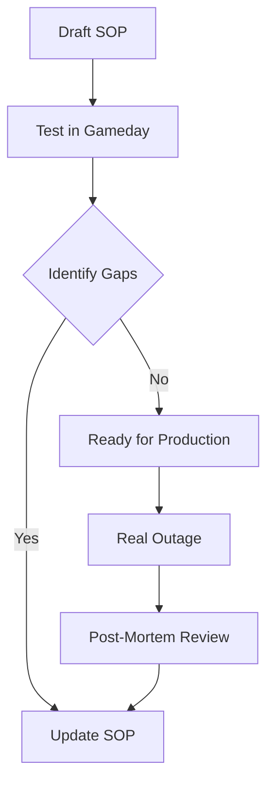

# Testing and Iteration (Gamedays)

Documentation is like code—if you don't test it, it's probably broken.

## 1. The Gameday (The Stress Test)
A Gameday is a scheduled workshop where you intentionally "break" a staging environment and task a team with fixing it *using only the documentation*.
- **The Observation**: A "Scribe" watches the engineer. If the engineer hesitates or searches Google, the documentation is missing a step.
- **The Goal**: High-fidelity verification of the SOP.

## 2. The Junior Test (The Clarity Test)
Give a "senior-level" SOP to a new junior engineer. If they can't follow it without asking for help, the SOP isn't clear enough.

## 3. Post-Mortem Feedback
After a real incident, the very first follow-up action must be: "Did the documentation serve us well? If not, what commit do we need to make today?"

## Mermaid Diagram: The Continuous Quality Loop

---

## 🏗️ Real-Life Scenario: The "Blind" Gameday
**Problem**: An SRE team thinks their "Primary Database Failover" SOP is perfect. They wrote it 6 months ago.
**Event**: During a Gameday, the senior who wrote it is barred from helping. The rest of the team tries to follow it. They discover that a specific CLI tool version was deprecated and the command no longer works.
**Outcome**: The Gameday fails. 
**Lesson**: Better to fail during a Tuesday morning drill than a Saturday night disaster. The SOP is updated before the real crash.

---

## ❓ Interview Questions
1.  **What is a 'Gameday' and what is its primary value for an SRE team?**
    *   *Answer*: A controlled exercise where you simulate a fault and test the response. Its value is in identifying gaps in both the monitoring and the documentation before they cause a real-world outage.
2.  **How do you incorporate documentation feedback into a blameless post-mortem?**
    *   *Answer*: By asking specific questions: "Was the documentation discoverable? Was it accurate? Was the rollback plan clear?" Any 'No' answers are turned into high-priority Jira tickets for the documentation owner.

---

## 🧠 Quiz Snippet (5/50+)
1.  **What is a 'Gameday' used for?** (Testing response and documentation in a safe environment)
2.  **True/False: Documentation should be updated after every incident where it was used.** (Yes)
3.  **What is the 'Junior Test'?** (Verifying doc clarity by having a less experienced person follow it)
4.  **When should you test your rollback plan?** (In a Gameday, before a real incident)
5.  **Which metric improves with regularly tested SOPs?** (Confidence and MTTR)
