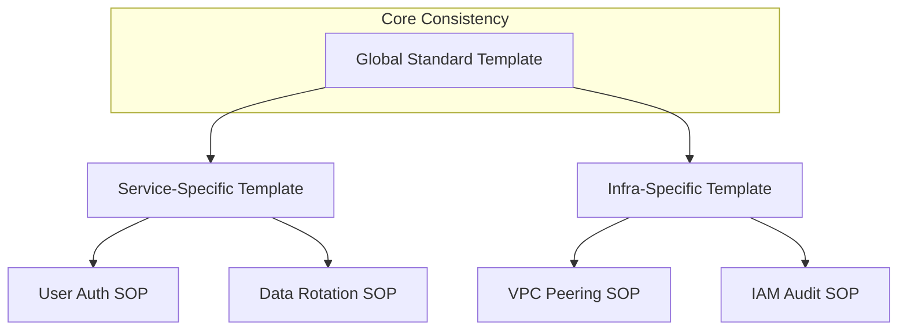

## The Template Hierarchy

---

## 🏗️ Real-Life Scenarios

### Scenario 1: The "Custom" Headache
**Problem**: One team likes to write SOPs as "Stories" in a Wiki. Another team uses "Checklists" in Git. A third team uses "Presentations."
**Crisis**: During a "Cross-Team" incident (e.g., Network + DB), the engineers are constantly confused by the different styles. They take 3 minutes per document just to figure out "how to read it."
**Outcome**: MTTR is pushed back by 10 minutes, leading to a missed SLA.
**Solution**: The CTO mandates a company-wide **Standard Markdown Template**.
**Result**: Context-switching time between teams drops to zero. Engineers "know where the meat is" regardless of which team wrote the doc.

### Scenario 2: The "Ghost" Owner
**Problem**: A critical service failed, and the SOP on file was 2 years old. The engineer tried to contact the "Author," but that person had left the company 18 months ago. There was no "Team Owner" listed.
**Solution**: Updated the **Standard Template** to require a `Team Owner` field and a `Last Reviewed` date.
**Result**: Documentation is now mapped to active teams, and stale docs are caught by automated audit scripts.

### Scenario 3: The "Cookiecutter" Success
**Problem**: Developers were resistant to writing documentation because "setting up the headers and structure is a pain."
**Solution**: Created a `cookiecutter` template. By running one CLI command, a developer gets a perfectly formatted Markdown file with all mandatory sections and sample steps ready to fill in.
**Result**: Documentation volume increased by 40% because the "starting friction" was removed.

---

## ❓ Interview Questions

1.  **Why is standardization of documentation formats critical for large organizations?**
    - *Answer*: It reduces "Cognitive Load" and "Context-Switching" time. When every document looks the same, an engineer's brain doesn't have to waste energy "finding" where the commands or rollback plans are. It also allows for easier automation (linting/auditing).
2.  **How do you handle 'Exceptions' to the standard template?**
    - *Answer*: Exceptions should be deliberate and rare. While the core "Steps" and "Header" should remain identical, a specific team (like Security) may add specialized sections (like Compliance Mapping). The goal is to have a "Global Base" with "Modular Extensions."
3.  **Explain the value of using a 'Cookiecutter' or Template Repository for docs.**
    - *Answer*: It ensures consistency from the very first second of a document's life. It removes the "Blank Page" syndrome for engineers and makes it impossible to accidentally forget mandatory fields like 'Owner' or 'SLO Impact'.
4.  **What role do 'Pre-commit Hooks' play in organizational documentation?**
    - *Answer*: They act as an automated gatekeeper. They can check if a new Markdown file contains all the mandatory headers (like an ID or a valid team name) and block the `git push` if they are missing, enforcing standards without manual review.
5.  **Should templates include 'Example Text'?**
    - *Answer*: High-quality templates include "In-line Examples." Instead of an empty `Steps:` section, it should have a commented-out sample: `# 1. Run [Command] | Expected: [Success]`. This guides the author toward the correct writing style.
6.  **How does a standard template help with 'Accessibility'?**
    - *Answer*: It ensures a consistent heading hierarchy (H1 -> H2 -> H3), which is essential for screen readers and automated table-of-contents generation.

---

## 🧠 Comprehensive Quiz (25 Questions)

**1. What is the primary benefit of a standardized Header in every doc?**
- A) It looks pretty
- B) Fast search, ownership tracking, and instant context for the reader
- C) It hides the content
- D) It's required by Git

Show Answer

**Answer: B**

**2. True/False: You should allow every team to invent their own unique document style.**
- A) True
- B) False

Show Answer

**Answer: B** - This increases "Cognitive Load" for the rest of the company.

**3. 'Cognitive Load' in documentation refers to:**
- A) How much the file weighs
- B) The mental effort required to find and understand information in a document
- C) The speed of the server
- D) the number of users

Show Answer

**Answer: B**

**4. Which section of the template describes the severity of the business impact?**
- A) Summary
- B) SLO Impact (P0/P1/P2)
- C) Prerequisites
- D) Footer

Show Answer

**Answer: B**

**5. A 'Cookiecutter' is a tool used to:**
- A) Bake cookies
- B) Generate project structures and files from a template automatically
- C) Edit images
- D) delete old code

Show Answer

**Answer: B**

**6. 'Metadata' in an SOP usually includes:**
- A) Only the code
- B) Title, ID, Owner, and Tags
- C) Large images
- D) random numbers

Show Answer

**Answer: B**

**7. True/False: Pre-commit hooks can enforce that an SOP has a 'Rollback' section before it's saved to the repo.**
- A) True
- B) False

Show Answer

**Answer: A**

**8. 'Context-Switching' occurs when:**
- A) You switch a light
- B) A reader has to move between two different document styles and re-learn the layout
- C) You reboot a laptop
- D) you change the font

Show Answer

**Answer: B**

**9. What is 'In-line Example Text'?**
- A) A mistake
- B) Sample content provided within the template to guide the author on how to write each section
- C) A hidden message
- D) nothing

Show Answer

**Answer: B**

**10. A 'Template Repository' on GitHub allows you to:**
- A) Create a new repo with a pre-filled folder structure and boilerplate files
- B) Delete old repos
- C) Host a website
- D) play a game

Show Answer

**Answer: A**

**11. Why is 'Version Correlation' a good template field?**
- A) To track money
- B) To link the documentation to a specific software version
- C) To hide the date
- D) no reason

Show Answer

**Answer: B**

**12. 'Atomic Steps' should be formatted as:**
- A) Paragraphs
- B) Numbered lists
- C) Bullet points
- D) Secret codes

Show Answer

**Answer: B**

**13. True/False: The 'Rollback' section is optional in the global template.**
- A) True
- B) False - It should be mandatory for all operational SOPs.

Show Answer

**Answer: B**

**14. What is the benefit of a 'Last Reviewed' date?**
- A) It makes the file larger
- B) It identifies potentially stale or outdated information that needs validation
- C) It's a secret
- D) it's the author's birthday

Show Answer

**Answer: B**

**15. 'Front Matter' is often used at the top of Markdown files to store:**
- A) The main story
- B) Metadata (Tags, Layout, Categories) in YAML format
- C) Images
- D) Links to Google

Show Answer

**Answer: B**

**16. Standardizing the template across 50 teams helps best with:**
- A) Individual creativity
- B) Cross-team incident response efficiency
- C) Saving disk space
- D) printing costs

Show Answer

**Answer: B**

**17. 'Template Friction' refers to:**
- A) How hard it is to type
- B) How difficult or confusing the template is for an author to fill out
- C) The speed of the mouse
- D) a type of server

Show Answer

**Answer: B**

**18. Which section of the template should come FIRST after the header?**
- A) Step 1
- B) Summary (Goal)
- C) Credits
- D) Appendix

Show Answer

**Answer: B**

**19. True/False: You can use a Markdown Linter to check for 'H1 Heading' presence.**
- A) True
- B) False

Show Answer

**Answer: A**

**20. 'Global Searchability' is improved by templates because:**
- A) They are short
- B) Every document uses the same keywords (e.g., 'Owner', 'Prerequisites') making it easier to parse
- C) They hide text
- D) nobody knows

Show Answer

**Answer: B**

**21. A 'Service-Specific' template should:**
- A) Be totally different
- B) Inherit the Global Template and add a few specialized fields
- C) Be empty
- D) cost more

Show Answer

**Answer: B**

**22. Why include 'Prerequisites' before the 'Steps'?**
- A) It's a tradition
- B) To ensure the engineer doesn't start a task they can't finish due to lack of access/tools
- C) To make more work
- D) No reason

Show Answer

**Answer: B**

**23. 'Checklist Formatting' is better for:**
- A) Long stories
- B) Ensuring that every sub-step is mentally marked as done by the operator
- C) Hiding information
- D) images

Show Answer

**Answer: B**

**24. The 'Outcome of Interest' section helps:**
- A) Win a game
- B) Define what the "Successful" state looks like after the SOP is run
- C) Count letters
- D) pay employees

Show Answer

**Answer: B**

**25. Excellence in organizational templates leads to:**
- A) More files
- B) Unified, professional, and predictable documentation that scales with the company
- C) Lower salaries
- D) boring work

Show Answer

**Answer: B**

