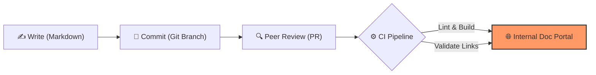
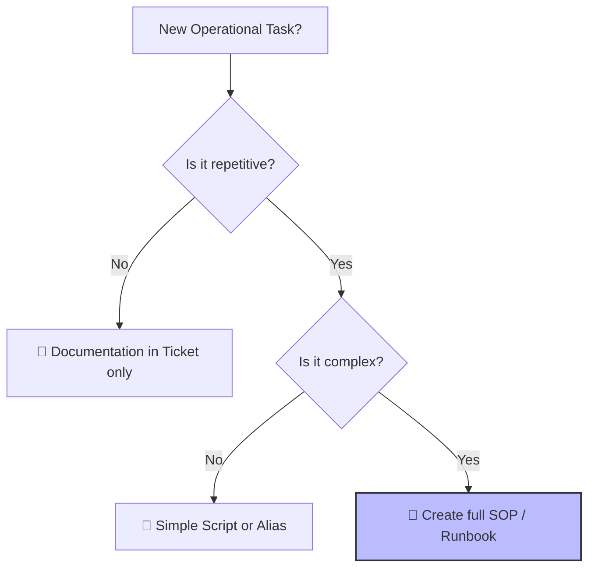

# Writing Effective SOPs: High-Performance Documentation

A **Standard Operating Procedure (SOP)** is the blueprint for operational consistency. In DevOps, we treat documentation with the same rigor as our application code—a philosophy known as **Docs-as-Code**. High-quality SOPs reduce cognitive load during high-stress incidents and eliminate "tribal knowledge" bottlenecks.

---

## 🏗️ 1. The Docs-as-Code Workflow

Documenting in a silo (like a private Word doc or an unversioned Wiki) is an anti-pattern. Modern DevOps teams integrate documentation into their standard developer lifecycle.

- **Accountability**: Git "Blame" shows exactly who updated a procedure and why.
- **Automation**: CI pipelines can automatically lint markdown for broken links or non-inclusive language.
- **Portability**: Markdown is platform-agnostic and won't get locked into a proprietary vendor format.

---

## 🎯 2. The Golden Rules of Operational Writing

To be effective, an SOP must be optimized for **speed of understanding**.

1.  **The Imperative Mood**: Use direct commands. 
    *   *Bad*: "The engineer might want to consider checking the logs if possible."
    *   *Good*: "**Check logs** using `kubectl logs -f deployment/api`."
2.  **Outcome-Based Steps**: Tell the reader what *should* happen after a command.
    *   *Example*: "Run `systemctl status nginx`. You should see `Active: active (running)` in green text."
3.  **Visual Discoverability**: Use bold text for key commands and alerts for warnings.
4.  **Atomic Steps**: One instruction per numbered bullet point. Never combine two unrelated actions in one paragraph.

---

## 📐 3. The Anatomy of a Professional SOP

A consistent structure acts as a "mental map" for engineers in a hurry.

| Section | Purpose |
| :--- | :--- |
| **Metadata Header** | Title, On-call Team, Service UUID, and SLO impact. |
| **Prerequisites** | Required IAM permissions, VPN access, and CLI tools. |
| **Health Check (The 'Is it real?' step)** | Proof of failure (e.g., "Check the Grafana 'Errors' panel"). |
| **Remediation** | The "Meat." Clearly numbered, linear steps with code blocks. |
| **Resolution Verification** | How to prove the incident is over. |
| **Post-Incident Checklist** | Reminders to update tickets and notify stakeholders. |

---

## 🚦 4. Logic: When to Write an SOP

Not every task needs an 8-page document. Use this logic to decide your documentation strategy:

---

## 🛠️ 5. Modern Tooling Layer

- **Static Site Generators (SSG)**: MkDocs (with Material theme) and Hugo provide extremely fast, searchable documentation portals.
- **Mermaid.js**: Allows you to treat **Diagrams-as-Code**. If the workflow changes, you update the text, and the SVG diagram re-renders automatically.
- **Vale / Markdown-lint**: Enforces a house style (brand voice) and technical accuracy across the entire team.

---

## 📈 6. Improving Efficiency (SDRY)

**SDRY (Single Source of Truth / Don't Repeat Yourself)**:
- Never copy-paste the same database connection steps into ten different SOPs. 
- Create a **"Global Prerequisite SOP"** and link to it from all others. This ensures that when the DB port changes, you only update it in *one* place.
