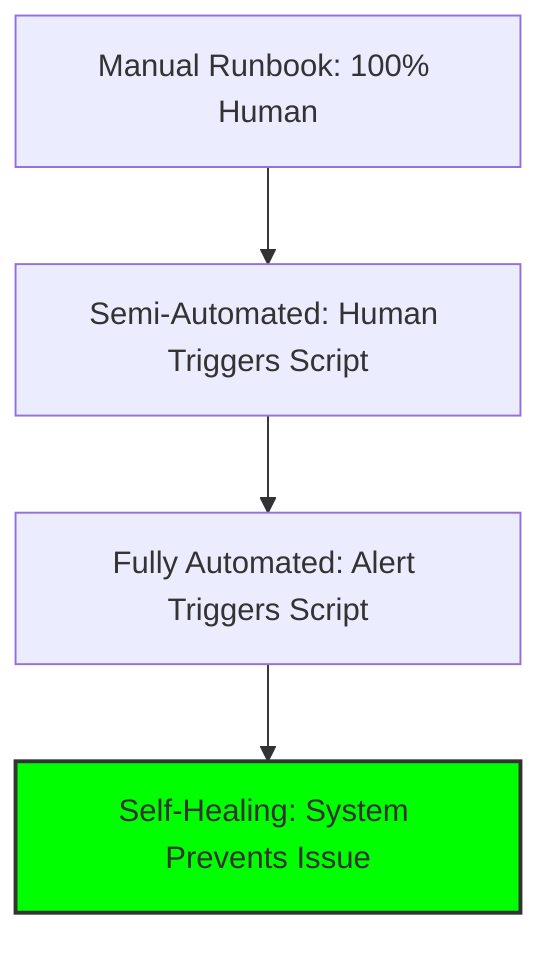

# Self-Healing Philosophy

The ultimate goal of Site Reliability Engineering is to build systems that can recover from failures **without human intervention**.

## The Vision: Zero-Touch Operations
In a perfect world, an SRE team's pager never goes off for routine issues. The system detects, diagnoses, and fixes itself.

## The Reality Check
- **Not Everything Can Be Automated**: Complex business logic decisions, security incidents, and novel failures require human judgment.
- **Automation Requires Trust**: You must have confidence that the automation won't make things worse.
- **The 80/20 Rule**: Automate the 80% of incidents that are repetitive and low-risk. Leave the 20% of complex, high-stakes issues to humans.

## The Toil Reduction Ladder

---

## 🏗️ Real-Life Scenario: The "Restart Loop" Disaster
**Problem**: A team automates "Restart the app if memory > 90%." 
**Crisis**: A memory leak causes the app to hit 90% within 2 minutes of every restart. The automation creates an infinite restart loop, preventing the app from ever serving traffic.
**Outcome**: A 6-hour outage because the automation had no "Circuit Breaker."
**Lesson**: Every auto-remediation must have a **retry limit** and a **human escalation path**.

---

## ❓ Interview Questions
1.  **What is the difference between 'Auto-Remediation' and 'Self-Healing'?**
    *   *Answer*: Auto-remediation is reactive (fixing a problem after it occurs). Self-healing is proactive (preventing the problem from occurring in the first place, e.g., predictive scaling before load spikes).
2.  **Why is 'Toil Reduction' a core SRE principle?**
    *   *Answer*: Toil is repetitive, manual work that doesn't provide long-term value. By automating toil, SREs free up time for high-impact projects like improving system reliability and building new features.

---

## 🧠 Quiz Snippet (5/50+)
1.  **What is 'Toil' in SRE terminology?** (Repetitive manual operational work)
2.  **True/False: All incidents should be automated.** (False - only routine, low-risk ones)
3.  **What is the '80/20 Rule' for automation?** (Automate 80% of routine issues, leave 20% complex ones to humans)
4.  **What is a 'Circuit Breaker' in automation?** (A safety mechanism that stops automation after repeated failures)
5.  **Which is more advanced: Auto-remediation or Self-healing?** (Self-healing - it's proactive)
