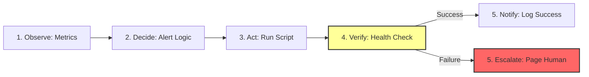

# Closed-Loop Architecture

A robust auto-remediation system follows a **closed-loop** pattern: Observe → Decide → Act → Verify → Notify.

## The Five Stages

### 1. Observe (Monitoring)
Collect metrics, logs, and traces from your infrastructure.
- **Tools**: Prometheus, Datadog, CloudWatch, Grafana.
- **Key Metrics**: CPU, Memory, Disk, Error Rates, Latency.

### 2. Decide (Alert Evaluation)
Determine if the observed condition matches a known auto-remediable pattern.
- **Logic**: "If disk > 85% for 5 minutes, trigger cleanup."
- **Tools**: Alertmanager, PagerDuty, AWS EventBridge.

### 3. Act (Execution)
Run the remediation script or command.
- **Examples**: Restart service, scale up instances, clear cache.
- **Tools**: Lambda, Kubernetes Jobs, Ansible.

### 4. Verify (Post-Check)
Confirm that the action resolved the issue.
- **Check**: "Is disk now < 80%?" or "Is error rate back to normal?"
- **Timeout**: If verification fails after 5 minutes, escalate.

### 5. Notify (Logging & Alerting)
Record every action taken, whether successful or not.
- **Success**: Log to audit trail, send Slack notification.
- **Failure**: Page the on-call engineer immediately.

## Mermaid Diagram: The Closed Loop

---

## 🏗️ Real-Life Scenario: The "Silent" Failure
**Problem**: An auto-remediation script restarts a crashed service. The script completes without errors.
**Hidden Issue**: The service starts but immediately crashes again due to a config error. The monitoring system shows "Running" for 2 seconds before the next crash.
**Outcome**: The automation reports "Success," but the service is still down. No human is notified.
**Fix**: Add a **Verification Step** that waits 60 seconds and checks if the service is *still* running and *healthy* (not just started).

---

## ❓ Interview Questions
1.  **Why is the 'Verify' step critical in auto-remediation?**
    *   *Answer*: Because a script can complete successfully without actually fixing the problem. Verification ensures the desired outcome (e.g., service is healthy) was achieved, not just that the command ran.
2.  **What should happen if verification fails?**
    *   *Answer*: The system should immediately escalate to a human (page the on-call engineer) and log detailed information about what was attempted and why it failed.

---

## 🧠 Quiz Snippet (5/50+)
1.  **What are the 5 stages of a closed-loop system?** (Observe, Decide, Act, Verify, Notify)
2.  **True/False: You should skip verification to make automation faster.** (False - verification is critical)
3.  **Which stage determines if an alert is auto-remediable?** (Decide)
4.  **What happens if verification fails?** (Escalate to human)
5.  **Should successful auto-remediation be logged?** (Yes - for audit trails)
