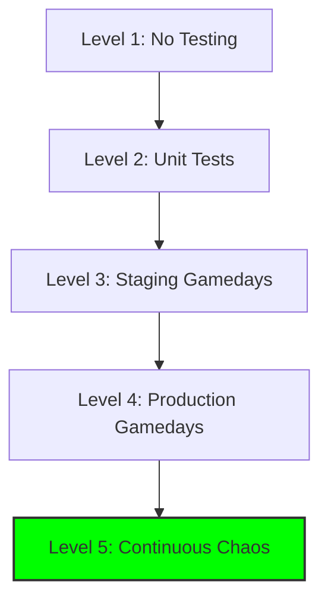

# Testing and Chaos Engineering

You can't trust automation you haven't tested. **Chaos Engineering** is the practice of intentionally breaking things to validate your remediation.

## Testing Levels

### 1. Unit Testing (The Script)
Test the remediation script in isolation.
```python
def test_disk_cleanup():
    # Create test files
    create_test_logs("/tmp/test", count=100)
    
    # Run cleanup
    cleanup_logs("/tmp/test", days_old=7)
    
    # Verify
    assert count_files("/tmp/test") < 20
```

### 2. Integration Testing (The Workflow)
Test the entire closed-loop in a staging environment.
1. Trigger a fake alert.
2. Verify automation runs.
3. Verify verification step passes.
4. Verify notification is sent.

### 3. Chaos Engineering (Production)
Intentionally inject failures in production to test remediation.

---

## Chaos Engineering Practices

### The Gameday
A scheduled event where you intentionally break production (with safeguards).
- **Example**: "Kill 20% of pods and verify HPA scales up."
- **Tools**: Chaos Monkey, Gremlin, Litmus Chaos.

### Chaos Experiments

#### Experiment 1: Pod Killer
```yaml
# Litmus Chaos Experiment
apiVersion: litmuschaos.io/v1alpha1
kind: ChaosEngine
metadata:
  name: pod-delete
spec:
  appinfo:
    appns: production
    applabel: 'app=api-server'
  chaosServiceAccount: litmus-admin
  experiments:
  - name: pod-delete
    spec:
      components:
        env:
        - name: TOTAL_CHAOS_DURATION
          value: '30'
        - name: CHAOS_INTERVAL
          value: '10'
```
**Expected Outcome**: Kubernetes auto-restarts pods, HPA scales up, no user impact.

#### Experiment 2: Network Latency
Inject 500ms latency to database connections.
**Expected Outcome**: Circuit breaker opens, requests fail fast, alerts fire, auto-remediation scales up read replicas.

#### Experiment 3: Disk Fill
Fill disk to 95% capacity.
**Expected Outcome**: Disk cleanup automation triggers, disk usage drops below 80%, alert clears.

---

## The Chaos Maturity Model



**Level 5**: Chaos experiments run continuously in production (e.g., Netflix's Chaos Monkey).

---

## 🏗️ Real-Life Scenario: The "Untested" Automation
**Problem**: A team builds auto-remediation for database failover. They test it once in staging and deploy to production.
**Crisis**: 6 months later, the primary database crashes. The automation triggers but fails because the staging test used a different database version.
**Outcome**: 4-hour outage while engineers manually fail over.
**Lesson**: **Test regularly in production-like environments**. Run Gamedays quarterly to validate automation still works.

---

## ❓ Interview Questions
1.  **What is Chaos Engineering and why is it important for auto-remediation?**
    *   *Answer*: It's the practice of intentionally injecting failures to test system resilience. It's important because it validates that auto-remediation actually works under real-world conditions, not just in theory.
2.  **How do you balance the risk of Chaos Engineering in production?**
    *   *Answer*: Start small (single instance), use blast radius limits, run during low-traffic periods, have a rollback plan, and ensure the team is on standby. Gradually increase scope as confidence grows.

---

## 🧠 Quiz Snippet (5/50+)
1.  **What is a 'Gameday'?** (Scheduled chaos engineering exercise)
2.  **True/False: You should only test automation in staging.** (False - test in production too)
3.  **What tool does Netflix use for chaos engineering?** (Chaos Monkey)
4.  **What is the highest level of chaos maturity?** (Continuous chaos in production)
5.  **Should you test auto-remediation before deploying it?** (Yes - always)
