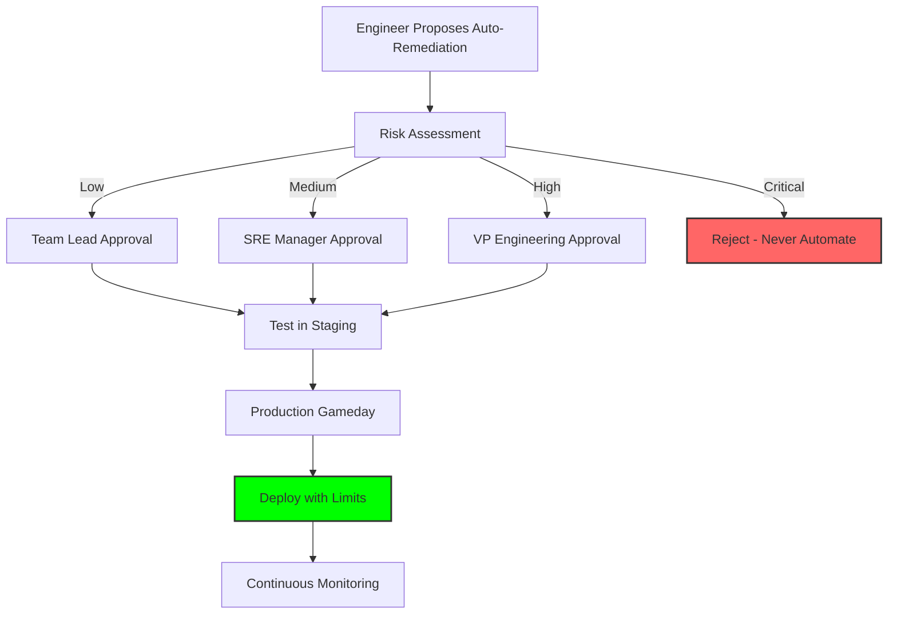

# Governance and Limits

Automation without governance is a recipe for disaster. **Every auto-remediation system needs rules, limits, and oversight.**

## The Risk Assessment Matrix

Before automating any remediation, assess the risk:

| Risk Level | Criteria | Approval Required | Example |
| :--- | :--- | :--- | :--- |
| **Low** | Read-only, no state change | Team Lead | Log rotation, cache clear |
| **Medium** | Restarts, scaling | SRE Manager | Service restart, auto-scale |
| **High** | Config changes, data operations | VP Engineering | Database failover, schema change |
| **Critical** | Irreversible, compliance-sensitive | **Never Automate** | Data deletion, security policy change |

---

## Governance Controls

### 1. Change Advisory Board (CAB)
All new auto-remediation patterns must be reviewed and approved.
- **Review Criteria**: Risk assessment, testing evidence, rollback plan.

### 2. Audit Logging
Every automated action must be logged with:
- Who approved the automation.
- When it was deployed.
- What it has done (audit trail).

### 3. Regular Review Cycles
Quarterly review of all active auto-remediation patterns.
- **Questions**: Is it still needed? Has it caused any incidents? Should limits be adjusted?

### 4. Compliance Requirements
For regulated industries (Finance, Healthcare):
- **SOC 2**: Demonstrate separation of duties (automation can't approve itself).
- **HIPAA**: Ensure automation doesn't expose PHI in logs.
- **PCI-DSS**: Ensure automation doesn't bypass security controls.

---

## Hard Limits

### 1. Cost Limits
Never allow automation to exceed budget thresholds.
```python
def scale_up(current_instances):
    max_cost_per_hour = 1000  # USD
    cost_per_instance = 2.50
    
    max_instances = max_cost_per_hour / cost_per_instance
    if current_instances >= max_instances:
        raise Exception("Cost limit reached - manual approval required")
```

### 2. Fleet Percentage Limits
Never affect more than X% of fleet simultaneously.
```python
def safe_restart(total_instances):
    max_percentage = 0.20  # 20%
    max_instances = int(total_instances * max_percentage)
    return min(requested_instances, max_instances)
```

### 3. Time-Based Limits
Disable automation during high-risk periods.
```python
def is_maintenance_window():
    current_hour = datetime.now().hour
    # Disable automation during deploy window (2-4 AM UTC)
    if 2 <= current_hour <= 4:
        return True
    return False
```

---

## The Approval Workflow



---

## 🏗️ Real-Life Scenario: The "$50k Mistake"
**Problem**: An engineer creates auto-scaling for a machine learning training job.
**Bug**: The script has no cost limit. A bug causes it to spin up 500 GPU instances.
**Outcome**: $50,000 cloud bill in 6 hours. AWS suspends the account.
**Fix**: Implement **Hard Cost Limits** and **Approval Workflows**. Now, any auto-scaling that could exceed $1,000/hour requires VP approval.

---

## ❓ Interview Questions
1.  **Why is a Change Advisory Board important for auto-remediation?**
    *   *Answer*: It provides oversight and ensures that automation is safe, tested, and aligned with business risk tolerance. It prevents "rogue automation" that could cause more harm than good.
2.  **What is the difference between a 'Hard Limit' and a 'Circuit Breaker'?**
    *   *Answer*: A hard limit is a predefined maximum (e.g., "never scale beyond 100 instances"). A circuit breaker is dynamic and disables automation after repeated failures. Both are safety mechanisms but serve different purposes.

---

## 🧠 Final Module Quiz (5/50+)
1.  **Should all remediation be automated?** (No - only low and medium risk)
2.  **True/False: Cost limits are optional for auto-scaling.** (False - they're critical)
3.  **What is a CAB?** (Change Advisory Board)
4.  **Should automation run during maintenance windows?** (No - disable it)
5.  **What percentage of fleet should automation affect max?** (10-20%)
