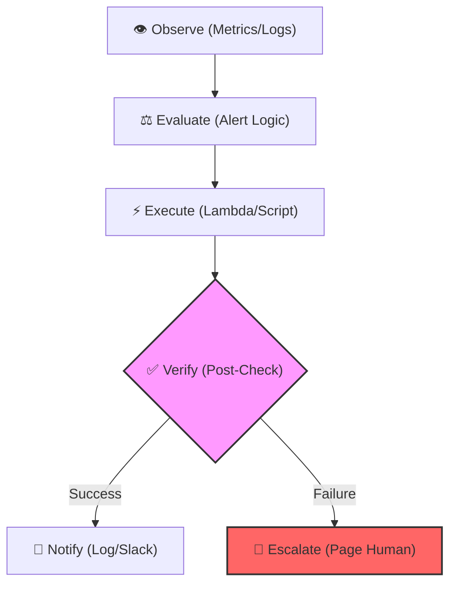
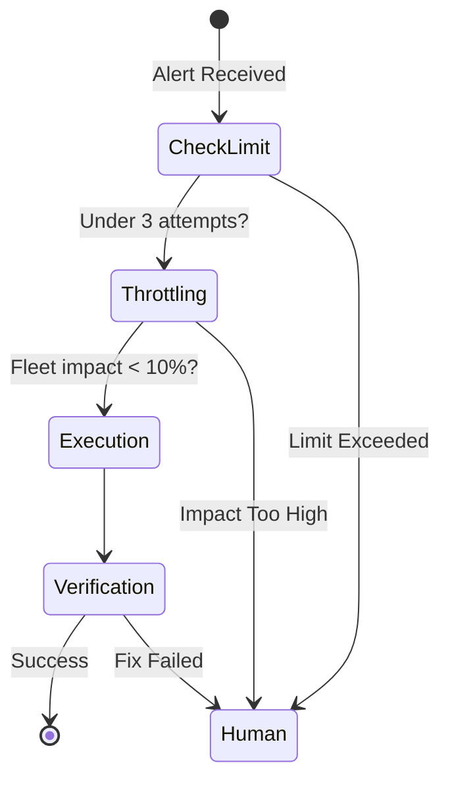

# Auto-Remediation Patterns: Building Self-Healing Systems

In advanced DevOps, the ultimate goal is to move beyond manual intervention. **Auto-Remediation** is the process of using software to automatically resolve incidents based on pre-defined technical runbooks. This creates a "Self-Healing" infrastructure that maintains high availability without human fatigue.

---

## 🤖 1. The Closed-Loop Remediation Cycle

Auto-remediation relies on a continuous feedback loop. If any stage of this loop fails, the system must immediately default to paging a human.

1.  **Observe**: Monitoring tools like Prometheus, CloudWatch, or Datadog detect a threshold breach.
2.  **Evaluate**: The system determines if the event matches a known "auto-remediable" pattern.
3.  **Execute**: An automation trigger (e.g., AWS EventBridge + Lambda) runs the recovery logic.
4.  **Verify**: The monitoring system performs a "health check" to see if the fix worked.
5.  **Notify/Escalate**: Every action must be logged. If the fix fails, the "Circuit Breaker" triggers a manual escalation.

---

## 🛠️ 2. Core Remediation Patterns

### 🔄 Pattern A: The Service Restarter
- **Symptoms**: High error rates (5xx), connection timeouts, or process hangs.
- **Logic**: A graceful restart of the service or container.
- **Implementation**: `kubectl rollout restart` or `systemctl restart service`.
- **Precaution**: Ensure that the service is stateless; otherwise, data corruption may occur.

### 🧹 Pattern B: Intelligent Storage Cleanup
- **Symptoms**: Disk usage > 85%, or "No space left on device" errors.
- **Logic**: Deleting rotated logs, clearing `/tmp` caches, or offloading old data to S3.
- **Implementation**: A Python script triggered by a "Low Disk Space" alarm.
- **Precaution**: Never delete active database binary logs or un-mirrored data.

### 📈 Pattern C: Proactive Capacity Scaling
- **Symptoms**: CPU/RAM usage trending towards 90%.
- **Logic**: Horizontal scaling by adding more pods or instances.
- **Implementation**: AWS Auto Scaling Groups (ASG) or K8s Horizontal Pod Autoscaler (HPA).
- **Precaution**: Set "Max Instance" limits to prevent runaway cloud costs.

---

## 🛑 3. The Auto-Remediation Safety Matrix

Not all fixes should be automated. Use this matrix to assess risk:

| Remediation Type | Risk | Trust Level | Recommended Action |
| :--- | :--- | :--- | :--- |
| **Log Rotation** | Very Low | High | Fully Automated |
| **Service Restart** | Low | Medium | Automated with 3-retry limit |
| **Config Change** | High | Low | **Human Review Required** |
| **DB Failover** | Critical | Low | **Human-in-the-loop** |

---

## 🛡️ 4. Advanced Safety Guardrails

To prevent "Automation Disasters" (where the script makes the outage worse), implement these barriers:

- **Retry Throttling**: Never attempt to fix the same server more than $X$ times in an hour.
- **Fleet Safeguards**: Never allow automation to touch more than 10-20% of your production instances at once.
- **Maintenance Windows**: Automatically disable auto-remediation during planned deployments to avoid conflict with manual changes.
- **Dead-Man's Switch**: Provide a global toggle to disable all auto-remediation loops instantly during a massive, unknown outage.

---

## 🔗 5. Implementation Stack
- **Event-Driven**: AWS EventBridge, Azure Grid, GCP Pub/Sub.
- **compute**: AWS Lambda, Azure Functions, Cloud Run.
- **Orchestration**: StackStorm, Kubernetes Controllers, Ansible Tower (AWX).
