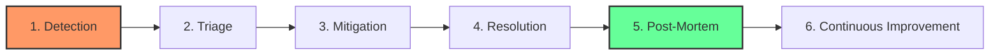

# Incident Fundamentals

An **incident** is any unplanned interruption to an IT service or reduction in its quality. In mature DevOps organizations, incidents are treated as learning opportunities, not failures.

## What Qualifies as an Incident?

### Incidents
- Production service outage or degradation.
- Security breach or data exposure.
- SLA violation (e.g., 99.9% uptime commitment broken).
- Customer-impacting bug in production.

### NOT Incidents
- Planned maintenance (with proper notification).
- Development environment issues.
- Feature requests or enhancements.
- Questions or "How do I...?" requests.

---

## The Incident Lifecycle

1.  **Detection**: Alert fires or user reports issue.
2.  **Triage**: Assess severity and assemble team.
3.  **Mitigation**: Stop the bleeding (rollback, scale, disable feature).
4.  **Resolution**: System returns to desired state.
5.  **Post-Mortem**: Analyze root cause and create action items.
6.  **Continuous Improvement**: Implement fixes to prevent recurrence.

---

## The Golden Rules

### Rule 1: Mitigation Over Root Cause
During an active incident, **stop the bleeding first**. Finding the root cause can wait until the service is stable.

### Rule 2: Never Alone
If you're on-call and stuck for 15 minutes, escalate. Pride has no place in incident response.

### Rule 3: Document Everything
The Scribe role exists for a reason. Every decision, every command, every observation must be timestamped.

### Rule 4: Blameless Culture
We fix systems, not people. If someone made a mistake, the system allowed it.

---

## 🏗️ Real-Life Scenario: The "Hero" Syndrome
**Problem**: A senior engineer always "saves the day" during incidents by working alone for hours.
**Hidden Cost**: No one else learns how to fix the issue. When the engineer goes on vacation, the same incident causes a 6-hour outage.
**Fix**: Implement **Incident Command System** (ICS) with mandatory role rotation. Now, every engineer learns every role.
**Outcome**: MTTR drops by 40% because the team works in parallel, not sequentially.

---

## ❓ Interview Questions
1.  **What is the difference between an incident and a problem?**
    *   *Answer*: An incident is a single event causing service disruption. A problem is the underlying cause that may lead to multiple incidents (e.g., a memory leak is a problem; the crashes it causes are incidents).
2.  **Why is 'Mitigation' prioritized over 'Root Cause Analysis' during an active incident?**
    *   *Answer*: Because users are currently impacted. Restoring service is the top priority. Root cause analysis happens in the post-mortem when the system is stable.

---

## 🧠 Quiz Snippet (5/50+)
1.  **What is an 'Incident'?** (Unplanned service interruption or degradation)
2.  **True/False: Planned maintenance is an incident.** (False)
3.  **What is the first step in the incident lifecycle?** (Detection)
4.  **Should you find the root cause before mitigating?** (No - mitigate first)
5.  **What does 'Blameless' mean?** (Focus on fixing systems, not punishing people)
