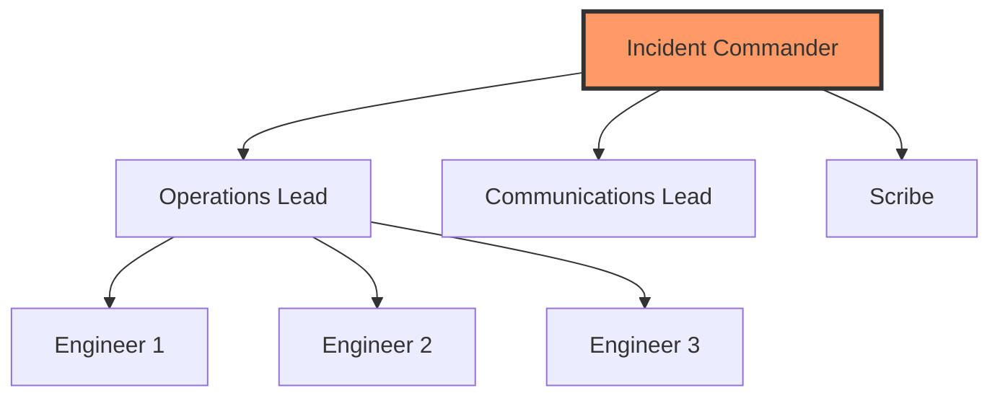

# Incident Command System (ICS)

During major outages, chaos is the enemy. The **Incident Command System** provides a clear command structure that eliminates confusion.

## The Core Roles

### Incident Commander (IC)
**Responsibility**: Single point of decision-making authority.
**Does**: Makes final calls on risky actions, manages the clock, coordinates all leads.
**Does NOT**: Touch code, debug logs, or get "in the weeds."
**Goal**: Maintain the 30,000-foot view.

**Key Phrases**:
- "Ops Lead, what's your status?"
- "We're rolling back in 2 minutes unless someone has a strong objection."
- "Comms Lead, update the status page now."

### Operations Lead (Ops Lead)
**Responsibility**: Technical execution.
**Does**: Manages engineers doing the actual work, runs commands, checks logs.
**Reports to**: IC with technical updates every 5-10 minutes.

### Communications Lead (Comms Lead)
**Responsibility**: External and internal stakeholder management.
**Does**: Updates status page, responds to executives, shields engineers from interruptions.
**Does NOT**: Make technical decisions.

### Scribe
**Responsibility**: Documentation and timeline.
**Does**: Records every key event with timestamps in a shared doc/channel.
**Output**: The foundation for the post-mortem.

---

## The ICS Hierarchy

---

## Role Rotation Best Practices
- **Never the same IC twice in a row**: Rotate to build team capability.
- **Shadow Program**: Junior engineers shadow the IC to learn decision-making.
- **Gameday Practice**: Run simulated incidents to practice ICS roles.

---

## 🏗️ Real-Life Scenario: The "Too Many Cooks" Disaster
**Problem**: During a P1 outage, 15 engineers join the war room. Everyone starts debugging simultaneously. Five different rollback attempts happen at once.
**Outcome**: Conflicting changes make the outage worse. MTTR: 4 hours.
**Fix**: Implement ICS. Only the Ops Lead directs technical work. IC makes final decisions.
**Result**: Next P1, MTTR: 45 minutes.

---

## ❓ Interview Questions
1.  **Why doesn't the Incident Commander touch code during an incident?**
    *   *Answer*: Because their role is strategic coordination and decision-making. If they're debugging, they lose the big picture and can't effectively manage the response.
2.  **What is the Scribe's most important output?**
    *   *Answer*: A timestamped timeline of all events, decisions, and actions taken. This becomes the foundation for the post-mortem and helps identify where delays occurred.

---

## 🧠 Quiz Snippet (5/50+)
1.  **Who makes the final decision during an incident?** (Incident Commander)
2.  **True/False: The IC should debug code.** (False)
3.  **What does the Scribe do?** (Records timeline with timestamps)
4.  **Who updates the status page?** (Communications Lead)
5.  **Should the same person be IC for every incident?** (No - rotate roles)
