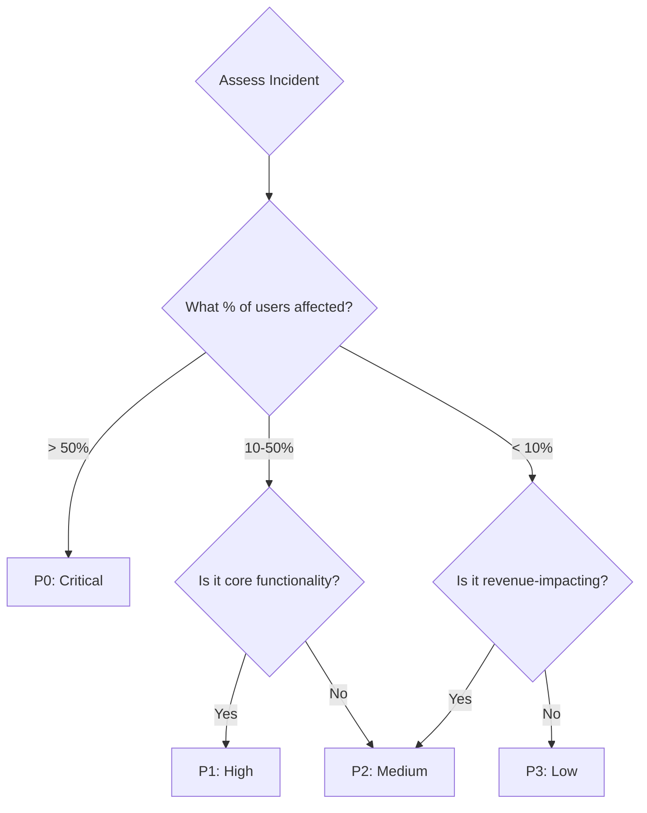

# Severity and Prioritization

Standardizing severity levels prevents arguments during outages and sets clear expectations for response times.

## The Standard Priority Matrix

| Priority | Impact | Response Time | Example | Notification |
| :--- | :--- | :--- | :--- | :--- |
| **P0 (Critical)** | Total outage | Immediate | Site completely down | Page entire team |
| **P1 (High)** | Major feature broken | < 15 min | Payment processing fails | Page on-call + IC |
| **P2 (Medium)** | Minor feature degraded | < 1 hour | Images load slowly | Alert on-call |
| **P3 (Low)** | Cosmetic or internal | Next business day | Typo on homepage | Create ticket |
| **P4 (Trivial)** | Nice-to-have | Backlog | Feature request | Backlog grooming |

---

## Impact vs. Urgency Matrix

---

## SLA Commitments

### Response Time SLA
How quickly must we acknowledge the incident?
- **P0**: Immediate (< 5 min)
- **P1**: < 15 min
- **P2**: < 1 hour
- **P3**: Next business day

### Resolution Time SLA
How quickly must we restore service?
- **P0**: < 1 hour (target)
- **P1**: < 4 hours
- **P2**: < 24 hours
- **P3**: Best effort

---

## Escalation Triggers

### Automatic Escalation
- **Time-based**: If P1 not resolved in 2 hours, auto-escalate to VP Engineering.
- **Impact-based**: If > 10,000 users affected, escalate immediately.
- **Repeat**: If same issue occurs 3 times in 24 hours, escalate to management.

---

## 🏗️ Real-Life Scenario: The "Everything is P1" Problem
**Problem**: A team marks every bug as P1. The on-call engineer is paged 20 times per day.
**Outcome**: Alert fatigue. Real P1s are ignored because the engineer assumes it's another false alarm.
**Fix**: Implement strict severity definitions. Only IC can declare P0/P1.
**Result**: Pages drop to 2 per week. Real incidents get immediate attention.

---

## ❓ Interview Questions
1.  **How do you determine if an incident is P0 vs. P1?**
    *   *Answer*: P0 is a total outage affecting all or most users. P1 is a major feature broken affecting a significant portion of users but the site is still accessible.
2.  **What is 'Alert Fatigue' and how does proper severity classification prevent it?**
    *   *Answer*: Alert fatigue occurs when engineers are paged so frequently for low-priority issues that they become desensitized and may ignore real emergencies. Proper classification ensures only truly urgent issues trigger pages.

---

## 🧠 Quiz Snippet (5/50+)
1.  **What is a P0 incident?** (Total outage / Critical)
2.  **True/False: All bugs should be P1.** (False)
3.  **What is the response time SLA for P1?** (< 15 minutes)
4.  **Who can declare a P0?** (Incident Commander or designated authority)
5.  **What causes 'Alert Fatigue'?** (Too many low-priority alerts/pages)
