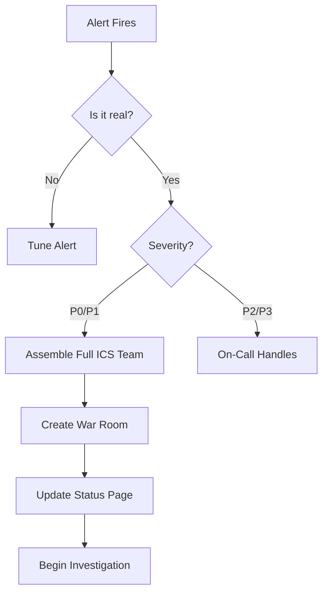

# Triage and Assessment

Triage is the critical first step after detection. **Get it wrong, and you waste precious time.**

## The Triage Checklist

### 1. Verify the Incident
Is this real or a false positive?
- Check multiple data sources (metrics + logs + user reports).
- Verify in production, not staging.

### 2. Assess Severity
Use the priority matrix (P0-P4).
- **Impact**: How many users affected?
- **Urgency**: Is it getting worse?

### 3. Assemble the Team
Who needs to be involved?
- **P0/P1**: Full ICS activation (IC, Ops Lead, Comms Lead, Scribe).
- **P2**: On-call engineer + backup.
- **P3**: Single engineer, async communication.

### 4. Establish Communication Channels
- **War Room**: Dedicated Slack channel or Zoom link.
- **Status Page**: Update immediately for P0/P1.
- **Stakeholder Notification**: Alert leadership for P0.

---

## The First 5 Minutes

---

## Common Triage Mistakes

### Mistake 1: Premature Diagnosis
**Problem**: Jumping to conclusions before gathering data.
**Example**: "It's probably the database again" (without checking).
**Fix**: Follow the data, not assumptions.

### Mistake 2: Under-Escalation
**Problem**: Trying to handle a P1 alone to "be a hero."
**Fix**: Escalate early. Better to over-communicate than under-communicate.

### Mistake 3: Analysis Paralysis
**Problem**: Spending 30 minutes in triage instead of mitigating.
**Fix**: Set a 5-minute triage time limit for P0/P1.

---

## 🏗️ Real-Life Scenario: The "Assumed" Cause
**Problem**: Monitoring shows high latency. Engineer assumes it's the database (it usually is).
**Action**: Spends 45 minutes optimizing database queries.
**Reality**: The issue was a misconfigured load balancer. Database was fine.
**Outcome**: 45 minutes wasted on wrong diagnosis.
**Lesson**: **Verify before you act**. Check all systems, not just the usual suspects.

---

## ❓ Interview Questions
1.  **What is the purpose of triage in incident response?**
    *   *Answer*: To quickly assess the severity, verify the incident is real, determine the scope of impact, and assemble the appropriate response team before beginning mitigation.
2.  **Why is it dangerous to assume the cause during triage?**
    *   *Answer*: Because assumptions can lead you down the wrong path, wasting time on fixes that don't address the actual problem. Data-driven triage ensures you're solving the right issue.

---

## 🧠 Quiz Snippet (5/50+)
1.  **What is the first step in triage?** (Verify the incident is real)
2.  **True/False: You should diagnose the root cause during triage.** (False - assess severity and assemble team)
3.  **How long should triage take for a P0?** (< 5 minutes)
4.  **What is 'Analysis Paralysis'?** (Spending too much time analyzing instead of acting)
5.  **Should you update the status page during triage?** (Yes, for P0/P1)
