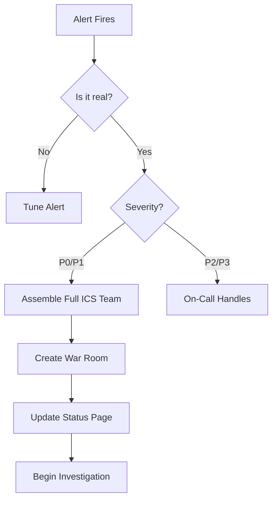

# Triage and Assessment

Triage is the critical first step after detection. **Get it wrong, and you waste precious time.**

## The Triage Checklist

### 1. Verify the Incident
Is this real or a false positive?
- Check multiple data sources (metrics + logs + user reports).
- Verify in production, not staging.

### 2. Assess Severity
Use the priority matrix (P0-P4).
- **Impact**: How many users affected?
- **Urgency**: Is it getting worse?

### 3. Assemble the Team
Who needs to be involved?
- **P0/P1**: Full ICS activation (IC, Ops Lead, Comms Lead, Scribe).
- **P2**: On-call engineer + backup.
- **P3**: Single engineer, async communication.

### 4. Establish Communication Channels
- **War Room**: Dedicated Slack channel or Zoom link.
- **Status Page**: Update immediately for P0/P1.
- **Stakeholder Notification**: Alert leadership for P0.

---

## The First 5 Minutes

---

## Common Triage Mistakes

### Mistake 1: Premature Diagnosis
**Problem**: Jumping to conclusions before gathering data.
**Example**: "It's probably the database again" (without checking).
**Fix**: Follow the data, not assumptions.

### Mistake 2: Under-Escalation
**Problem**: Trying to handle a P1 alone to "be a hero."
**Fix**: Escalate early. Better to over-communicate than under-communicate.

### Mistake 3: Analysis Paralysis
**Problem**: Spending 30 minutes in triage instead of mitigating.
**Fix**: Set a 5-minute triage time limit for P0/P1.

---

---

## 🏗️ Real-Life Scenarios

### Scenario 1: The "Assumed" Database Crisis
**Problem**: An SRE saw high latency on the checkout service. They immediately assumed it was "Database Lock Contention" (a common issue the previous week).
**Action**: The SRE spent 45 minutes manually killing database sessions and optimizing queries without verifying the network logs.
**Crisis**: While the SRE was "Fixing" the database, the real cause was a misconfigured Load Balancer that was sending 100% of traffic to a single node. The database was actually healthy.
**Outcome**: 45 minutes of customer downtime that could have been fixed in 5 minutes with proper triage.
**Solution**: Implemented a **Mandatory Triage Checklist**. Engineers must now check "Networking," "App Logs," AND "Database" before making any state-changing fixes.
**Result**: MTTR for similar issues dropped by 80%.

### Scenario 2: The "Under-Escalated" P0
**Problem**: A junior engineer noticed the status page was showing 500 errors for all of Europe. They thought they could fix it alone to "prove themselves."
**Crisis**: After 90 minutes of trial-and-error, the engineer accidentally deleted the European Routing table, making the outage global.
**Outcome**: A localized P1 became a global P0 because the engineer didn't escalate.
**Solution**: Implemented a **15-Minute Rule**. If a P1/P2 isn't understood or mitigated within 15 minutes, you MUST notify the Incident Commander and escalate.
**Result**: Stress on junior engineers decreased, and major outages are now handled by the full ICS team much faster.

### Scenario 3: The "False Positive" War Room
**Problem**: A legacy alert fired for "Global Error Rate > 5%". The team automatically activated a full WAR room with 20 people and updated the status page to "Major Outage."
**Discovery**: 10 minutes into the call, someone realized that the "Error Rate" spike was actually caused by a single partner's broken API, not our systems. No customers were affected.
**Outcome**: Lost productivity for 20 senior engineers and a "reputation hit" from a false status page update.
**Solution**: Added a **Verification Step** to the triage process. Engineers must now confirm the "Impact" using a second dashboard (like User Login Success) before declaring a P1/P0.
**Result**: False alarms no longer trigger expensive war rooms.

---

## ❓ Interview Questions

1.  **What is the primary goal of the 'Triage' phase?**
    - *Answer*: To verify if the incident is real, assess its scope/impact, determine the correct priority (P0-P3), and assemble the required team to resolve it. It is NOT about finding the root cause.
2.  **Why is 'Verification' separated from 'Detection'?**
    - *Answer*: Detection is usually automated (an alert). Verification is the human check to ensure it's not a false positive or a monitoring bug. Acting on an unverified alert can waste resources and cause "unforced errors."
3.  **Explain the danger of 'Analysis Paralysis' during triage.**
    - *Answer*: It occurs when an engineer spends too much time trying to "perfectly" understand the incident rather than taking action. In a P0 scenario, every minute counts; the focus should be on "Stopping the Bleeding" (Mitigation), not perfect analysis.
4.  **When should you create a 'War Room'?**
    - *Answer*: For any P0 or P1 incident. A war room (Slack/Zoom) centralizes communication, prevents information silos, and allows the Incident Commander to coordinate multiple roles simultaneously.
5.  **How do you assess 'Urgency' versus 'Impact'?**
    - *Answer*: **Impact** is the current damage (e.g., "1,000 users offline"). **Urgency** is the rate of change (e.g., "The error rate is growing by 5% every minute"). A low-impact incident with high urgency can quickly become a P0.
6.  **What is the 'Single Point of Truth' during triage?**
    - *Answer*: For a team, it is usually the **Incident Channel** or **Command Doc**. During triage, the Incident Commander must declare a single place where all data and decisions are recorded by the Scribe.

---

## 🧠 Comprehensive Quiz (25 Questions)

**1. Triage is the step that follows immediately after:**
- A) Resolution
- B) Detection
- C) Post-Mortem
- D) Coding

Show Answer

**Answer: B**

**2. True/False: You should always spend at least 30 minutes in Triage to be thorough.**
- A) False - P0 triage should take < 5 minutes.
- B) True

Show Answer

**Answer: A**

**3. 'Verification' means checking if:**
- A) You have a backup
- B) The alert is real and production is actually impacted
- C) The code is pretty
- D) nothing

Show Answer

**Answer: B**

**4. For a P0 incident, which team structure is required?**
- A) Single Engineer
- B) Full ICS Activation (IC, Ops, Comms, Scribe)
- C) HR
- D) Support only

Show Answer

**Answer: B**

**5. Which is a common triage mistake?**
- A) Checking logs
- B) Premature Diagnosis (assuming the cause)
- C) Asking for help
- D) Using a timer

Show Answer

**Answer: B**

**6. A 'War Room' is:**
- A) A place to fight colleagues
- B) A dedicated communication channel for incident response coordination
- C) A server room
- D) none of the above

Show Answer

**Answer: B**

**7. True/False: You should verify the incident in Staging first.**
- A) False - Verify in Production where the impact is happening.
- B) True

Show Answer

**Answer: A**

**8. 'Analysis Paralysis' leads to:**
- A) Faster fixes
- B) Increased downtime due to indecision
- C) Better logs
- D) more sleep

Show Answer

**Answer: B**

**9. The 'Scope' of an incident refers to:**
- A) The size of the screen
- B) The breadth of impact (which services and how many users are affected)
- C) The price
- D) nothing

Show Answer

**Answer: B**

**10. What is a 'False Positive' in triage?**
- A) A successful fix
- B) An alert that fired when there was no real problem
- C) A bug
- D) a green light

Show Answer

**Answer: B**

**11. True/False: The Scribe role should be assigned during the Triage phase.**
- A) True - For P0/P1 incidents, documentation must start immediately.
- B) False

Show Answer

**Answer: A**

**12. When should you update the 'Status Page'?**
- A) Only after it's fixed
- B) As soon as the incident is verified for P0/P1
- C) Never
- D) weekly

Show Answer

**Answer: B**

**13. A 'Triage Checklist' helps prevent:**
- A) Coding errors
- B) Human error and "Skipping steps" under pressure
- C) Cost
- D) nothing

Show Answer

**Answer: B**

**14. If a junior engineer is stuck for 15 minutes, they should:**
- A) Keep trying alone
- B) Escalate to the team or IC
- C) Go to lunch
- D) restart their PC

Show Answer

**Answer: B**

**15. 'Impact' vs. 'Urgency': Which one refers to the "Rate of Change"?**
- A) Impact
- B) Urgency
- C) Neither
- D) Both

Show Answer

**Answer: B**

**16. True/False: You should find the 'Root Cause' before you finish Triage.**
- A) False - Diagnosis happens during investigation/mitigation; Triage is for assessment.
- B) True

Show Answer

**Answer: A**

**17. The 'Stakeholder Notification' for a P0 should happen:**
- A) Within 24 hours
- B) Immediately during or right after Triage
- C) Only if they ask
- D) monthly

Show Answer

**Answer: B**

**18. Why use a 'Dedicated' Slack channel for an incident?**
- A) To hide from the boss
- B) To keep incident communication separate from daily chat noise
- C) To use more RAM
- D) no reason

Show Answer

**Answer: B**

**19. Which role confirms 'Incidents' on the status page?**
- A) Ops Lead
- B) Communications Lead (with IC approval)
- C) HR
- D) The customer

Show Answer

**Answer: B**

**20. True/False: Triage must be a calm, data-driven process.**
- A) True
- B) False

Show Answer

**Answer: A**

**21. 'Hero Syndrome' in triage often leads to:**
- A) Faster MTTR
- B) Delayed escalation and longer outages
- C) Higher salary
- D) better code

Show Answer

**Answer: B**

**22. 'Context Gathering' involves:**
- A) Reading a book
- B) Looking at recent deployments and health metric dashboards
- C) Checking vacation schedules
- D) nothing

Show Answer

**Answer: B**

**23. Under-escalation is a risk of:**
- A) Low risk
- B) High Pride/Ego or poor culture
- C) Speed
- D) automation

Show Answer

**Answer: B**

**24. The 'ICS Hierarchy' is activated for which priorities?**
- A) P4 only
- B) P0 and P1
- C) P3
- D) nothing

Show Answer

**Answer: B**

**25. Triage is about _____ information to make _____ decisions.**
- A) Hiding / slow
- B) Filtering / rapid, accurate
- C) Deleting / expensive
- D) Ignoring / bad

Show Answer

**Answer: B**

