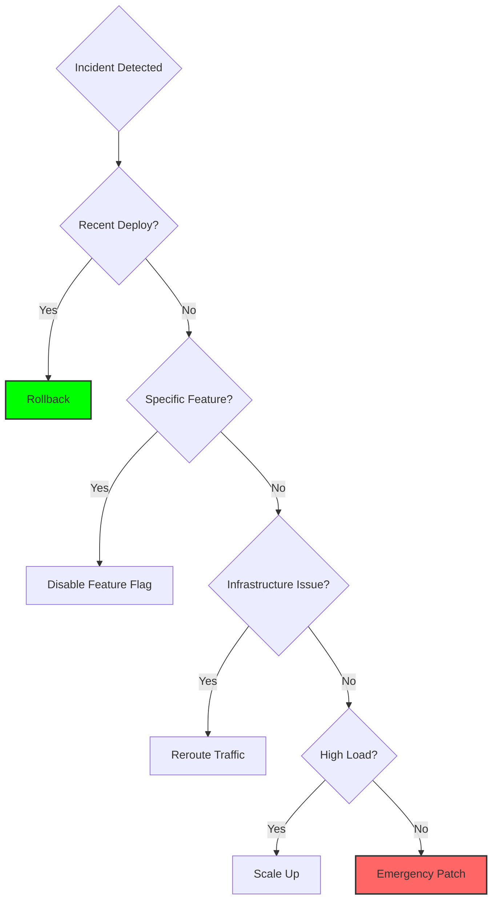

# Mitigation Strategies

Mitigation is about **stopping the bleeding**, not finding the root cause. Speed matters more than perfection.

## The Mitigation Hierarchy

### 1. Rollback (Fastest)
Revert to the last known good state.
```bash
# Kubernetes
kubectl rollout undo deployment/api-server

# Git-based deployment
git revert HEAD && git push
```
**When**: Recent deployment caused the issue.
**Time**: < 2 minutes.

### 2. Feature Flag Disable
Turn off the problematic feature without full rollback.
```python
if feature_flags.is_enabled("new_checkout"):
    # New code
else:
    # Old stable code
```
**When**: Specific feature is broken but rest of app is fine.
**Time**: < 30 seconds.

### 3. Traffic Rerouting
Redirect traffic away from failing component.
- **DNS**: Point to backup region.
- **Load Balancer**: Remove unhealthy instances.
- **CDN**: Serve cached version.

**When**: Infrastructure failure in one region/zone.
**Time**: 1-5 minutes.

### 4. Scaling (Horizontal)
Add more capacity to handle load.
```bash
# Kubernetes
kubectl scale deployment/api-server --replicas=10

# AWS
aws autoscaling set-desired-capacity --desired-capacity 20
```
**When**: Performance degradation due to load.
**Time**: 2-5 minutes (depending on boot time).

### 5. Emergency Patch (Slowest)
Deploy a hotfix.
**When**: No other option available.
**Time**: 15-60 minutes.
**Risk**: Highest (could make things worse).

---

## The Decision Tree



---

## Mitigation Anti-Patterns

### Anti-Pattern 1: The "Let Me Debug First" Trap
**Problem**: Spending 30 minutes debugging before mitigating.
**Fix**: Mitigate first, debug later.

### Anti-Pattern 2: The "Perfect Fix" Fallacy
**Problem**: Trying to find the perfect solution instead of a quick fix.
**Fix**: Accept that mitigation is temporary. Root cause fix comes later.

### Anti-Pattern 3: The "Untested Hotfix"
**Problem**: Deploying an emergency patch without any testing.
**Fix**: Even in emergencies, test in staging first (if possible).

---

## 🏗️ Real-Life Scenario: The "Debugging During Fire" Mistake
**Problem**: Payment processing is down. Engineer starts debugging the code to find the bug.
**Time**: 2 hours of debugging.
**Reality**: A simple rollback would have fixed it in 2 minutes.
**Outcome**: $200k in lost revenue.
**Lesson**: **Mitigate first**. You can debug after the fire is out.

---

## ❓ Interview Questions
1.  **Why is rollback usually the best mitigation strategy?**
    *   *Answer*: Because it's the fastest way to return to a known good state with minimal risk. It doesn't require understanding the root cause and can be executed in under 2 minutes.
2.  **When should you deploy an emergency hotfix instead of rolling back?**
    *   *Answer*: Only when rollback isn't possible (e.g., database schema migration already applied, data corruption occurred) or when the issue existed in the previous version too.

---

## 🧠 Quiz Snippet (5/50+)
1.  **What is the fastest mitigation strategy?** (Rollback)
2.  **True/False: You should debug before mitigating.** (False - mitigate first)
3.  **What is a 'Feature Flag'?** (A toggle to enable/disable features without deployment)
4.  **Which mitigation has the highest risk?** (Emergency Patch)
5.  **Should you test an emergency hotfix?** (Yes, even quickly in staging if possible)
