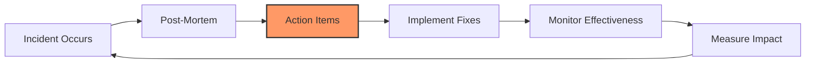

# Continuous Improvement

Incidents are expensive lessons. **The goal is to never have the same incident twice.**

## The Improvement Cycle

---

## Tracking Metrics

### 1. Incident Frequency
How often do incidents occur?
- **Target**: Decreasing trend month-over-month.
- **Red Flag**: Same incident type recurring.

### 2. MTTR (Mean Time To Recovery)
How fast do we recover?
- **Target**: < 1 hour for P1.
- **Improvement**: Track trend over time.

### 3. MTTD (Mean Time To Detect)
How fast do we detect issues?
- **Target**: < 5 minutes for P0/P1.
- **Improvement**: Better monitoring and alerting.

### 4. Repeat Incident Rate
What percentage of incidents are repeats?
- **Target**: < 10%.
- **Red Flag**: > 25% indicates poor follow-through on action items.

---

## Action Item Management

### The Problem
Action items from post-mortems often get forgotten.

### The Solution
1.  **Assign Owners**: Every action item has a specific owner.
2.  **Set Due Dates**: Realistic but firm deadlines.
3.  **Track in Sprint**: Add to sprint planning, not a separate backlog.
4.  **Review in Retros**: Discuss progress in retrospectives.
5.  **Executive Visibility**: Share action item completion rates with leadership.

---

## The Incident Review Board

### Purpose
Monthly meeting to review all incidents and trends.

### Attendees
- SRE Team Lead
- Engineering Managers
- Product Managers
- CTO (for major incidents)

### Agenda
1.  Review incident metrics (frequency, MTTR, MTTD).
2.  Discuss repeat incidents.
3.  Review action item completion rates.
4.  Identify systemic patterns.
5.  Allocate resources for major improvements.

---

## Building a Learning Culture

### 1. Celebrate Learning
Share post-mortems company-wide.
- **Example**: "Incident of the Month" presentation.

### 2. Reward Honesty
Thank people who surface issues early.

### 3. Gamedays
Simulate incidents to practice response.

### 4. Runbook Reviews
Quarterly review of all runbooks for accuracy.

### 5. Knowledge Sharing
Rotate on-call roles so everyone learns.

---

## 🏗️ Real-Life Scenario: The "Groundhog Day" Incident
**Problem**: The same database connection issue causes outages every 2 months.
**Post-Mortem**: Each time, action item is "Add monitoring."
**Reality**: Action item never gets prioritized in sprints.
**Outcome**: 6 outages in 1 year. Customers lose trust.
**Fix**: CTO mandates: "No new features until repeat incidents are below 10%."
**Result**: Team dedicates 2 sprints to fixing root causes. Repeat rate drops to 5%.

---

## ❓ Interview Questions
1.  **What is the goal of continuous improvement in incident management?**
    *   *Answer*: To learn from each incident and implement systemic fixes so that the same incident never happens again, progressively reducing incident frequency and severity over time.
2.  **Why do action items from post-mortems often fail to get implemented?**
    *   *Answer*: Because they're not integrated into regular sprint planning, lack clear owners and deadlines, and aren't given priority over feature work. Executive visibility and dedicated time allocation are needed.

---

## 🧠 Final Module Quiz (5/50+)
1.  **What is MTTR?** (Mean Time To Recovery)
2.  **True/False: The same incident should never happen twice.** (True - that's the goal)
3.  **What is a 'Repeat Incident'?** (An incident of the same type occurring again)
4.  **Should action items be tracked in sprints?** (Yes)
5.  **What is the target repeat incident rate?** (< 10%)
