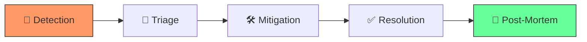
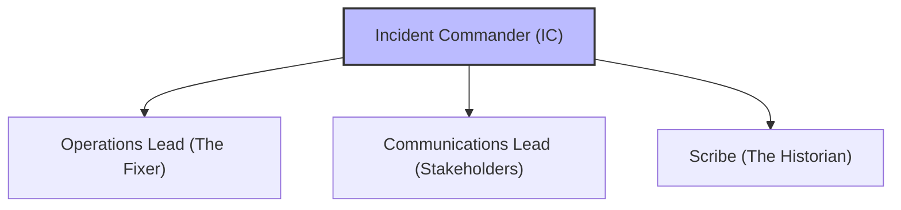

# Master the Storm

An incident is any unplanned interruption to an IT service or a reduction in its quality. In a mature DevOps culture, we don't just "fix things"; we manage the response with military-grade precision to prioritize stability and learn from every failure.

---
## 🏗️ 1. The Incident Response Lifecycle
Effective response follows a predictable cycle. Moving through these stages too quickly or skipping one can lead to "fix-loops" where the problem recurs or escalates.

- **Detection**: Monitoring alerts or user reports trigger the response.
- **Triage**: Determining the severity (P1-P4) and assembly of the response team.
- **Mitigation**: The immediate goal is to **stop the bleeding** (e.g., rollback or scale up), not necessarily finding the root cause.
- **Resolution**: The system is back to its "Desired State."
- **Post-Mortem**: The "Learning Phase" where we analyze the failure.

---

## 👥 2. The Incident Command System (ICS)

During a major outage (P0/P1), the technical team must reorganize into specific roles to eliminate communication chaos.

### **Incident Commander (IC)**
- **Role**: The single point of truth and decision-making.
- **Responsibility**: They do **not** touch code. They manage the clock, coordinate the leads, and make the final call on risky actions (like a full site restart).
- **Goal**: Maintain the "30,000-foot view" of the incident.
### **Operations Lead**
- **Role**: The technical driver.
- **Responsibility**: They manage the engineers "in the weeds," executing the runbook steps, checking logs, and reporting technical results back to the IC.
### **Communications Lead**
- **Role**: The bridge to the outside world.
- **Responsibility**: They update the **Status Page**, respond to internal stakeholders, and ensure the engineering team isn't interrupted by "When will it be back up?" questions.
### **Scribe**
- **Role**: The timestamp recorder.
- **Responsibility**: They record every key event and decision in a shared channel/document. This timeline is the foundation of the post-mortem.

---

## 📈 3. Priority & Escalation Matrix

Standardizing "Severity" prevents arguments during an outage and sets expectations for recovery time (SLAs).

| Priority | Impact | Urgency | Example |
| :--- | :--- | :--- | :--- |
| **P1 (Critical)** | Global / Majority of users | Immediate | Site down, Payment processing failure. |
| **P2 (High)** | Core feature broken | High | Checkout working, but images not loading. |
| **P3 (Medium)** | Minor feature broken | Moderate | Internal reporting tool slow. |
| **P4 (Low)** | Minimal | Low | UI typo, Logo alignment off. |

---

## 📝 4. The Blameless Post-Mortem
The goal of a post-mortem is to **fix the system, not the person.** If an engineer feels they will be punished for a mistake, they will hide the details, preventing the team from learning.

### **Key Post-Mortem Elements**:
1.  **Summary**: A 2-sentence executive summary of the impact.
2.  **Timeline**: "At 14:03 UTC, Engineer A ran `rm -rf /`..."
3.  **The "Five Whys"**: Drill down to the systemic root cause. (e.g., Why did they run that command? Because the backup script wasn't localized. Why? Because the template was shared...).
4.  **Remediation Items**: Concrete Jira tickets or tasks (e.g., "Add confirmation prompt to the cleanup script").

---

## 🛡️ 5. Cultural Best Practices
- **"The On-call is Never Alone"**: If an engineer is paged and can't find a solution within 15 minutes, they **must** escalate.
- **War Rooms**: For P1s, use a dedicated, always-on Zoom/Google Meet link to prevent delays in joining.
- **Stay Calm**: The IC’s most important tool is a calm voice. Stress leads to typos and dangerous shortcuts.
