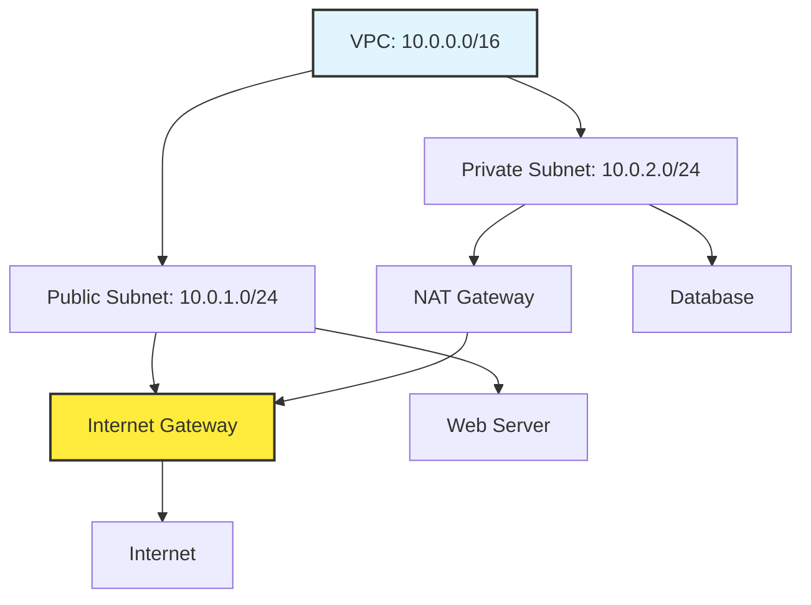

# VPC Concepts and Architecture

A **Virtual Private Cloud (VPC)** is your private, isolated network in the cloud. It's the foundation of cloud networking.

## What is a VPC?

A VPC is a logically isolated section of the cloud where you can launch resources in a virtual network that you define. You have complete control over:
- IP address ranges
- Subnets
- Route tables
- Network gateways

## Why VPCs Matter

### Isolation
Your VPC is isolated from other customers' networks, even though you're sharing the same physical infrastructure.

### Control
You define the network topology, IP addressing, and security policies.

### Connectivity
You can connect your VPC to:
- The internet (via Internet Gateway)
- Your on-premises data center (via VPN or Direct Connect)
- Other VPCs (via VPC Peering or Transit Gateway)

---

## VPC Architecture Components

---

## Cloud Provider Comparison

| Feature | AWS VPC | Azure VNet | GCP VPC |
| :--- | :--- | :--- | :--- |
| **Max CIDR Size** | /16 (65,536 IPs) | /8 (16M IPs) | /8 (16M IPs) |
| **Subnets** | Per AZ | Per Region | Global |
| **Default VPC** | Yes | No | Yes (auto mode) |
| **Peering** | VPC Peering | VNet Peering | VPC Peering |

---

## 🏗️ Real-Life Scenario: The "Flat Network" Mistake
**Problem**: A startup launches all resources in the default VPC with no subnets or security groups.
**Crisis**: A compromised web server gains access to the production database because everything is in the same network.
**Outcome**: Data breach, $500k fine.
**Fix**: Implement proper VPC design with public/private subnets and security groups.
**Result**: Defense in depth - even if one layer is compromised, others protect critical resources.

---

## ❓ Interview Questions
1.  **What is the difference between a VPC and a traditional data center network?**
    *   *Answer*: A VPC is software-defined and virtualized, allowing for rapid provisioning, scaling, and modification without physical hardware changes. It provides logical isolation using the same physical infrastructure as other customers.
2.  **Why would you create multiple VPCs instead of using one large VPC?**
    *   *Answer*: For environment isolation (dev/staging/prod), compliance requirements, different security policies, or organizational boundaries (different business units or customers in a multi-tenant architecture).

---

## 🧠 Quiz Snippet (5/50+)
1.  **What does VPC stand for?** (Virtual Private Cloud)
2.  **True/False: All customers share the same VPC.** (False - each has their own isolated VPC)
3.  **What provides internet connectivity to a VPC?** (Internet Gateway)
4.  **Can a VPC span multiple regions?** (No - VPCs are regional)
5.  **What is the purpose of subnets in a VPC?** (To segment the network and control routing/security)
