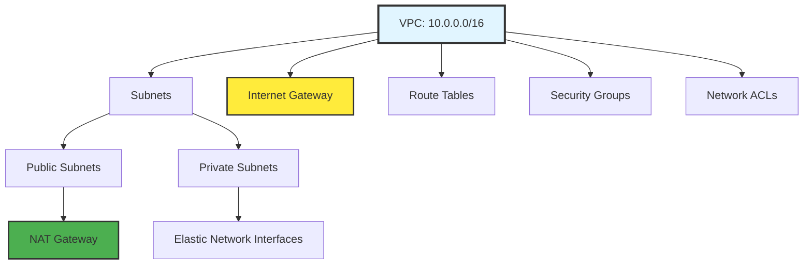
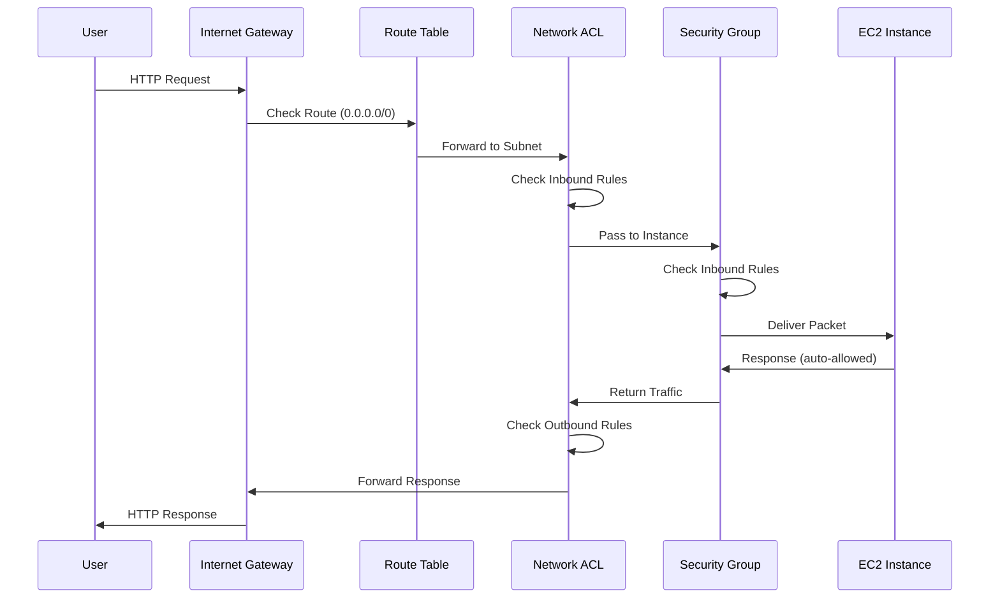

# VPC Components Overview

A VPC consists of multiple interconnected components that work together to create a secure, isolated network.

## Core VPC Components

---

## 1. VPC (Virtual Private Cloud)

**Purpose**: The container for all your network resources.

**Key Attributes**:
- **CIDR Block**: Primary IP range (e.g., 10.0.0.0/16)
- **Tenancy**: Default (shared hardware) or Dedicated
- **DNS Settings**: Enable DNS hostnames and resolution

**Limits**:
- 5 VPCs per region (soft limit, can be increased)
- 1 primary CIDR + up to 4 secondary CIDRs

---

## 2. Subnets

**Purpose**: Segment your VPC into smaller networks.

**Key Attributes**:
- **CIDR Block**: Subset of VPC CIDR (e.g., 10.0.1.0/24)
- **Availability Zone**: Must reside in single AZ
- **Type**: Public (IGW route) or Private (no IGW route)

**Limits**:
- 200 subnets per VPC
- 5 AWS-reserved IPs per subnet

---

## 3. Internet Gateway (IGW)

**Purpose**: Enable internet connectivity for your VPC.

**Key Attributes**:
- **Attachment**: One IGW per VPC
- **Availability**: Highly available, AWS-managed
- **NAT**: Performs 1:1 NAT for public IPs

**Cost**: Free (only pay for data transfer)

---

## 4. NAT Gateway

**Purpose**: Allow private subnet resources to access internet (outbound only).

**Key Attributes**:
- **Placement**: Must be in public subnet
- **Elastic IP**: Requires one EIP
- **Availability**: Single AZ (deploy one per AZ for HA)

**Cost**: $0.045/hour + $0.045/GB processed

---

## 5. Route Tables

**Purpose**: Control traffic routing within VPC and to external networks.

**Key Attributes**:
- **Routes**: Destination CIDR + Target
- **Association**: Linked to subnets
- **Priority**: Longest prefix match wins

**Limits**:
- 200 route tables per VPC
- 50 routes per route table

---

## 6. Security Groups

**Purpose**: Instance-level stateful firewall.

**Key Attributes**:
- **State**: Stateful (return traffic auto-allowed)
- **Rules**: Allow only (no deny rules)
- **Scope**: Applied to ENIs (network interfaces)

**Limits**:
- 2,500 security groups per VPC
- 60 inbound + 60 outbound rules per group
- 5 security groups per network interface

---

## 7. Network ACLs (NACLs)

**Purpose**: Subnet-level stateless firewall.

**Key Attributes**:
- **State**: Stateless (must allow both directions)
- **Rules**: Allow and Deny rules
- **Processing**: Rules evaluated in order (lowest number first)

**Limits**:
- 200 NACLs per VPC
- 20 inbound + 20 outbound rules per NACL

---

## 8. Elastic Network Interfaces (ENIs)

**Purpose**: Virtual network card for EC2 instances.

**Key Attributes**:
- **IP Addresses**: Primary private IP + secondary IPs
- **MAC Address**: Persistent across stop/start
- **Security Groups**: Up to 5 per ENI

**Use Cases**:
- Multi-homed instances (multiple subnets)
- Low-budget high availability
- Network appliances (firewalls, load balancers)

---

## 9. VPC Endpoints

**Purpose**: Private connectivity to AWS services without internet.

**Types**:
- **Gateway Endpoints**: S3, DynamoDB (free)
- **Interface Endpoints**: Most other services ($0.01/hour)

**Benefits**:
- No NAT Gateway costs for AWS service access
- Traffic stays on AWS network
- Better security (no internet exposure)

---

## 10. VPC Peering

**Purpose**: Connect two VPCs privately.

**Key Attributes**:
- **Routing**: Non-transitive (no daisy-chaining)
- **CIDR**: No overlapping IP ranges
- **Region**: Can peer across regions

**Limits**:
- 125 peering connections per VPC

---

## Component Interaction Example

---

## 🏗️ Real-Life Scenario: The Missing Component
**Problem**: Application deployed, but can't access internet.
**Investigation**:
- ✓ VPC created (10.0.0.0/16)
- ✓ Subnet created (10.0.1.0/24)
- ✓ EC2 instance launched
- ✓ Security group allows all outbound
- ✗ No Internet Gateway attached!

**Fix**: Created and attached IGW, added route 0.0.0.0/0 -> IGW.
**Lesson**: All components must work together - missing any one breaks connectivity.

---

## ❓ Interview Questions
1.  **What is the difference between a Security Group and a Network ACL?**
    *   *Answer*: Security Groups are stateful, instance-level firewalls that only support allow rules. NACLs are stateless, subnet-level firewalls that support both allow and deny rules and process rules in numerical order.
2.  **Why would you use VPC Endpoints instead of NAT Gateway?**
    *   *Answer*: VPC Endpoints provide private connectivity to AWS services without internet access, eliminating NAT Gateway data processing costs, improving security, and reducing latency by keeping traffic on the AWS network.

---

## 🧠 Quiz Snippet (5/20+)
1.  **How many IGWs can attach to one VPC?** (One)
2.  **True/False: NAT Gateways are free.** (False - $0.045/hour + data)
3.  **What is an ENI?** (Elastic Network Interface - virtual network card)
4.  **Are Security Groups stateful or stateless?** (Stateful)
5.  **What is the limit for security groups per VPC?** (2,500)
