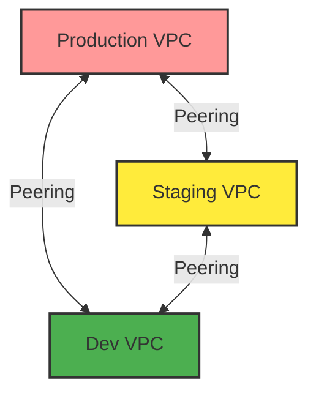
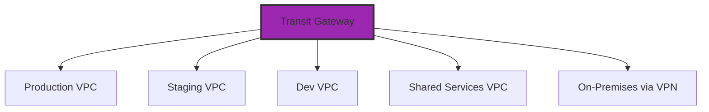
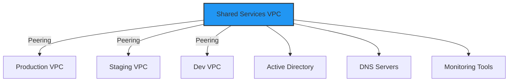

# Multi-VPC Strategies

As organizations grow, they often need multiple VPCs. Understanding when and how to use multiple VPCs is crucial for scalable architecture.

## Reasons for Multiple VPCs

### 1. Environment Isolation
Separate VPCs for different environments:
- **Production**: 10.0.0.0/16
- **Staging**: 10.1.0.0/16
- **Development**: 10.2.0.0/16
- **Testing**: 10.3.0.0/16

**Benefits**: Complete isolation, different security policies, blast radius containment.

### 2. Organizational Boundaries
Separate VPCs for different teams or business units:
- **Engineering**: 10.10.0.0/16
- **Data Science**: 10.20.0.0/16
- **Finance**: 10.30.0.0/16

**Benefits**: Independent management, cost allocation, compliance separation.

### 3. Compliance and Regulatory Requirements
- **PCI-DSS VPC**: 10.100.0.0/16 (payment processing)
- **HIPAA VPC**: 10.101.0.0/16 (healthcare data)
- **General VPC**: 10.102.0.0/16 (non-regulated workloads)

**Benefits**: Easier audits, clear compliance boundaries, reduced scope.

### 4. Multi-Tenancy
SaaS providers often use one VPC per customer:
- **Customer A**: 10.200.0.0/16
- **Customer B**: 10.201.0.0/16
- **Customer C**: 10.202.0.0/16

**Benefits**: Complete customer isolation, dedicated resources, security.

---

## Multi-VPC Connectivity Patterns

### Pattern 1: VPC Peering



**Pros**: Simple, low latency, no additional cost
**Cons**: Non-transitive, doesn't scale beyond ~10 VPCs, complex routing

### Pattern 2: Transit Gateway (Hub-and-Spoke)



**Pros**: Scales to thousands of VPCs, transitive routing, centralized management
**Cons**: Additional cost ($0.05/hour + $0.02/GB), slight latency increase

### Pattern 3: Shared Services VPC



**Use Case**: Centralized services (AD, DNS, logging, monitoring)

---

## CIDR Planning for Multiple VPCs

### Strategy 1: Hierarchical Allocation
```
10.0.0.0/8 - Company-wide allocation

10.0.0.0/12 - Production (16 VPCs)
  10.0.0.0/16 - Prod VPC 1
  10.1.0.0/16 - Prod VPC 2
  ...

10.16.0.0/12 - Staging (16 VPCs)
  10.16.0.0/16 - Stage VPC 1
  10.17.0.0/16 - Stage VPC 2
  ...

10.32.0.0/12 - Development (16 VPCs)
  10.32.0.0/16 - Dev VPC 1
  10.33.0.0/16 - Dev VPC 2
  ...
```

### Strategy 2: Regional Allocation
```
10.0.0.0/8 - Global allocation

10.0.0.0/12 - us-east-1
10.16.0.0/12 - us-west-2
10.32.0.0/12 - eu-west-1
10.48.0.0/12 - ap-southeast-1
```

---

## Multi-Account vs. Multi-VPC

| Approach | Use Case | Pros | Cons |
| :--- | :--- | :--- | :--- |
| **Multi-VPC, Single Account** | Small teams, simple org | Easy management, single bill | Limited isolation, shared limits |
| **Multi-VPC, Multi-Account** | Enterprise, compliance | Strong isolation, separate limits | Complex management, consolidated billing needed |

**Best Practice**: Use AWS Organizations with multiple accounts AND multiple VPCs.

---

## Cost Considerations

### VPC Peering
- **Cost**: Free (only pay for data transfer)
- **Data Transfer**: $0.01/GB (same region), $0.02/GB (cross-region)

### Transit Gateway
- **Attachment**: $0.05/hour per VPC
- **Data Processing**: $0.02/GB
- **Example**: 10 VPCs = $0.50/hour = $360/month (before data transfer)

### VPN Connection
- **Cost**: $0.05/hour per connection
- **Data Transfer**: Standard AWS rates

---

## 🏗️ Real-Life Scenario: The Peering Mesh Nightmare
**Company**: Growing startup with 15 VPCs
**Initial Setup**: Full mesh VPC peering (every VPC peered with every other)
**Problem**: 15 VPCs = 105 peering connections (n*(n-1)/2)
**Issues**:
- Routing table explosion (14 routes per VPC)
- Management nightmare (updating routes across 105 connections)
- Hit peering connection limit (50 per VPC)

**Solution**: Migrated to Transit Gateway
- 15 attachments instead of 105 peering connections
- Centralized routing
- Easy to add new VPCs

**Cost**: $540/month for TGW vs. $0 for peering, but saved 20 hours/month in management time.

---

## ❓ Interview Questions
1.  **When would you use multiple VPCs instead of multiple subnets in one VPC?**
    *   *Answer*: Use multiple VPCs for complete isolation between environments (prod/dev), compliance requirements (PCI-DSS/HIPAA), organizational boundaries (different teams/business units), or multi-tenancy (one VPC per customer).
2.  **What is the difference between VPC Peering and Transit Gateway?**
    *   *Answer*: VPC Peering is a 1:1 connection between two VPCs, non-transitive, and free (except data transfer). Transit Gateway is a hub that can connect thousands of VPCs with transitive routing, but costs $0.05/hour per attachment plus $0.02/GB data processing.

---

## 🧠 Quiz Snippet (5/20+)
<b>1. Is VPC Peering transitive?</b>
<details>
<summary>Show Answer</summary>
Answer: No
</details>

<b>2. True/False: Transit Gateway can connect VPCs across regions.</b>
<details>
<summary>Show Answer</summary>
Answer: True
</details>

<b>3. What is the formula for full mesh peering connections?</b>
<details>
<summary>Show Answer</summary>
Answer: n*(n-1)/2
</details>

<b>4. Should production and development share a VPC?</b>
<details>
<summary>Show Answer</summary>
Answer: No
</details>

<b>5. What is the cost of VPC Peering?</b>
<details>
<summary>Show Answer</summary>
Answer: Free, except data transfer
</details>
