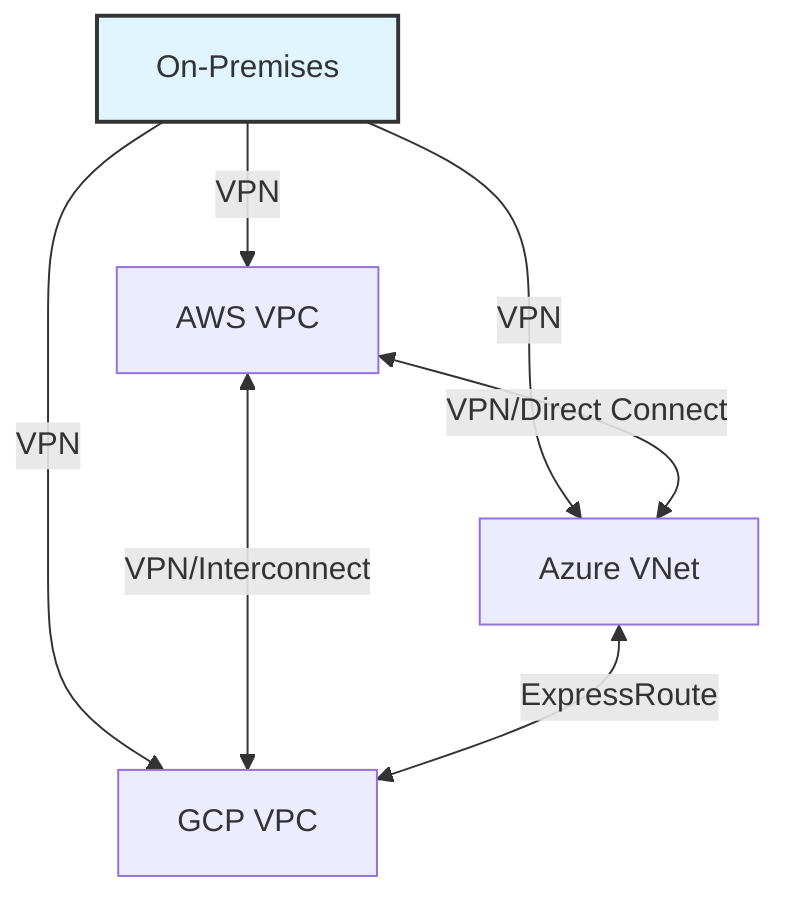

# Cloud Provider Comparison

Understanding VPC implementations across major cloud providers helps with multi-cloud strategies and migrations.

## AWS VPC

### Key Features
- **CIDR**: /16 to /28 (primary + 4 secondary blocks)
- **Subnets**: Per AZ, 200 per VPC
- **Default VPC**: Yes (172.31.0.0/16)
- **Peering**: VPC Peering, Transit Gateway
- **Endpoints**: Gateway (S3, DynamoDB), Interface (others)

### Unique Strengths
- Most mature VPC implementation
- Extensive third-party tool ecosystem
- Transit Gateway for hub-and-spoke
- PrivateLink for service exposure

### Pricing
- VPC: Free
- NAT Gateway: $0.045/hour + $0.045/GB
- Transit Gateway: $0.05/hour per attachment + $0.02/GB
- VPC Peering: Free (data transfer charges apply)

---

## Azure Virtual Network (VNet)

### Key Features
- **CIDR**: /8 to /29 (up to 16M IPs)
- **Subnets**: Per region, 3,000 per VNet
- **Default VNet**: No
- **Peering**: VNet Peering, Virtual WAN
- **Endpoints**: Service Endpoints, Private Link

### Unique Strengths
- Larger address space (/8 vs AWS /16)
- Global VNet peering built-in
- Integrated with Azure AD
- Virtual WAN for SD-WAN

### Pricing
- VNet: Free
- NAT Gateway: $0.045/hour + $0.045/GB
- Virtual WAN: $0.25/hour per hub + data
- VNet Peering: $0.01/GB (same region)

---

## Google Cloud VPC

### Key Features
- **CIDR**: /8 to /29, global by default
- **Subnets**: Global, auto-mode or custom
- **Default VPC**: Yes (auto-mode)
- **Peering**: VPC Peering, Shared VPC
- **Endpoints**: Private Google Access, Private Service Connect

### Unique Strengths
- **Global VPC**: Subnets span regions
- **Auto-mode**: Automatic subnet creation
- **Shared VPC**: Cross-project networking
- **No NAT Gateway**: Cloud NAT is free (only pay for IPs)

### Pricing
- VPC: Free
- Cloud NAT: Free (only pay for NAT IPs)
- VPC Peering: Free (data transfer charges apply)
- Private Service Connect: $0.01/hour per endpoint

---

## Feature Comparison

| Feature | AWS VPC | Azure VNet | GCP VPC |
| :--- | :--- | :--- | :--- |
| **Scope** | Regional | Regional | Global |
| **Max CIDR** | /16 (65,536) | /8 (16M) | /8 (16M) |
| **Subnets per Network** | 200 | 3,000 | Unlimited |
| **Default Network** | Yes | No | Yes |
| **NAT Cost** | $0.045/hour | $0.045/hour | Free |
| **Peering Cost** | Free | $0.01/GB | Free |
| **IPv6 Support** | Yes | Yes | Yes |
| **Hub-and-Spoke** | Transit Gateway | Virtual WAN | Shared VPC |

---

## Subnet Design Comparison

### AWS: AZ-Specific Subnets
```
VPC: us-east-1 (10.0.0.0/16)
├── Subnet-A: us-east-1a (10.0.1.0/24)
├── Subnet-B: us-east-1b (10.0.2.0/24)
└── Subnet-C: us-east-1c (10.0.3.0/24)
```

### Azure: Region-Specific Subnets
```
VNet: East US (10.0.0.0/16)
├── Subnet-Web: (10.0.1.0/24)
├── Subnet-App: (10.0.2.0/24)
└── Subnet-Data: (10.0.3.0/24)
```

### GCP: Global Subnets
```
VPC: global (10.0.0.0/16)
├── Subnet-US: us-central1 (10.0.1.0/24)
├── Subnet-EU: europe-west1 (10.0.2.0/24)
└── Subnet-ASIA: asia-east1 (10.0.3.0/24)
```

---

## Security Comparison

| Security Feature | AWS | Azure | GCP |
| :--- | :--- | :--- | :--- |
| **Instance Firewall** | Security Groups | Network Security Groups | Firewall Rules |
| **Subnet Firewall** | Network ACLs | Network Security Groups | Firewall Rules |
| **Stateful** | Security Groups | NSGs | Firewall Rules |
| **Stateless** | NACLs | None | None |
| **DDoS Protection** | AWS Shield | Azure DDoS Protection | Cloud Armor |

---

## Migration Considerations

### AWS → Azure
- **Terminology**: VPC → VNet, Subnet → Subnet, IGW → Internet Gateway
- **CIDR**: Can use larger blocks in Azure
- **NAT**: Similar NAT Gateway concept
- **Challenge**: Different security model (NSGs vs SGs/NACLs)

### AWS → GCP
- **Terminology**: VPC → VPC, Subnet → Subnet, IGW → Internet Gateway
- **Global VPC**: Major architectural difference
- **NAT**: Cloud NAT is free (cost savings)
- **Challenge**: Subnets can span regions (different design paradigm)

### Multi-Cloud Strategy


---

## 🏗️ Real-Life Scenario: The Multi-Cloud Migration
**Company**: Enterprise with AWS workloads
**Requirement**: Migrate some workloads to GCP for ML capabilities
**Challenge**: Different VPC models (regional vs. global)
**Solution**:
- Designed GCP VPC with regional subnets (custom mode)
- Used Cloud VPN for AWS-GCP connectivity
- Maintained consistent CIDR allocation (10.0.0.0/8)
**Outcome**: Successful multi-cloud deployment
**Lesson**: Understand provider differences before migration.

---

## ❓ Interview Questions
1.  **What is the main architectural difference between AWS VPC and GCP VPC?**
    *   *Answer*: AWS VPCs are regional (subnets must be in one region), while GCP VPCs are global (subnets can span multiple regions). This affects how you design multi-region architectures.
2.  **Why is GCP's Cloud NAT free while AWS charges for NAT Gateway?**
    *   *Answer*: GCP's Cloud NAT is a software-defined service without dedicated infrastructure, so they only charge for the NAT IP addresses. AWS NAT Gateway is a managed service with dedicated capacity, hence the hourly charge plus data processing fees.

---

## 🧠 Quiz Snippet (5/20+)
<b>1. Which cloud has global VPCs?</b>
<details>
<summary>Show Answer</summary>
Answer: GCP
</details>

<b>2. True/False: Azure VNets can be larger than AWS VPCs.</b>
<details>
<summary>Show Answer</summary>
Answer: True - /8 vs /16
</details>

<b>3. Which provider has free NAT?</b>
<details>
<summary>Show Answer</summary>
Answer: GCP - Cloud NAT
</details>

<b>4. What is Azure's equivalent of AWS Security Groups?</b>
<details>
<summary>Show Answer</summary>
Answer: Network Security Groups
</details>

<b>5. Can GCP subnets span regions?</b>
<details>
<summary>Show Answer</summary>
Answer: Yes
</details>
