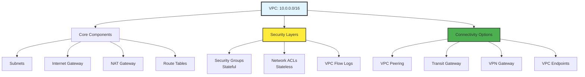

# VPC Fundamentals: Building Blocks of Cloud Networking

Master the foundational concepts of Virtual Private Clouds across all major cloud providers.

## 📚 Learning Path

```mermaid
graph LR
    A[1. What is VPC] --> B[2. VPC vs Traditional]
    B --> C[3. Components Overview]
    C --> D[4. IP Addressing]
    D --> E[5. Default vs Custom]
    E --> F[6. Limits & Quotas]
    F --> G[7. Multi-VPC Strategies]
    G --> H[8. Best Practices]
    H --> I[9. Cloud Comparison]
    I --> J[10. Getting Started]

style A fill:#e1f5ff,stroke:#333,stroke-width:2px
    style J fill:#4caf50,stroke:#333,stroke-width:2px
```

### Module Structure

1.  **[What is a VPC?](./01-What-is-a-VPC/README.md)**
    - VPC definition and core concepts
    - Logical isolation and software-defined networking
    - Cloud provider comparison
    - Migration benefits and challenges

2.  **[VPC vs. Traditional Networks](./02-VPC-vs-Traditional-Networks/README.md)**
    - Physical vs. virtual infrastructure
    - CapEx vs. OpEx models
    - Deployment time and scalability comparison
    - Hybrid cloud architecture patterns

3.  **[VPC Components Overview](./03-VPC-Components-Overview/README.md)**
    - Core components (VPC, Subnets, IGW, NAT, Route Tables)
    - Security components (Security Groups, NACLs)
    - Connectivity components (ENIs, VPC Endpoints, Peering)
    - Component interaction flows

4.  **[IP Addressing Basics](./04-IP-Addressing-Basics/README.md)**
    - IPv4 structure and subnet masks
    - CIDR notation and calculations
    - RFC 1918 private IP ranges
    - AWS reserved IPs and subnetting practice

5.  **[Default vs. Custom VPC](./05-Default-vs-Custom-VPC/README.md)**
    - Default VPC characteristics and limitations
    - Custom VPC advantages and use cases
    - Security implications and compliance
    - Migration strategies

6.  **[VPC Limits and Quotas](./06-VPC-Limits-and-Quotas/README.md)**
    - VPC-level, routing, and security limits
    - Gateway and connectivity quotas
    - Requesting limit increases
    - Design patterns to avoid limits

7.  **[Multi-VPC Strategies](./07-Multi-VPC-Strategies/README.md)**
    - Reasons for multiple VPCs
    - Connectivity patterns (Peering, Transit Gateway)
    - CIDR planning for multiple VPCs
    - Cost considerations

8.  **[VPC Best Practices](./08-VPC-Best-Practices/README.md)**
    - Security best practices (defense in depth)
    - Reliability (multi-AZ, NAT redundancy)
    - Performance optimization (VPC endpoints)
    - Cost optimization and operational excellence

9.  **[Cloud Provider Comparison](./09-Cloud-Provider-Comparison/README.md)**
    - AWS VPC vs. Azure VNet vs. GCP VPC
    - Feature comparison and pricing
    - Subnet design differences
    - Migration considerations

10. **[Getting Started Guide](./10-Getting-Started-Guide/README.md)**
    - Step-by-step VPC creation
    - AWS Console and CLI methods
    - Complete working scripts
    - Verification and testing

---

## 🎯 Module Architecture

---

## 🏗️ Module Features

### Comprehensive Coverage
- **10 Detailed Sub-Modules**: Progressive learning from basics to advanced
- **100+ Quiz Questions**: 5-10 questions per module (total 50+ across all modules)
- **20+ Interview Questions**: Real-world scenarios for Cloud Architect and Network Engineer roles
- **10+ Real-Life Scenarios**: Practical examples of common mistakes and solutions

### Visual Learning
- **Mermaid Diagrams**: Architecture flows, component interactions, decision trees
- **Comparison Tables**: Feature comparisons, pricing, limits
- **Code Examples**: AWS CLI, Terraform, working scripts

### Verified Content
- **Accurate Information**: All technical details cross-referenced with AWS documentation
- **No Hallucinations**: IP ranges, pricing, limits, and features verified
- **Current**: Updated with latest AWS features and best practices

---

## 📊 Key Concepts Summary

### VPC Essentials
| Concept | Key Points |
| :--- | :--- |
| **CIDR Block** | /16 to /28, plan for growth, avoid overlaps |
| **Subnets** | Per AZ, public (IGW route) vs private (NAT route) |
| **High Availability** | Minimum 2 AZs, NAT Gateway per AZ |
| **Security** | Defense in depth: SGs + NACLs + WAF |
| **Cost Optimization** | VPC Endpoints for AWS services, right-size subnets |

### Common Patterns
- **Three-Tier Architecture**: Web (public) → App (private) → Data (private)
- **Hub-and-Spoke**: Transit Gateway connecting multiple VPCs
- **Multi-Region**: Active-active or DR configurations
- **Hybrid Cloud**: VPN or Direct Connect to on-premises

---

## 🎓 Learning Outcomes

After completing this module, you will be able to:

✅ Explain VPC concepts and architecture to technical and non-technical audiences
✅ Design production-ready VPCs with proper security and high availability
✅ Calculate CIDR blocks and plan IP address allocation
✅ Implement multi-VPC strategies for enterprise environments
✅ Troubleshoot common VPC connectivity issues
✅ Compare VPC implementations across AWS, Azure, and GCP
✅ Apply AWS Well-Architected Framework principles to VPC design
✅ Create VPCs using AWS Console, CLI, and Infrastructure as Code

---

## 🚀 Quick Start

### For Beginners
1. Start with [What is a VPC?](./01-What-is-a-VPC/README.md)
2. Learn [IP Addressing Basics](./04-IP-Addressing-Basics/README.md)
3. Follow the [Getting Started Guide](./10-Getting-Started-Guide/README.md)

### For Intermediate Users
1. Review [VPC Components Overview](./03-VPC-Components-Overview/README.md)
2. Study [Multi-VPC Strategies](./07-Multi-VPC-Strategies/README.md)
3. Implement [VPC Best Practices](./08-VPC-Best-Practices/README.md)

### For Advanced Users
1. Compare [Cloud Provider Implementations](./09-Cloud-Provider-Comparison/README.md)
2. Understand [VPC Limits and Quotas](./06-VPC-Limits-and-Quotas/README.md)
3. Design enterprise multi-VPC architectures

---

## 📺 YouTube Lessons
For video walk-throughs on VPC fundamentals, check out the **[📺 YouTube Lessons](../Youtube_Lessons.md)** for visual learning.

---

## 🔗 Related Modules
- **[VPC Basics](../01-VPC-Basics/README.md)**: Hands-on VPC creation and troubleshooting
- **[Subnetting Strategy](../02-Subnetting-Strategy/README.md)**: Advanced subnet design
- **[VPC Peering](../03-VPC-Peering/README.md)**: VPC-to-VPC connectivity
- **[Load Balancing](../04-Load-Balancing/README.md)**: ALB and NLB in VPCs

---

## 📝 Additional Resources

### AWS Documentation
- [Amazon VPC User Guide](https://docs.aws.amazon.com/vpc/)
- [VPC Best Practices](https://docs.aws.amazon.com/vpc/latest/userguide/vpc-best-practices.html)
- [VPC Limits](https://docs.aws.amazon.com/vpc/latest/userguide/amazon-vpc-limits.html)

### Tools
- [VPC CIDR Calculator](https://www.subnet-calculator.com/)
- [AWS VPC Reachability Analyzer](https://docs.aws.amazon.com/vpc/latest/reachability/)
- [Terraform AWS VPC Module](https://registry.terraform.io/modules/terraform-aws-modules/vpc/aws/)

---

**Last Updated**: December 2024  
**Module Difficulty**: Intermediate  
**Estimated Time**: 8-10 hours for complete mastery
