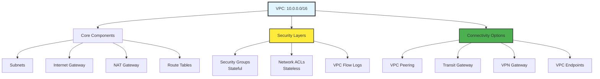

# VPC Fundamentals: Building Blocks of Cloud Networking

Master the foundational concepts of Virtual Private Clouds across all major cloud providers.

## 📚 Learning Path

```mermaid
graph LR
    A[1. What is VPC] --> B[2. VPC vs Traditional]
    B --> C[3. Components Overview]
    C --> D[4. IP Addressing]
    D --> E[5. Default vs Custom]
    E --> F[6. Limits & Quotas]
    F --> G[7. Multi-VPC Strategies]
    G --> H[8. Best Practices]
    H --> I[9. Cloud Comparison]
    I --> J[10. Getting Started]

style A fill:#e1f5ff,stroke:#333,stroke-width:2px
    style J fill:#4caf50,stroke:#333,stroke-width:2px
```

### Module Structure

1.  **[What is a VPC?](./01-What-is-a-VPC/README.md)**: VPC definition and core concepts.
2.  **[VPC vs. Traditional Networks](./02-VPC-vs-Traditional-Networks/README.md)**: Physical vs. virtual infrastructure.
3.  **[VPC Components Overview](./03-VPC-Components-Overview/README.md)**: Core components and security layers.
4.  **[IP Addressing Basics](./04-IP-Addressing-Basics/README.md)**: CIDR notation and RFC 1918.
5.  **[Default vs. Custom VPC](./05-Default-vs-Custom-VPC/README.md)**: Security and compliance considerations.
6.  **[VPC Limits and Quotas](./06-VPC-Limits-and-Quotas/README.md)**: Quotas and design constraints.
7.  **[Multi-VPC Strategies](./07-Multi-VPC-Strategies/README.md)**: Peering and Transit Gateways.
8.  **[VPC Best Practices](./08-VPC-Best-Practices/README.md)**: High availability and security.
9.  **[Cloud Provider Comparison](./09-Cloud-Provider-Comparison/README.md)**: AWS vs. Azure vs. GCP.
10. **[Getting Started Guide](./10-Getting-Started-Guide/README.md)**: Step-by-step implementation.

---

## 🎯 Module Architecture

---

## 🏗️ Real-Life Scenarios

### Scenario 1: The "IP Exhaustion" Crisis
**Problem**: A fast-growing startup created their VPC with a small /24 CIDR block (256 IPs), thinking it would be plenty for their initial 10 servers.
**Crisis**: Six months later, they launched a Kubernetes cluster and an auto-scaling group. Within hours, new pods failed to start because the VPC had run out of available private IP addresses.
**Outcome**: The team had to build an entirely new VPC with a /16 range and perform a risky live migration of all services, leading to 4 hours of scheduled downtime.
**Solution**: Use a large CIDR block (like /16) from the start. IP addresses in a VPC are free; running out of them is expensive.
**Result**: The company now uses a standard 10.x.0.0/16 template for all new regions, ensuring they never face exhaustion again.

### Scenario 2: The "Open Door" Security Breach
**Problem**: A developer created a "Default" VPC and launched a database server. To make debugging easier, they attached an Internet Gateway and set the Security Group to allow `0.0.0.0/0` on port 3306.
**Crisis**: Within 48 hours, the database was hit by a ransomware attack that encrypted all customer records because the server was directly reachable from the public internet.
**Outcome**: The company lost 2 days of data and had to pay a consultant to harden their infrastructure.
**Solution**: Implement a "Private Subnet" strategy. Databases should never have a public IP or a path to an Internet Gateway. Use a Bastion Host or VPN for management.
**Result**: All sensitive workloads were moved to isolated subnets with no direct internet ingress, reducing the attack surface by 99%.

### Scenario 3: The "Regional Outage" Survival
**Problem**: A SaaS provider hosted their entire application in a single Availability Zone (AZ) to save on "Inter-AZ data transfer" costs.
**Crisis**: AWS experienced a power failure in that specific data center (Zone A). The entire SaaS platform went offline for 8 hours.
**Outcome**: The company violated their SLA and lost several high-value enterprise clients who demanded high availability.
**Solution**: Redeployed the VPC components across three different Availability Zones (Multi-AZ). They used an Application Load Balancer to distribute traffic across all three zones.
**Result**: When a similar AZ failure occurred a year later, the application stayed online with zero downtime as traffic automatically shifted to the healthy zones.

---

## ❓ Interview Questions

1.  **What is the 'Default VPC' and why do production environments usually avoid it?**
    - *Answer*: A Default VPC is pre-configured by the cloud provider in every region to help beginners get started quickly. Production environments avoid it because it has public subnets by default, uses a standard CIDR block that might overlap with other networks, and doesn't follow the "Least Privilege" security model required for enterprise compliance.
2.  **Explain the difference between a 'Soft Limit' and a 'Hard Limit' in VPC quotas.**
    - *Answer*: A **Soft Limit** (e.g., number of VPCs per region) can be increased by submitting a support ticket to the cloud provider. A **Hard Limit** (e.g., the maximum size of a CIDR block being /16 in some legacy contexts or specific hardware constraints) cannot be changed regardless of the request.
3.  **Why should you avoid overlapping CIDR blocks when designing a Multi-VPC architecture?**
    - *Answer*: Overlapping IP ranges make it impossible to connect those VPCs via VPC Peering or a Transit Gateway. Routine routing cannot distinguish between the two networks if they share the same IP space, preventing hybrid cloud or cross-account communication.
4.  **What is the purpose of the 'Primary' CIDR block vs. 'Secondary' CIDR blocks?**
    - *Answer*: The Primary block is defined at VPC creation and is immutable. If a VPC grows unexpectedly and runs out of IPs, cloud providers allow you to add "Secondary" CIDR blocks to the existing VPC to expand capacity without rebuilding the entire network.
5.  **How does 'Software Defined Networking' (SDN) differ from traditional hardware networking?**
    - *Answer*: SDN abstracts the network hardware into software. In a VPC, routers, switches, and firewalls are "Virtual instances" managed via API. This allows for near-instant provisioning, global scalability, and programmatic control that physical hardware cannot match.
6.  **In a 3-Tier architecture, which tier should have a 'Public IP'?**
    - *Answer*: Only the **Web/Load Balancer** tier (Tier 1) should have public access. The Application tier (Tier 2) and Database tier (Tier 3) should reside in private subnets with only private IPs to ensure security.

---

## 🧠 Comprehensive Quiz (25 Questions)

**1. What is the maximum size of a VPC CIDR block in AWS?**
- A) /8
- B) /16
- C) /24
- D) /32

Show Answer

**Answer: B**

**2. True/False: VPCs are globally scoped and span all regions automatically.**
- A) True
- B) False (VPCs are Regional)

Show Answer

**Answer: B**

**3. Which component provides a path for a VPC to communicate with the Public Internet?**
- A) NAT Gateway
- B) Internet Gateway (IGW)
- C) Virtual Private Gateway
- D) VPC Endpoint

Show Answer

**Answer: B**

**4. A 'Subnet' exists within a single:**
- A) Region
- B) Availability Zone
- C) Country
- D) Data Center Rack

Show Answer

**Answer: B**

**5. Which protocol is used by cloud providers to isolate VPC traffic on shared hardware?**
- A) HTTP
- B) BGP
- C) Encapsulation (e.g., VXLAN or similar SDN tech)
- D) FTP

Show Answer

**Answer: C**

**6. RFC 1918 defines which of the following?**
- A) Routing protocols
- B) Private IP address ranges
- C) Public DNS settings
- D) Nothing

Show Answer

**Answer: B**

**7. True/False: You can increase the number of VPCs in your account by contacting support.**
- A) True (It is a soft limit)
- B) False

Show Answer

**Answer: A**

**8. Which architectural pattern connects multiple VPCs in a 'Hub and Spoke' model?**
- A) VPC Peering
- B) Transit Gateway (TGW)
- C) NAT Gateway
- D) VPN

Show Answer

**Answer: B**

**9. A 'Public Subnet' is defined by having a route to:**
- A) A Database
- B) An Internet Gateway (IGW)
- C) A S3 Bucket
- D) nothing

Show Answer

**Answer: B**

**10. What happens if you try to peer two VPCs with overlapping CIDR blocks?**
- A) It works fine
- B) The request will fail or routing will be broken
- C) The clodu provider auto-fixes the IPs
- D) nothing

Show Answer

**Answer: B**

**11. Which 'Security' component is stateful?**
- A) NACL
- B) Security Group
- C) Route Table
- D) NAT Gateway

Show Answer

**Answer: B**

**12. 'Elasticity' in a VPC refers to:**
- A) Changing the color of the console
- B) The ability to scale network resources up or down quickly
- C) Hardening the network
- D) nothing

Show Answer

**Answer: B**

**13. How many 'Availability Zones' should a production VPC span at minimum?**
- A) 1
- B) 2
- C) 5
- D) 10

Show Answer

**Answer: B**

**14. A 'Private IP' address is reachable from:**
- A) Anywhere on the Internet
- B) Only within the VPC (and connected networks)
- C) Only by the CEO
- D) nothing

Show Answer

**Answer: B**

**15. 'Default VPCs' are created in:**
- A) Only the US-East-1 region
- B) Every region by default
- C) Only when you pay extra
- D) nothing

Show Answer

**Answer: B**

**16. True/False: VPC Peering supports 'Transitive Routing' (A -> B -> C).**
- A) False (You must peer A to C directly)
- B) True

Show Answer

**Answer: A**

**17. What is the smallest CIDR block allowed for a VPC subnet in AWS?**
- A) /16
- B) /24
- C) /28
- D) /32

Show Answer

**Answer: C**

**18. Which service allows private connection to AWS services without an IGW?**
- A) NAT Gateway
- B) VPC Endpoint (PrivateLink)
- C) VPN
- D) Direct Connect

Show Answer

**Answer: B**

**19. 'Tenancy' in a VPC refers to:**
- A) How much rent you pay
- B) Whether resources run on shared or dedicated physical hardware
- C) The name of the VPC
- D) nothing

Show Answer

**Answer: B**

**20. True/False: You can delete the Default VPC.**
- A) True
- B) False

Show Answer

**Answer: A**

**21. A 'Route Table' contains a set of rules called:**
- A) Codes
- B) Routes
- C) Laws
- D) nothing

Show Answer

**Answer: B**

**22. Which range is a valid RFC 1918 Private IP range?**
- A) 8.8.8.8/32
- B) 10.0.0.0/8
- C) 1.1.1.1/32
- D) nothing

Show Answer

**Answer: B**

**23. 'VPC Flow Logs' capture:**
- A) Video of the servers
- B) IP traffic information reaching network interfaces
- C) The cost of the VPC
- D) nothing

Show Answer

**Answer: B**

**24. The main disadvantage of 'Multi-AZ' architectures is:**
- A) Complexity and cross-AZ data transfer costs
- B) Slow speed
- C) Bad security
- D) nothing

Show Answer

**Answer: A**

**25. A VPC is an implementation of:**
- A) IaaS (Infrastructure as a Service)
- B) SaaS
- C) PaaS
- D) nothing

Show Answer

**Answer: A**

